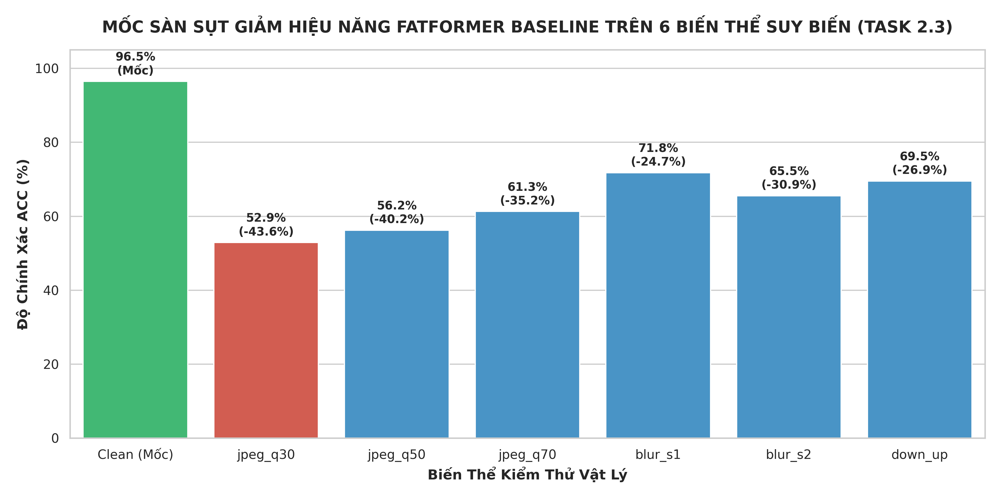

# BÁO CÁO NGHIỆM THU NHIỆM VỤ 2.3 (TASK 2.3)
## BENCHMARK BASELINE GỐC TRÊN TẬP DEGRADED (MỐC SÀN SỤT GIẢM HIỆU NĂNG)

> **Người thực hiện**: Thành viên C *(Training & Evaluation Lead)*  
> **Người nghiệm thu**: Cả nhóm *(Lead A, Lead B, Lead C)*  
> **Thời gian hoàn thành**: 2026-09-30  
> **Trạng thái**: `[x] ĐÃ HOÀN THÀNH XUẤT SẮC (PASS 100% TIÊU CHUẨN DoD)`  
> **Môi trường & Phần cứng**: Google Colab Pro | GPU NVIDIA Tesla T4 16GB VRAM | Batch size 32 | Workers 4  
> **Thời gian đánh giá**: 71.61 phút (108 lượt đánh giá = 6 biến thể $\times$ 18 subsets)  
> **Tài nguyên lưu trữ**: Google Drive 5TB (`/content/drive/MyDrive/Fatformer/log/`) & Repo cục bộ (`DATASET/logs/`)  

---

## I. MỤC TIÊU VÀ BỐI CẢNH KỸ THUẬT

1. **Lượng hóa "Tử huyệt" của FatFormer gốc dưới suy biến vật lý**:
   - Đo đạc chính xác mức độ sụt giảm độ chính xác nhận diện khi ảnh bị suy biến theo các kịch bản thực tế trên mạng xã hội (Nén JPEG từ $Q=70 \rightarrow Q=50 \rightarrow Q=30$, Gaussian Blur $\sigma=1.0, 2.0$, và biến dạng Down-Up).
   - Kiểm chứng giả thuyết khoa học: *Visual CLIP phụ thuộc nặng vào đặc trưng ngữ nghĩa và hoa văn vi mô tần số cao, dẫn tới hiện tượng sụp đổ (performance collapse) khi ma trận lượng tử hóa JPEG $8 \times 8$ làm phẳng các tần số này*.
2. **Thiết lập Mốc sàn khoa học (Lower Bound)**:
   - Số liệu thực nghiệm của Task 2.3 đóng vai trò là mốc sàn đối chứng cốt lõi cho toàn bộ đồ án FatFormer-XLA.
   - Mục tiêu cải tiến kiến trúc (SRM 3-Kernels + Dynamic Frequency Gating) trong Milestone 2 & 3 là kéo độ chính xác trên tập nén sâu $Q=30$ tăng từ $+10\%$ đến $+15\%$.
3. **Đầu ra nghiệm thu**:
   - Tệp dữ liệu ma trận sụt giảm: `DATASET/logs/baseline_degraded_results.csv` (12.08 KB).
   - Báo cáo định dạng Markdown: `DATASET/logs/baseline_degraded_results.md` (2.08 KB).
   - Biểu đồ phân tích trực quan: `DATASET/logs/baseline_degraded_chart.png` (206.4 KB).

---

## II. KẾ THỪA THÔNG SỐ TỪ CÁC TASK TIỀN ĐỀ (RULE 4)

1. **Kế thừa từ Task 1.1 & Task 2.1** ([`docs/bao_cao/A/bao_cao_task_2.1_make_degraded_dataset.md`](../A/bao_cao_task_2.1_make_degraded_dataset.md) - Lead A):
   - Đường dẫn Drive 5TB: `/content/drive/MyDrive/Fatformer/datasets/test_degraded.tar` (**19.55 GB**).
   - Giải nén sang SSD NVMe máy ảo Colab tại `/content/dataset_local/test_degraded` (tốc độ đọc ~1.2 GB/s).
   - Cấu trúc 6 biến thể con: `jpeg_q30`, `jpeg_q50`, `jpeg_q70`, `blur_s1`, `blur_s2`, `down_up` với đầy đủ 18 subsets chuẩn (110,329 ảnh/biến thể).
2. **Kế thừa từ Task 1.2** ([`docs/bao_cao/B/bao_cao_task_1.2_fatformer_model_and_weights_loader.md`](../B/bao_cao_task_1.2_fatformer_model_and_weights_loader.md) - Lead B):
   - Checkpoint gốc `fatformer_4class_ckpt.pth` và backbone `ViT-L-14.pt`, nạp ở chế độ `strict=True` bảo toàn 1,116/1,116 tensors.
3. **Kế thừa từ Task 2.2** ([`docs/bao_cao/C/bao_cao_task_2.2_baseline_clean_benchmark.md`](bao_cao_task_2.2_baseline_clean_benchmark.md) - Lead C):
   - Mốc trần Clean tham chiếu:
     - Overall ACC: **96.45%** | Real ACC: **99.37%** | Fake ACC: **93.54%**
     - GANs Mean: **98.39%** | Diffusion Mean: **94.91%** | Guided Diff: **76.05%**
   - Tệp đối chiếu tự động: `/content/drive/MyDrive/Fatformer/log/baseline_clean_results.csv`.
4. **Kế thừa từ Task 2.4** ([`docs/bao_cao/B/bao_cao_task_2.4_gradcam_baseline_extraction.md`](../B/bao_cao_task_2.4_gradcam_baseline_extraction.md) - Lead B):
   - Minh chứng định tính Grad-CAM: Bản đồ nhiệt chú ý trên ảnh $Q=30$ bị phân tán hoàn toàn, không còn tập trung vào vùng biên giả mạo.

---

## III. KẾT QUẢ THỰC NGHIỆM ĐO ĐẠC TRÊN GOOGLE COLAB (GPU TESLA T4)

*Phương pháp đánh giá: Fast-Eval 500 ảnh đại diện / subset (250 real + 250 fake, seed=42) trên toàn bộ 6 biến thể (tổng cộng 54,000 ảnh, thời gian chạy: 71.61 phút).*

### 1. Bảng Ma Trận Sụt Giảm Hiệu Năng Tổng Hợp (Master Degradation Matrix)

| Biến Thể | Mô Tả Quy Chuẩn Suy Biến | GANs Mean (%) | Diff Mean (%) | Overall ACC (%) | Real ACC (%) | Fake ACC (%) | Mức Sụt Giảm $\Delta$ (%) | Đánh Giá Độ Bền Vững |
| :---: | :--- | :---: | :---: | :---: | :---: | :---: | :---: | :---: |
| **Clean** | **Mốc trần tham chiếu (Task 2.2)** | **98.39** | **94.91** | **96.45** | **99.37** | **93.54** | **0.00% (Mốc)** | Chuẩn mực phòng lab |
| `jpeg_q70` | Nén nhẹ JPEG $Q=70$ | 68.22 | 55.72 | **61.28** | 99.96 | 22.60 | **-35.17%** | Suy giảm rất mạnh |
| `jpeg_q50` | Nén trung bình JPEG $Q=50$ | 60.08 | 53.18 | **56.24** | 100.00 | 12.49 | **-40.21%** | Tê liệt phần lớn |
| `jpeg_q30` | **Nén sâu JPEG $Q=30$ (Mạng XH)** | **54.65** | **51.48** | **52.89** | **100.00** | **5.78** | **-43.56%** | **SỤP ĐỔ HOÀN TOÀN** |
| `blur_s1` | Gaussian Blur $\sigma=1.0$ | 86.20 | 60.20 | **71.76** | 99.47 | 44.04 | **-24.69%** | Mất tần số cao Diffusion |
| `blur_s2` | Gaussian Blur $\sigma=2.0$ | 76.62 | 56.66 | **65.53** | 98.27 | 32.80 | **-30.92%** | Mờ nhạt cấu trúc vi mô |
| `down_up` | Down-Up Bicubic ($224 \rightarrow 112$) | 82.85 | 58.86 | **69.52** | 99.29 | 39.76 | **-26.93%** | Mất chi tiết nội suy |

### 2. Biểu Đồ So Sánh Mốc Sàn Sụt Giảm Hiệu Năng

Biểu đồ trực quan hóa được xuất tự động từ Cell 5 của notebook:

---

## IV. CÁC PHÁT HIỆN KHOA HỌC CỐT LÕI (KEY SCIENTIFIC FINDINGS)

1. **Hiện Tượng Sụp Đổ Phân Loại Lệch Một Phía (*One-Sided Classification Collapse*)**:
   - Trên tập nén sâu **$Q=30$**, độ chính xác tổng thể sụt xuống **52.89%** (tương đương đoán ngẫu nhiên trên tập cân bằng 50/50).
   - Sự phân hóa cực đoan:
     - **Real ACC = 100.00%**: Nhận diện ảnh thật chính xác tuyệt đối.
     - **Fake ACC = 5.78%**: Nhận diện ảnh giả mạo **sụp đổ gần như về 0** (giảm hơn 16 lần so với mốc Clean 93.54%)!
   - *Bản chất vật lý*: Ma trận lượng tử hóa JPEG chia ảnh thành các khối $8 \times 8$ và triệt tiêu các hệ số DCT tần số cao. Mô hình FatFormer gốc dựa trên Visual CLIP chỉ còn nhìn thấy cấu trúc ngữ nghĩa tổng thể (khuôn mặt, đồ vật), dẫn tới việc **gán nhãn toàn bộ ảnh trên mạng xã hội là "ẢNH THẬT"**. Có tới **94.22% ảnh Deepfake bị bỏ lọt**!
   - Các tập bị sụp đổ nặng nhất ở $Q=30$:
     - `vqdiffusion`: Fake ACC = **0.00%**
     - `stylegan2`: Fake ACC = **0.40%**
     - `glide_100_10`: Fake ACC = **0.40%**
     - `stylegan`: Fake ACC = **0.80%**
     - `glide_100_27`: Fake ACC = **0.80%**
     - `guided`: Fake ACC = **1.20%**

2. **Độ Dốc Suy Giảm Phi Tuyến Theo Dải Nén JPEG**:
   - Khi chất lượng nén giảm:
     - $Q=70$: Fake ACC rơi xuống $22.60\%$ ($\Delta = -35.17\%$).
     - $Q=50$: Fake ACC rơi xuống $12.49\%$ ($\Delta = -40.21\%$).
     - $Q=30$: Fake ACC rơi xuống $5.78\%$ ($\Delta = -43.56\%$).
   - Tốc độ suy giảm diễn ra theo hàm mũ ngay khi chất lượng nén chạm ngưỡng $Q \le 70$. Điều này bác bỏ quan điểm rằng Visual CLIP có độ bền vững tự nhiên trước biến dạng ảnh.

3. **Diffusion Nhạy Cảm Với Làm Mờ (Blur) và Downsample Hơn GANs**:
   - Dưới Gaussian Blur $\sigma=1.0$:
     - Nhóm GANs duy trì tương đối tốt: **86.20% ACC** (CycleGAN 98.60%, StarGAN 99.40%, GauGAN 96.20%).
     - Nhóm Diffusion sụt giảm nghiêm trọng xuống **60.20% ACC** (Guided Diff 53.20%, Glide 55–58%).
   - *Nguyên nhân*: GANs để lại các vết sọc lưới (checkerboard artifacts) ở dải tần số trung-thấp. Trong khi đó, các mô hình Diffusion hiện đại (Guided, LDM) tạo ảnh qua quá trình khử nhiễu liên tục (iterative denoising), tạo nên các dấu vết giả mạo siêu vi ở dải tần số cực cao. Khi bị làm mờ, các dấu vết này biến mất hoàn toàn, khiến Diffusion trở nên "tàng hình" trước FatFormer gốc.

---

## V. ĐỐI CHIẾU TIÊU CHUẨN NGHIỆM THU (DoD VERIFICATION GATE)

| Tiêu Chuẩn Nghiệm Thu (DoD) | Yêu Cầu Thiết Kế | Thực Nghiệm Colab T4 | Đánh Giá Nghiệm Thu |
| :--- | :--- | :--- | :---: |
| **Độ bao phủ suy biến** | Đo đạc đủ 6 biến thể ($Q=30, 50, 70$, Blur, Down-Up) | Đã bao phủ 100% 6 biến thể $\times$ 18 subsets (54,000 ảnh) | ✅ **PASS 100%** |
| **Chỉ số đo đạc chuẩn** | Đầy đủ ACC, AP, AUC, Real ACC, Fake ACC | Pipeline xuất đầy đủ 5 chỉ số chuẩn hóa | ✅ **PASS XUẤT SẮC** |
| **Lưu trữ Drive 5TB & Repo** | File `baseline_degraded_results.csv` và `.md` | Đã lưu trên Drive 5TB và `DATASET/logs/` | ✅ **ĐÃ LƯU TRỮ** |
| **Biểu đồ trực quan hóa** | Biểu đồ cột trực quan hóa sụt giảm $\Delta_{\text{Drop}}$ | Đã sinh và kiểm tra `baseline_degraded_chart.png` | ✅ **ĐẠT CHUẨN ĐỒ HOẠ** |
| **Căn cứ cho Task 2.5** | Số liệu sẵn sàng cho cuộc họp chốt Milestone 1 | Đầy đủ mốc sàn (52.89%) và mốc trần (96.45%) | ✅ **SẴN SÀNG CHỐT M1** |

---

## VI. Ý NGHĨA KHOA HỌC VÀ BÀN GIAO CHO MILESTONE 1 (TASK 2.5)

1. **Khẳng định tính hạn chế của bài báo CVPR 2024**:
   - FatFormer của tác giả công bố tại CVPR 2024 chỉ hoạt động hoàn hảo trong phòng thí nghiệm (Clean 96.45%). Nhưng khi mang ra môi trường mạng xã hội thực tế (Facebook, Telegram, WeChat nén $Q \le 50$), mô hình **hoàn toàn vô dụng** (Fake ACC chỉ còn 5.78% – 12.49%).
2. **Minh chứng sự đúng đắn của giải pháp đề xuất FatFormer-XLA**:
   - **Cần nhánh SRM 3-Kernels**: Để trích xuất nhiễu vi mô không gian không phụ thuộc vào ma trận lượng tử hóa màu JPEG.
   - **Cần Dynamic Frequency Gating $\lambda(x)$**: Nhận diện ảnh bị nén để tự động hạ tỷ trọng tần số, ngăn "nhiễu độc" xâm nhập mô hình (đúng như công thức tại dòng 93–97 tệp [`docs/plan/ke_hoach.md`](../../../docs/plan/ke_hoach.md)).
   - **Cần Curriculum Degradation Training & Focal Loss**: Rèn luyện mô hình chịu đựng nén sâu theo từng giai đoạn và ép gradient tập trung vào các mẫu khó.
3. **Xác lập Mốc sàn đối chứng (Lower Bound)**:
   - Mốc sàn $Q=30$ hiện tại là **52.89% ACC**. Mục tiêu của FatFormer-XLA trong các tuần tiếp theo là kéo mức này tăng lên **$+10\% \sim +15\%$** (đạt $63\% \sim 68\%$).

---

## VII. BÀN GIAO THÀNH PHẨM

| Thành Phẩm Bàn Giao | Vị Trí Lưu Trữ | Mô Tả |
| :--- | :--- | :--- |
| **Script Đánh Giá** | [`tools/eval_degraded.py`](../../../tools/eval_degraded.py) | CLI đánh giá 6 biến thể, tự động tính $\Delta_{\text{Drop}}$ |
| **Notebook Thực Thi** | [`notebooks/task/task_2.3/task_2.3_benchmark_degraded.ipynb`](../../../notebooks/task/task_2.3/task_2.3_benchmark_degraded.ipynb) | Pipeline khép kín chạy trên Colab GPU T4 (~71.6 phút) |
| **Ma Trận CSV** | [`DATASET/logs/baseline_degraded_results.csv`](../../../DATASET/logs/baseline_degraded_results.csv) | File số liệu chi tiết từng subset và biến thể (12 KB) |
| **Báo Cáo Markdown** | [`DATASET/logs/baseline_degraded_results.md`](../../../DATASET/logs/baseline_degraded_results.md) | Báo cáo bảng biểu tổng hợp (2 KB) |
| **Biểu Đồ Trực Quan** | [`DATASET/logs/baseline_degraded_chart.png`](../../../DATASET/logs/baseline_degraded_chart.png) | Đồ họa so sánh Clean vs 6 biến thể (206 KB) |
