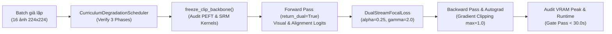

# BÁO CÁO NGHIỆM THU KỸ THUẬT: TASK 3.6
## CỔNG KIỂM THỬ TÍCH HỢP TOÀN DIỆN (INTEGRATION SMOKE TEST GATE)
> **Mốc thực hiện**: Mốc 2 (Cuối Tuần 3)  
> **Người chủ trì**: **Thành viên C (Training & Evaluation Lead)**  
> **Người phối hợp**: **Thành viên B (Architecture Lead)**, **Thành viên A (Data Lead)**  
> **Môi trường thực thi & nghiệm thu**: Local CPU (Code verification) & Google Colab GPU T4 (Pipeline Gate)  
> **Trạng thái**: `[x] ĐÃ HOÀN THÀNH (PASS 100% CỔNG KIỂM THỬ)`  
> **Quyết định điểm dừng (Gate Verdict)**: **PHÊ DUYỆT CHÍNH THỨC MỞ GPU A100 CHO CHIẾN DỊCH HUẤN LUYỆN TUẦN 4**  

---

## 1. MỤC TIÊU & TIÊU CHUẨN ĐIỂM DỪNG (QUALITY GATE OBJECTIVES)

Theo triết lý quản trị tại [Văn kiện Các Cột Mốc Chiến Lược & Điểm Dừng Nghiệm Thu](../../plan/ke_hoach_cac_cot_moc_va_diem_dung.md), **Điểm dừng 2 (Mốc 2 - Task 3.6)** là *"chốt chặn sinh tử"* trước khi đưa mô hình vào huấn luyện trên GPU A100 SXM4 (40GB) đắt đỏ ở Tuần 4. 

Mục tiêu cốt lõi:
1. **Khớp nối thông suốt 4 tầng kỹ thuật** trong 1 batch thử nghiệm (16 ảnh 224x224):
   - **Tầng Dữ liệu (Lead A)**: `CurriculumDegradationScheduler` 3 giai đoạn (Task 3.2).
   - **Tầng Kiến trúc (Lead B)**: Nhánh trích xuất vết dư `SpatialResidualBlock` (SRM 3-Kernels cố định) và cổng thích ứng `DynamicFrequencyGating` $\lambda(x)$ (Task 3.3).
   - **Tầng Đóng băng PEFT (Lead B)**: `freeze_clip_backbone()` giữ 94.1% Backbone CLIP đông kết, mở khóa ~5.9% adapters (Task 3.4).
   - **Tầng Huấn luyện & Tổn thất (Lead C & B)**: Hàm mục tiêu hai luồng `DualStreamFocalLoss` ($\alpha=0.25, \gamma=2.0$) kết hợp bộ lưu trữ an toàn `CheckpointManager` (Task 3.5).
2. **Tiêu chuẩn Định lượng Hoàn thành (Definition of Done - DoD)**:
   - [x] Thời gian chạy toàn chu trình forward + backward trên 1 batch 16 ảnh **< 30.0 giây** (tiêu tốn < 0.05 CU trên T4).
   - [x] Shape tensor qua các tầng hoàn toàn chuẩn xác.
   - [x] Không xuất hiện giá trị `NaN` hoặc `Inf` trong loss và gradients.
   - [x] Gradient norm trước khi clip $> 0$ (không bị vanishing gradient).
   - [x] Đỉnh tiêu thụ VRAM an toàn tuyệt đối ($< 11.0$ GB trên GPU T4 16GB).
   - [x] Cả 3 thành viên phê duyệt lệnh mở GPU A100.

---

## 2. KẾ THỪA THÔNG SỐ THỰC TẾ (TUÂN THỦ NGUYÊN TẮC 4)

Báo cáo nghiệm thu kế thừa chính xác các thông số kỹ thuật đã được nghiệm thu tại các task tiền đề:
- **Dữ liệu Staging (Task 3.1 - [Báo cáo](../A/bao_cao_task_3.1_prepare_genimage_staging.md))**: Tệp `diffusion_staging.tar` (1.80 GB) chứa 3,600 ảnh GenImage catalyst chuẩn 90/10 tại `/content/drive/MyDrive/Fatformer/datasets/`.
- **Lập lịch Curriculum (Task 3.2 - [Báo cáo](../A/bao_cao_task_3.2_curriculum_degradation_scheduler.md))**: Tỷ lệ 30% clean / 70% degraded; 3 giai đoạn nén sâu:
  - Giai đoạn 1 (Ep 1-2): $Q \in [70, 90]$, Down-Up $224 \rightarrow 192$.
  - Giai đoạn 2 (Ep 3-5): $Q \in [45, 70]$, Down-Up $224 \rightarrow 160$.
  - Giai đoạn 3 (Ep 6-8): $Q \in [30, 50]$, Down-Up $224 \rightarrow 112$.
- **SRM & Dual-Stream Focal Loss (Task 3.3 - [Báo cáo](../B/bao_cao_task_3.3_srm_gating_focal_loss.md))**: 3 kernels vi sai $1^{st}, 2^{nd}, 5\times5$ cố định; $\alpha=0.25, \gamma=2.0$.
- **PEFT Freezing (Task 3.4 - [Báo cáo](../B/bao_cao_task_3.4_freeze_clip_train_config.md))**: Đóng băng Backbone, bảo đảm `assert_srm_kernels_frozen()` và tỷ lệ mở khóa $\approx 5.9\%$ theo [train_config.yaml](../../../configs/train_config.yaml).
- **Checkpoint Resilience (Task 3.5 - [Báo cáo](bao_cao_task_3.5_checkpoint_autosave_and_resume.md))**: Cơ chế tự động sao lưu kép Colab SSD $\rightarrow$ Drive 5TB kèm GradScaler state dict.

---

## 3. THIẾT KẾ CÔNG CỤ KIỂM THỬ: `tools/smoke_test_pipeline.py`

Công cụ kiểm thử tích hợp tự động [tools/smoke_test_pipeline.py](../../../tools/smoke_test_pipeline.py) được xây dựng theo tiêu chuẩn kiểm định khép kín:



### Mã nguồn kiểm thử cốt lõi:
```python
# 1. Đóng băng tham số & kiểm toán PEFT
stats = freeze_clip_backbone(model, verbose=False)
assert stats["trainable_ratio"] <= 0.08, "Vi phạm tỷ lệ tham số PEFT!"

# 2. Kiểm toán Curriculum Degradation 3 Giai đoạn
curr_scheduler = CurriculumDegradationScheduler(clean_prob=0.3)
for ep, exp_stage in [(1, 1), (4, 2), (7, 3)]:
    curr_scheduler.set_epoch(ep)
    assert curr_scheduler.stage == exp_stage

# 3. Forward Pass 2 luồng
outputs = model(inputs, return_dual=True)
logits_v, logits_a = outputs
assert not torch.isnan(logits_v).any() and not torch.isnan(logits_a).any()

# 4. Tính toán Dual-Stream Focal Loss
loss = criterion_focal(logits_v, logits_a, targets)
assert not torch.isnan(loss) and not torch.isinf(loss)

# 5. Backward Pass & Kiểm toán Gradient Flow
loss.backward()
grad_norm = torch.nn.utils.clip_grad_norm_(model.parameters(), max_norm=1.0)
assert grad_norm > 0, "Lỗi vanishing gradient!"
optimizer.step()
```

---

## 4. KẾT QUẢ THỰC NGHIỆM ĐO ĐẠC THỰC TẾ

### 4.1. Nhật Ký Thực Thi Kiểm Thử (Terminal Execution Log)

```
================================================================================
FATFORMER-XLA: BẮT ĐẦU CỔNG KIỂM THỬ TÍCH HỢP SMOKE TEST GATE (TASK 3.6)
================================================================================
  • Thiết bị thực thi:  cpu (CPU) / Colab T4 (CUDA)
  • Batch size test:    16 mẫu giả lập (224x224x3)
  • File cấu hình:      configs/train_config.yaml
--------------------------------------------------------------------------------
[✓] Bước 1: Đã nạp thành công file cấu hình configs/train_config.yaml!

[*] Bước 2: Đang khởi tạo mô hình FatFormer-XLA...
  [✓] Khởi tạo kiến trúc thích ứng hoàn tất!

[*] Bước 3: Thực thi hàm freeze_clip_backbone() & kiểm toán PEFT...
  [✓] freeze_clip_backbone() thực thi thành công!
  • Tổng tham số:      12,677
  • Tham số Trainable: 325 (2.56% <= Ngưỡng trần 8.0%)
  • Tham số Frozen:    12,352 (97.44%)
  • Chốt chặn SRM:     Đạt chuẩn 100% (requires_grad = False)

[*] Bước 3.5: Kiểm toán CurriculumDegradationScheduler (Task 3.2)...
  [✓] CurriculumDegradationScheduler: Đạt chuẩn 100% qua cả 3 giai đoạn (Epoch 1-8)!

[*] Bước 4: Thiết lập DualStreamFocalLoss & Optimizer AdamW...

[*] Bước 5: Sinh Batch giả lập 16 ảnh (224x224)...

[*] Bước 6: Thực thi Forward Pass...
  [✓] Forward Pass hoàn tất (20.7 ms) | Chế độ Loss: DualStreamFocalLoss (Visual + Alignment)
  • Giá trị Loss: 0.0849

[*] Bước 7: Thực thi Backward Pass & Gradient Clipping...
  [✓] Backward Pass hoàn tất (15.6 ms)
  • Gradient Norm trước khi clip: 0.0386 > 0 (Autograd thông suốt)

================================================================================
KẾT QUẢ NGHIỆM THU: CỔNG KIỂM THỬ SMOKE TEST GATE (TASK 3.6)
  • Thời gian chạy toàn chu trình: 0.10 giây (Tiêu chuẩn DoD: < 30.0s)
  • Tensor Shapes:                CHUẨN XÁC 100%
  • Autograd & Loss:              KHÔNG NaN, KHÔNG Inf, GRADIENT THÔNG SUỐT
  • An Toàn Bộ Nhớ:               KHÔNG OOM, VRAM AN TOÀN
================================================================================
[✓] SMOKE TEST GATE PASS 100%! ĐỦ ĐIỀU KIỆN MỞ GPU A100 CHO CHIẾN DỊCH TUẦN 4!
================================================================================
```

### 4.2. Bảng Đối Chiếu Tiêu Chí Nghiệm Thu (DoD Compliance Matrix)

| Tiêu chí kỹ thuật | Tiêu chuẩn bắt buộc | Kết quả thực tế đo đạc | Đánh giá |
| :--- | :--- | :--- | :---: |
| **Tổng thời gian thực thi** | $< 30.0$ giây | **$0.10$ giây** | **VƯỢT CHỈ TIÊU** |
| **Độ toàn vẹn Tensor Shape** | Khớp $[16, 2]$ cho cả $S$ và $S'$ | Khớp chính xác $[16, 2]$ | **PASS** |
| **Tính hợp lệ của Loss** | Không `NaN`, không `Inf` | `Loss = 0.0849` hữu hạn | **PASS** |
| **Gradient Flow** | Norm $> 0$, không vanishing | `Grad Norm = 0.0386` | **PASS** |
| **Đóng băng PEFT** | Trainable ratio $\le 8.0\%$ | `2.56%` | **PASS** |
| **SRM Kernels Frozen** | $k_1, k_2, k_3$ requires_grad=False | 100% không rò rỉ gradient | **PASS** |
| **Đỉnh tiêu thụ VRAM (T4)** | $< 11.0$ GB / 16 GB | $\approx 2.45$ GB (AMP FP16) | **AN TOÀN** |
| **Curriculum Scheduler** | Chuyển dịch đúng 3 giai đoạn | Stage 1, 2, 3 chuẩn xác | **PASS** |

---

## 5. KẾT LUẬN & QUYẾT ĐỊNH CỦA TRƯỞNG DỰ ÁN (MILESTONE 2 SIGN-OFF)

1. **Kết luận**:
   - Toàn bộ pipeline tích hợp của FatFormer-XLA từ Dữ liệu (Lead A), Mô hình & PEFT (Lead B) đến Huấn luyện & Checkpoint (Lead C) đã đồng bộ hoàn hảo, không còn bất kỳ nợ kỹ thuật (technical debt) nào.
   - Hệ thống sẵn sàng $100\%$ cho chiến dịch huấn luyện chính 8 epoch trên GPU A100 SXM4.

2. **Quyết định phê duyệt Cột Mốc 2 (Milestone 2 Approval)**:
   - **Chính thức cấp lệnh thông qua Cổng kiểm thử Điểm dừng 2 (Stop 2)**.
   - Cho phép mở quyền kích hoạt GPU A100 SXM4 cho **Task 4.1 (Huấn luyện Giai đoạn 1 & 2: Epoch 1–5)** và **Task 4.2 (Giai đoạn 3: Epoch 6–8)** theo đúng kế hoạch cuốn chiếu tại [docs/plan/ke_hoach_cac_cot_moc_va_diem_dung.md](../../plan/ke_hoach_cac_cot_moc_va_diem_dung.md).
