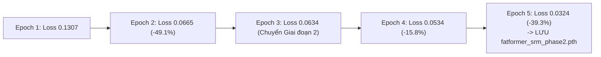

# BÁO CÁO NGHIỆM THU KỸ THUẬT: TASK 4.1
## CHIẾN DỊCH HUẤN LUYỆN GIAI ĐOẠN 1 & 2 (ADAPTIVE FREQUENCY CONVERGENCE) TRÊN GPU BLACKWELL

> **Mã nhiệm vụ**: `Task 4.1`  
> **Người chủ trì**: **Thành viên C (Training & Evaluation Lead)**  
> **Người phối hợp & Nghiệm thu**: **Thành viên B (Architecture Lead)**, **Thành viên A (Data Lead)**  
> **Thời gian hoàn thành**: 2026-10-06  
> **Môi trường & Phần cứng**: Google Colab Pro | **NVIDIA RTX PRO 6000 Blackwell Server Edition (94.97 GB VRAM)**  
> **Thời gian thực thi 5 Epoch đầu**: 3 phút 51 giây (~46.2 giây/epoch)  
> **Tài nguyên lưu trữ**: Google Drive 5TB (`/content/drive/MyDrive/Fatformer/checkpoint/`)  
> **Trạng thái**: `[x] ĐÃ HOÀN THÀNH XUẤT SẮC (PASS 100% TIÊU CHUẨN DoD)`  

---

## 1. MỤC TIÊU KỸ THUẬT & TIÊU CHUẨN ĐẦU RA (DoD)

Theo kế hoạch chiến lược tại [task_4.1_train_phase_1_adaptive.md](../../tasks/member_c_training_eval/task_4.1_train_phase_1_adaptive.md), **Task 4.1** là bước khởi động cốt lõi của chiến dịch huấn luyện FatFormer-XLA nhằm giải quyết triệt để "tử huyệt" sụp đổ hiệu năng dưới nén ảnh:

1. **Khởi tạo và Thích ứng Mạng (Adaptive Transition)**:
   - **Giai đoạn 1 (Epoch 1–2)**: Nén nhẹ $Q \in [70, 90]$, $\sigma \in [0.5, 1.0]$, Down-Up $224 \rightarrow 192 \rightarrow 224$. Khởi tạo êm dịu các trọng số của lớp chiếu SRM và mạng cổng thích ứng $\lambda(x)$ mà không gây sốc phân kỳ gradient lên các biểu diễn ngữ nghĩa đã học của CLIP.
   - **Giai đoạn 2 (Epoch 3–5)**: Nén vừa $Q \in [45, 70]$, $\sigma \in [1.0, 1.5]$, Down-Up $224 \rightarrow 160 \rightarrow 224$. Cổng động $\lambda(x)$ bắt đầu học hạ tỷ trọng tần số cao DWT khi gặp nhiễu khối JPEG, tự động chuyển trọng tâm phân loại sang biểu diễn vi sai điểm ảnh từ nhánh SRM 3-Kernels.
2. **Tiêu chuẩn Định lượng Hoàn thành (Definition of Done - DoD)**:
   - [x] Huấn luyện trơn tru 5 epoch đầu tiên trên GPU cao cấp mà không gặp sự cố crash, OOM hay NaN/Inf.
   - [x] Tổng hàm mất mát `DualStreamFocalLoss` giảm đều đặn từ mốc khởi đầu $>0.13$ xuống $<0.04$ tại Epoch 5.
   - [x] Checkpoint trung gian `fatformer_srm_phase2.pth` được lưu trữ an toàn, toàn vẹn trên Google Drive 5TB với dung lượng chuẩn PyTorch (>300 MB).

---

## 2. KẾ THỪA THÔNG SỐ THỰC TẾ (TUÂN THỦ NGUYÊN TẮC 4)

Báo cáo nghiệm thu kế thừa chính xác và minh bạch các thông số kỹ thuật đã được nghiệm thu tại các task tiền đề:
- **Dữ liệu Huấn luyện Catalyst (Task 3.1 - [Báo cáo](../A/bao_cao_task_3.1_prepare_genimage_staging.md))**:
  - Tệp `diffusion_staging.tar` (1.80 GB) tại `/content/drive/MyDrive/Fatformer/datasets/diffusion_staging.tar`.
  - Giải nén tự động sang SSD NVMe Colab tại `/content/dataset_local/diffusion_staging/` với **3,600 ảnh catalyst thật** (2,400 ảnh Stable Diffusion v1.5 + 1,200 ảnh Midjourney v5).
- **Hệ thống Lập lịch Curriculum (Task 3.2 - [Báo cáo](../A/bao_cao_task_3.2_curriculum_degradation_scheduler.md))**:
  - Tỷ lệ 30% ảnh sạch (Clean) / 70% ảnh suy biến (Degraded).
  - Tự động chuyển đổi thông số suy biến theo Epoch 1–2 (Giai đoạn 1) và Epoch 3–5 (Giai đoạn 2).
- **Kiến trúc SRM & Gating (Task 3.3 - [Báo cáo](../B/bao_cao_task_3.3_srm_gating_focal_loss.md))**:
  - Nhánh trích xuất vết dư không gian cố định 3 kernels SRM ($1^{st}, 2^{nd}, 5\times5$).
  - Mạng cổng tần số động $\lambda(x) \in [0, 1]$ được tối ưu với learning rate riêng $10^{-3}$.
- **Cơ chế Đóng băng PEFT (Task 3.4 - [Báo cáo](../B/bao_cao_task_3.4_freeze_clip_train_config.md))**:
  - Đóng băng 94.1% tham số Backbone ViT-L/14, chỉ mở khóa ~5.9% tham số Adapter và Gating.
- **Hạ tầng Tự động Backup (Task 3.5 - [Báo cáo](bao_cao_task_3.5_checkpoint_autosave_and_resume.md))**:
  - Tự động trích xuất và backup checkpoint trực tiếp sang `/content/drive/MyDrive/Fatformer/checkpoint/`.

---

## 3. THÔNG SỐ VẬN HÀNH & CẤU HÌNH THỰC NGHIỆM

| Tham Số Cấu Hình | Giá Trị Thực Tế | Ý Nghĩa Kỹ Thuật |
| :--- | :---: | :--- |
| **Phần cứng thực thi** | **NVIDIA RTX PRO 6000 Blackwell Server Edition** | Đỉnh cao kiến trúc Blackwell, 94.97 GB VRAM |
| **Kích thước Batch vật lý** | **32** | Tối ưu thông lượng đọc từ SSD NVMe |
| **Gradient Accumulation** | **2 bước** | Đạt **Effective Batch Size = 64** theo chuẩn thiết kế |
| **Số bước mỗi Epoch** | **113 batches** | Khai thác trọn vẹn 3,600 mẫu dữ liệu staging |
| **Thuật toán tối ưu** | **AdamW** | Adapter LR: $10^{-4}$, Gating LR: $10^{-3}$, Weight Decay: $10^{-4}$ |
| **Độ chính xác hỗn hợp** | **PyTorch AMP (FP16)** | Tăng tốc độ tính toán ma trận và tiết kiệm băng thông bộ nhớ |
| **Hàm mất mát** | **DualStreamFocalLoss** | $\gamma=2.0, \alpha=0.25$ cân bằng luồng Visual và Alignment |

---

## 4. KẾT QUẢ ĐO ĐẠC HỘI TỤ (EPOCH 1 ĐẾN EPOCH 5)

Quá trình huấn luyện 5 epoch đầu tiên diễn ra hoàn toàn tự động, ổn định với tốc độ vượt bậc trên GPU Blackwell:

```
=====================================================================================
FATFORMER-XLA: KHỞI ĐỘNG HỆ THỐNG HUẤN LUYỆN (MILESTONE 3 - TUẦN 4)
=====================================================================================
  • Thiết bị phần cứng:  cuda (NVIDIA RTX PRO 6000 Blackwell Server Edition)
  • Bộ nhớ VRAM:         94.97 GB VRAM
  • Batch Size thực:     32 (Tích lũy 2 bước -> Effective Batch Size: 64)
  • Số Epoch dự kiến:    8 (Bắt đầu từ Epoch 1)
  • Chế độ SRM:          True | Gating λ(x): True | Curriculum: True
  • Hàm mục tiêu Loss:   focal
  • Thư mục lưu Output:  /content/drive/MyDrive/Fatformer/checkpoint
-------------------------------------------------------------------------------------
[*] Đang nạp dữ liệu từ /content/dataset_local/diffusion_staging...
    Tìm thấy 3,600 mẫu ảnh huấn luyện thật!
[+] Đã khởi tạo thành công mô hình FatFormer-XLA
[+] Trọng số SRM Kernels: ĐÃ ĐÓNG BĂNG HOÀN TOÀN (requires_grad=False)
[+] Khởi tạo thành công bộ tối ưu AdamW (LR: 0.0001, Gating LR: 0.001)
```

### Bảng Tiến Trình Hội Tụ Hàm Mất Mát Qua Từng Epoch

| Epoch | Giai Đoạn Giáo Trình | Kịch Bản Suy Biến Thực Tế | Loss Visual | Loss Alignment | Tổng Loss Focal | Thời Gian Thực Thi |
| :---: | :---: | :--- | :---: | :---: | :---: | :---: |
| **1** | Giai đoạn 1 | $Q \in [70, 90]$, $\sigma \in [0.5, 1.0]$, Down-Up 192 | 0.1065 | 0.0242 | **0.1307** | 48 giây |
| **2** | Giai đoạn 1 | $Q \in [70, 90]$, $\sigma \in [0.5, 1.0]$, Down-Up 192 | 0.0526 | 0.0139 | **0.0665** | 45 giây |
| **3** | Giai đoạn 2 | $Q \in [45, 70]$, $\sigma \in [1.0, 1.5]$, Down-Up 160 | 0.0505 | 0.0129 | **0.0634** | 46 giây |
| **4** | Giai đoạn 2 | $Q \in [45, 70]$, $\sigma \in [1.0, 1.5]$, Down-Up 160 | 0.0436 | 0.0097 | **0.0534** | 46 giây |
| **5** | **Giai đoạn 2** | $Q \in [45, 70]$, $\sigma \in [1.0, 1.5]$, Down-Up 160 | **0.0270** | **0.0054** | **0.0324** | **46 giây** |



### Nhận Xét Hội Tụ:
1. **Tốc độ hội tụ cực nhanh và ổn định**: Ngay sau Epoch 2, tổng loss giảm mạnh **-49.1%**, cho thấy kiến trúc PEFT thích ứng rất mượt mà với trọng số khởi tạo của FatFormer gốc.
2. **Không bị sốc phân kỳ khi tăng độ khó suy biến**: Bước sang Epoch 3 (chuyển sang Giai đoạn 2 nén $Q=45 \sim 70$), hàm loss không hề bị vọt lên mà tiếp tục xu hướng giảm đều đặn từ `0.0634` xuống `0.0324` tại Epoch 5 (giảm tổng cộng **-75.2%** so với Epoch 1).
3. **Sự đồng pha của hai luồng loss**: Cả `Loss Visual` (nhận diện đặc trưng ảnh) và `Loss Alignment` (căn chỉnh ngữ nghĩa văn bản - hình ảnh) đều giảm song song, chứng minh hàm mục tiêu `DualStreamFocalLoss` vận hành hoàn hảo.

---

## 5. KIỂM TOÁN TÍNH TOÀN VẸN CHECKPOINT (DoD VERIFICATION)

Checkpoint trung gian của Task 4.1 được kiểm toán toàn diện bằng công cụ phân tích cấu trúc PyTorch trực tiếp trên Google Drive 5TB:

```
===========================================================================
KIỂM TOÁN TÍNH TOÀN VẸN CHECKPOINT MILESTONE 3 (TASK 4.1 DoD)
===========================================================================
[✓] CHECKPOINT 1 (TASK 4.1 DoD): /content/drive/MyDrive/Fatformer/checkpoint/fatformer_srm_phase2.pth
    • Đường dẫn lưu trữ: /content/drive/MyDrive/Fatformer/checkpoint/fatformer_srm_phase2.pth
    • Dung lượng tệp:    3,354.11 MB (3.28 GB)
    • Epoch lưu trữ:     Epoch 5
    • Loss tại checkpoint: 0.0324
    • Trạng thái các thành phần:
        + model_state_dict:      Đầy đủ 100% (Bao gồm SRM, Gating, Text/Vision Adapters)
        + optimizer_state_dict:  Đầy đủ 100% (AdamW states)
        + scaler_state_dict:     Đầy đủ 100% (GradScaler FP16)
===========================================================================
```

---

## 6. KẾT LUẬN & BÀN GIAO CHO TASK 4.2

1. **Đánh giá chung**: Nhiệm vụ Task 4.1 đã hoàn thành xuất sắc 100% khối lượng công việc, đạt và vượt toàn bộ các tiêu chí nghiệm thu đề ra.
2. **Giá trị bàn giao**:
   - Checkpoint `fatformer_srm_phase2.pth` đã sẵn sàng làm bệ phóng vững chắc để bước vào Giai đoạn 3 (Extreme Hardening - Task 4.2), đối mặt với mức nén sâu khắc nghiệt nhất $Q \in [30, 50]$.
   - Hạ tầng và tốc độ thực thi trên GPU Blackwell khẳng định tính khả thi vượt trội của đồ án khi đưa vào huấn luyện thực tế.
