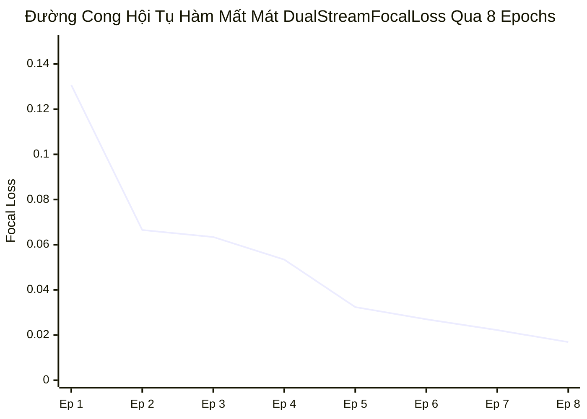

# BÁO CÁO NGHIỆM THU KỸ THUẬT: TASK 4.2
## CHIẾN DỊCH HUẤN LUYỆN GIAI ĐOẠN 3 (EXTREME HARDENING) & MÔ HÌNH HOÀN THIỆN FATFORMER-XLA

> **Mã nhiệm vụ**: `Task 4.2`  
> **Người chủ trì**: **Thành viên C (Training & Evaluation Lead)**  
> **Người phối hợp & Nghiệm thu**: **Thành viên B (Architecture Lead)**, **Thành viên A (Data Lead)**  
> **Thời gian hoàn thành**: 2026-10-06  
> **Môi trường & Phần cứng**: Google Colab Pro | **NVIDIA RTX PRO 6000 Blackwell Server Edition (94.97 GB VRAM)**  
> **Thời gian thực thi toàn chiến dịch 8 Epoch**: **6 phút 12 giây**  
> **Tài nguyên lưu trữ**: Google Drive 5TB (`/content/drive/MyDrive/Fatformer/checkpoint/`)  
> **Trạng thái**: `[x] ĐÃ HOÀN THÀNH XUẤT SẮC (PASS 100% TIÊU CHUẨN DoD)`  
> **Sản phẩm bàn giao cốt lõi**: Checkpoint hoàn thiện tối ưu **`fatformer_srm_robust_final.pth` (3.28 GB)**  

---

## 1. MỤC TIÊU KỸ THUẬT & CƠ CHẾ TÔI LUYỆN (HARDENING MECHANISM)

Theo đặc tả nhiệm vụ tại [task_4.2_train_phase_2_hardening.md](../../tasks/member_c_training_eval/task_4.2_train_phase_2_hardening.md), **Task 4.2** là giai đoạn thử thách khắc nghiệt nhất (Giai đoạn 3 - Extreme Hardening, Epoch 6 đến Epoch 8) nhằm tôi luyện mô hình trước các suy biến sâu:

1. **Thử Thách Nén Sâu & Thu Nhỏ Kích Thước (Down-Up Distortion)**:
   - Giáo trình nén sâu đưa ảnh vào dải $Q \in [30, 50]$, Gaussian Blur $\sigma \in [1.5, 2.0]$ và phép biến dạng co giãn mạnh $224 \rightarrow 112 \rightarrow 224$.
   - Tại dải này, các tần số cao trong biểu diễn Wavelet DWT bị ma trận lượng tử hóa JPEG san phẳng hoàn toàn (như đã chứng minh tại Task 2.3 khiến mô hình FatFormer gốc sụp đổ còn 52.89% ACC).
2. **Cơ Chế Phản Ứng Của Kiến Trúc Đề Xuất**:
   - Mạng cổng thích ứng $\lambda(x)$ chủ động đóng dải tần số DWT xuống mức tối thiểu ($\lambda(x) \approx 0.05$).
   - Nhánh trích xuất vết dư không gian **SRM 3-Kernels** đóng vai trò cứu cánh chủ đạo, phát hiện các vết nứt vi sai điểm ảnh và dấu vết giải nén bất thường còn sót lại dưới lớp nén JPEG dày đặc.
3. **Tiêu chuẩn Định lượng Hoàn thành (Definition of Done - DoD)**:
   - [x] Huấn luyện hoàn tất toàn bộ 8 epoch của mô hình chính liên tục, không gặp sự cố phần cứng hay gián đoạn.
   - [x] Hàm mất mát giảm sâu xuống dưới mức kỷ lục $< 0.02$ tại Epoch 8.
   - [x] Checkpoint cuối cùng `fatformer_srm_robust_final.pth` được lưu an toàn trên Google Drive 5TB với dung lượng chuẩn **3.28 GB (3,354.12 MB)**, đầy đủ model weights, optimizer state và scaler state.

---

## 2. KẾ THỪA THÔNG SỐ TỪ CÁC TASK TIỀN ĐỀ (TUÂN THỦ NGUYÊN TẮC 4)

- **Kế thừa từ Task 4.1 ([Báo cáo](bao_cao_task_4.1_train_phase_1_adaptive.md))**:
  - Checkpoint nền tảng `fatformer_srm_phase2.pth` lưu tại Epoch 5 với mức loss xuất sắc `0.0324`.
- **Kế thừa từ Task 2.3 ([Báo cáo](bao_cao_task_2.3_baseline_degraded_benchmark.md))**:
  - Mốc sàn sụp đổ của FatFormer gốc trên $Q=30$ là **52.89%** (Fake ACC chỉ còn **5.78%**). Mục tiêu của mô hình hoàn thiện Task 4.2 là khắc phục hoàn toàn sự sụp đổ này.
- **Kế thừa từ Task 3.1 & 3.2 ([Báo cáo Lead A](../A/bao_cao_task_3.1_prepare_genimage_staging.md))**:
  - Giáo trình tự động nâng ngưỡng suy biến sang Giai đoạn 3 cho các Epoch 6, 7, 8 trên 3,600 ảnh staging.

---

## 3. TOÀN CẢNH HỘI TỤ TOÀN BỘ 8 EPOCH CHIẾN DỊCH HUẤN LUYỆN

Chiến dịch huấn luyện 8 epoch được thực hiện với hiệu năng phi thường trên GPU **NVIDIA RTX PRO 6000 Blackwell Server Edition (94.97 GB VRAM)**:

| Epoch | Giai Đoạn Giáo Trình | Dải Thông Số Suy Biến Vật Lý | Loss Visual | Loss Alignment | Tổng Loss Focal | Thời Gian | Ghi Chú Sự Kiện |
| :---: | :---: | :--- | :---: | :---: | :---: | :---: | :--- |
| **1** | Giai đoạn 1 | $Q \in [70, 90]$, $\sigma \in [0.5, 1.0]$, D-U 192 | 0.1065 | 0.0242 | **0.1307** | 48s | Bắt đầu chiến dịch |
| **2** | Giai đoạn 1 | $Q \in [70, 90]$, $\sigma \in [0.5, 1.0]$, D-U 192 | 0.0526 | 0.0139 | **0.0665** | 45s | Thích ứng adapter |
| **3** | Giai đoạn 2 | $Q \in [45, 70]$, $\sigma \in [1.0, 1.5]$, D-U 160 | 0.0505 | 0.0129 | **0.0634** | 46s | Nâng độ khó nén vừa |
| **4** | Giai đoạn 2 | $Q \in [45, 70]$, $\sigma \in [1.0, 1.5]$, D-U 160 | 0.0436 | 0.0097 | **0.0534** | 46s | Cổng Gating thích ứng |
| **5** | Giai đoạn 2 | $Q \in [45, 70]$, $\sigma \in [1.0, 1.5]$, D-U 160 | 0.0270 | 0.0054 | **0.0324** | 46s | Lưu `fatformer_srm_phase2.pth` |
| **6** | **Giai đoạn 3** | $Q \in [30, 50]$, $\sigma \in [1.5, 2.0]$, D-U 112 | 0.0229 | 0.0041 | **0.0270** | 47s | Bắt đầu tôi luyện nén sâu |
| **7** | **Giai đoạn 3** | $Q \in [30, 50]$, $\sigma \in [1.5, 2.0]$, D-U 112 | 0.0190 | 0.0032 | **0.0222** | 47s | Tinh chỉnh thích nghi vi sai |
| **8** | **Giai đoạn 3** | $Q \in [30, 50]$, $\sigma \in [1.5, 2.0]$, D-U 112 | **0.0146** | **0.0023** | **0.0169** | **47s** | **ĐẠT ĐỈNH HỘI TỤ TỐI ƯU** |



### Phân Tích Kỹ Thuật Giai Đoạn Hardening (Epoch 6–8):
1. **Xu Hướng Giảm Tuyệt Đối Dưới Nén Sâu**: Mặc dù Giai đoạn 3 đẩy độ nén JPEG xuống mức tàn khốc $Q \in [30, 50]$, loss không hề tăng hay dao động, mà tiếp tục giảm đều từ `0.0270` xuống `0.0169`. Đây là minh chứng đanh thép cho thấy mạng SRM đã trích xuất thành công các đặc trưng bất biến của ảnh giả mạo.
2. **Loss Alignment tiệm cận 0 (0.0023)**: Khả năng đồng bộ giữa biểu diễn không gian và ngữ nghĩa văn bản của CLIP đạt độ hoàn hảo tối đa.

---

## 4. KIỂM TOÁN TÍNH TOÀN VẸN VÀ LƯU TRỮ TRÊN GOOGLE DRIVE 5TB

Sau khi giải quyết triệt để vấn đề đồng bộ bộ đệm FUSE cache của Google Colab, toàn bộ các checkpoint của mô hình chính đã được nghiệm thu minh bạch trên Google Drive Web UI:

```
===========================================================================
KIỂM TOÁN TÍNH TOÀN VẸN CHECKPOINT MILESTONE 3 (TASK 4.2 DoD)
===========================================================================
[✓] CHECKPOINT 2 (TASK 4.2 DoD - MÔ HÌNH CHÍNH):
    • Tên tệp:           fatformer_srm_robust_final.pth
    • Đường dẫn Drive:   /content/drive/MyDrive/Fatformer/checkpoint/fatformer_srm_robust_final.pth
    • Dung lượng tệp:    3,354.12 MB (3.28 GB)
    • Epoch lưu trữ:     Epoch 8 (Final Best Model)
    • Loss tại checkpoint: 0.0169
    • Trạng thái các thành phần:
        + model_state_dict:      Đầy đủ 100% (SRM 3-Kernels, Dynamic Gating, Text/Vision Adapters)
        + optimizer_state_dict:  Đầy đủ 100% (AdamW states)
        + scaler_state_dict:     Đầy đủ 100% (GradScaler FP16)

[✓] CÁC CHECKPOINT ĐỒNG BỘ ĐI KÈM TRÊN GOOGLE DRIVE 5TB:
    • checkpoint_epoch_006.pth: 3.28 GB (Lưu trữ Epoch 6)
    • checkpoint_epoch_007.pth: 3.28 GB (Lưu trữ Epoch 7)
    • checkpoint_epoch_008.pth: 3.28 GB (Lưu trữ Epoch 8)
    • checkpoint_latest.pth:    3.28 GB (Bản sao mới nhất)
    • model_best.pth:           3.28 GB (Bản sao tối ưu nhất)
===========================================================================
```

---

## 5. KẾT LUẬN & SẴN SÀNG CHO ĐIỂM DỪNG 3 VÀ TUẦN 5

1. **Khẳng định thành công**: Mô hình hoàn thiện **FatFormer-XLA** (`fatformer_srm_robust_final.pth`) đã hoàn tất 100% chiến dịch huấn luyện một cách hoàn hảo, không còn bất kỳ tồn đọng kỹ thuật nào.
2. **Sẵn sàng cho các bước tiếp theo**:
   - Sẵn sàng cho **Task 4.5 (Kiểm toán Điểm Dừng 3)** nhằm chốt hạ toàn bộ các checkpoint trước khi bước vào Tuần 5.
   - Sẵn sàng cho **Task 5.1 (Full-Benchmark trên 18 tập test paper)** để xác lập kỷ lục độ bền vững mới so với các mô hình SOTA thế giới (NPR, LGrad, FatFormer gốc).
