# CẨM NANG THỰC CHIẾN: CHIẾN LƯỢC FINE-TUNING & DANH MỤC DỮ LIỆU FATFORMER-XLA
> **Dự án**: Nâng cao độ bền pháp y và khả năng tổng quát hóa cho FatFormer (FatFormer-XLA)  
> **Mục tiêu**: Khắc phục hiện tượng sụt giảm hiệu năng khi gặp suy thoái nén mạng xã hội (JPEG, Gaussian Blur, Resize) và mở rộng nhận diện các kiến trúc Diffusion thế hệ mới.  
> **Hạ tầng thực thi**: Google Colab Pro (GPU A100 40GB / 300 Compute Units) + Google Drive 5TB nhóm.  
> **Đối tượng sử dụng**: Thành viên A (Data & Infra), Thành viên B (Architecture & Loss), Thành viên C (Training & Eval).

---

## MỤC LỤC
1. [Nguyên Lý Nền Tảng: Tại Sao Phải Fine-Tuning Thay Vì Train From Scratch?](#1-nguyen-ly-nen-tang)
2. [Chi Tiết 6 Chiến Lược Fine-Tuning Chuyên Sâu](#2-chi-tiet-6-chien-luoc-fine-tuning)
   - [Chiến lược 1: Baseline Fine-Tuning (Dual-Stream + SRM + Gating)](#chien-luoc-1-baseline-fine-tuning)
   - [Chiến lược 2: Curriculum Degradation Learning (Học Tăng Tiến)](#chien-luoc-2-curriculum-degradation-learning)
   - [Chiến lược 3: Multi-Generator Staging & Focal Loss (Mũi Nhọn Trị Mẫu Khó)](#chien-luoc-3-multi-generator-staging--focal-loss)
   - [Chiến lược 4: Representation Consistency Regularization (Đối Sánh Khử Nhiễu)](#chien-luoc-4-representation-consistency-regularization)
   - [Chiến lược 5: Parameter-Efficient LoRA Trên ViT Backbone (Mở Rộng Ngữ Nghĩa)](#chien-luoc-5-parameter-efficient-lora-tren-vit-backbone)
   - [Chiến lược 6: Teacher-Student EMA Consistency (Làm Mượt Dự Đoán)](#chien-luoc-6-teacher-student-ema-consistency)
3. [Đặc Tả Toàn Diện Các Bộ Dữ Liệu (Datasets Specification)](#3-dac-ta-toan-dien-cac-bo-du-lieu)
   - [Nhóm Dữ Liệu Huấn Luyện (Training Datasets)](#nhom-du-lieu-huan-luyen)
   - [Nhóm Dữ Liệu Kiểm Thử Đối Chứng (Evaluation Benchmarks)](#nhom-du-lieu-kiem-thu)
   - [Bộ Dữ Liệu Suy Thoái Thực Nghiệm (Degraded Testset)](#bo-du-lieu-suy-thoai)
4. [Ma Trận Ánh Xạ: Chiến Lược Fine-Tune $\leftrightarrow$ Dữ Liệu $\leftrightarrow$ Mã Nguồn](#4-ma-tran-anh-xa)
5. [Cấu Hình Siêu Tham Số & Dự Toán Chi Phí Colab Pro A100](#5-cau-hinh-sieu-tham-so--ngan-sach)
6. [Ma Trận Phân Vai 3 Thành Viên & Quy Trình Phối Hợp](#6-ma-tran-phan-vai-3-thanh-vien)

---

<a name="1-nguyen-ly-nen-tang"></a>
## 1. NGUYÊN LÝ NỀN TẢNG: TẠI SAO PHẢI FINE-TUNING THAY VÌ TRAIN FROM SCRATCH?

Trong bài toán phát hiện ảnh giả mạo tổng quát (Generalizable Synthetic Image Detection), việc huấn luyện từ đầu (*Train from scratch*) mạng thị giác Transformer cỡ lớn (như OpenAI CLIP ViT-L/14 với 427.6M tham số) là một **sai lầm nghiêm trọng về cả phương pháp luận lẫn tài nguyên**:

1. **Bảo Tồn Biểu Diễn Ngữ Nghĩa Tổng Quát (Zero-Shot Semantic Retention)**:
   - OpenAI CLIP ViT-L/14 đã được tiền huấn luyện trên 400 triệu cặp ảnh - văn bản (WebImageText). Nó nắm giữ không gian biểu diễn ngữ nghĩa đa dạng nhất thế giới hiện nay.
   - Nếu train lại từ đầu trên một tập dữ liệu ảnh giả mạo nhỏ (vài chục nghìn ảnh ProGAN), mô hình sẽ ngay lập tức bị **quên thảm khốc (Catastrophic Forgetting)**, chỉ nhận diện được đúng các class có trong tập train (xe hơi, máy bay) và mất sạch khả năng nhận diện các vật thể lạ.
2. **Nguyên Lý Parameter-Efficient Fine-Tuning (PEFT)**:
   - FatFormer đóng băng **94.1%** tham số (toàn bộ các lớp self-attention và MLP của ViT-L/14).
   - Chỉ mở khóa và huấn luyện **5.9%** tham số (~55.11M tham số), tập trung tại:
     - Các khối **Forgery-Aware Adapter (FAA)** đặt song song tại lớp 7, 15, 23 (trích xuất tần số cao qua sóng Haar Wavelet).
     - Khối căn chỉnh ngôn ngữ **Language-Guided Alignment (LGA)**.
     - Các khối cải tiến bổ sung: **SRM 3-Kernels** và **Dynamic Frequency Gating $\lambda(x)$**.
3. **Bài Toán Đối Chứng Khoa Học (Scientific Benchmark Reproducibility)**:
   - Checkpoint [`fatformer_4class_ckpt.pth`](file:///d:/GIT%20REPO/.nam4/fatformer-xla/fatformer_4class_ckpt.pth) do chính nhóm tác giả CVPR 2024 cung cấp chính là mốc chuẩn (Ground Truth Anchor). 
   - Đồ án sử dụng checkpoint này để đánh giá Zero-shot làm mốc sàn, sau đó dùng chính checkpoint này làm **Warm-Start** để tinh chỉnh thích ứng miền (Domain Adaptation) cho môi trường nén mạng xã hội.
4. **Tiết Kiệm Ngân Sách Tính Toán (300 Compute Units Colab Pro)**:
   - Train from scratch: Cần cụm 8x V100 / A100 chạy trong 3–5 ngày (sẽ tiêu thụ > 250 CUs chỉ trong 1 lần chạy, nguy cơ đứt phiên).
   - Fine-tuning tối ưu: Mỗi lượt chạy chỉ mất **5 – 8 epochs (~45 – 70 phút trên 1 GPU A100)**, tiêu thụ khoảng **~8 – 16 CUs/lượt** (tùy thuộc mức tiêu hao 6.77 – 13 CUs/giờ của GPU A100).

---

<a name="2-chi-tiet-6-chien-luoc-fine-tuning"></a>
## 2. CHI TIẾT 6 CHIẾN LƯỢC FINE-TUNING CHUYÊN SÂU

```mermaid
graph TD
    subgraph S1 ["Chiến Lược 1: Baseline Dual-Stream (Hiện Tại)"]
        A1["Checkpoint Gốc (strict=False)"] --> B1["Dual-Stream (30% Clean, 70% Degraded ngẫu nhiên)"]
        B1 --> C1["SRM + Gating λ(x)"]
        C1 --> D1["Cross-Entropy Loss (Eq. 10)"]
    end

    subgraph S2 ["Chiến Lược 2: Curriculum Learning (Nâng Cấp Độ Bền)"]
        A2["Curriculum Scheduler"] --> B2["Epoch 1-2: Q=70-90 (Nén nhẹ)"]
        B2 --> C2["Epoch 3-5: Q=45-70 (Nén vừa)"]
        C2 --> D2["Epoch 6-8: Q=30-50 (Nén khắc nghiệt)"]
    end

    subgraph S3 ["Chiến Lược 3: Multi-Gen Staging + Focal Loss (Mũi Nhọn)"]
        A3["90% ProGAN + 10% Diffusion (SD / Midjourney)"] --> B3["Focal Loss (γ=2.0)"]
        B3 --> C3["Dồn gradient vào Guided Diffusion & Mẫu khó"]
    end

    subgraph S4 ["Chiến Lược 4: Representation Consistency (Khử Nhiễu)"]
        A4["Cặp ảnh: Clean x_i & Degraded x̃_i"] --> B4["Cosine Distance Loss L_con"]
        B4 --> C4["Ép biểu diễn tiềm ẩn bất biến trước nhiễu JPEG"]
    end
```



---

### CHIẾN LƯỢC 1: BASELINE FINE-TUNING (DUAL-STREAM + SRM + GATING)
*Đây là cấu hình nền tảng đã được kiểm thử khắt khe trong [tools/test_src_load.py](file:///d:/GIT%20REPO/.nam4/fatformer-xla/tools/test_src_load.py).*

* **Khối Mạng Hoạt Động**:
  - **Backbone**: CLIP ViT-L/14 (Frozen).
  - **Adapters**: FAA tại Layer 7, 15, 23 (Trainable).
  - **Vết dư không gian SRM**: [`src/models/srm.py`](file:///d:/GIT%20REPO/.nam4/fatformer-xla/src/models/srm.py) (3 kernels đạo hàm bậc 1, bậc 2 và bộ lọc vuông 5x5).
  - **Cổng tần số thích ứng**: [`src/models/gating.py`](file:///d:/GIT%20REPO/.nam4/fatformer-xla/src/models/gating.py) ($\lambda(x) \in [0.0, 2.0]$ điều chỉnh tỷ trọng giữa đặc trưng sóng DWT và đặc trưng không gian).
* **Cơ Chế Biến Đổi Dữ Liệu**:
  - Module [`src/datasets/transforms.py`](file:///d:/GIT%20REPO/.nam4/fatformer-xla/src/datasets/transforms.py) phân bổ xác suất theo batch:
    - **$30\%$ Luồng Clean**: Giữ nguyên ảnh gốc để bảo toàn khả năng nhận diện tần số cao.
    - **$70\%$ Luồng Degraded**: Áp dụng ngẫu nhiên 1 trong 3 phép suy biến:
      1. Nén JPEG: $Q \in \{30, 50, 70\}$.
      2. Làm mờ Gaussian Blur: $\sigma \in \{1.0, 2.0\}$.
      3. Down-Up Resize: $224 \rightarrow 112 \rightarrow 224$ (nội suy song tuyến tính Bilinear).
* **Hàm Mất Mát**:
  $$\mathcal{L}_{\text{total}} = \mathcal{L}_{CE}(S(i), y) + \mathcal{L}_{CE}(S'(i), y)$$
  - $S(i)$: Logit dự đoán từ nhánh Visual (FAA + SRM).
  - $S'(i)$: Logit dự đoán từ nhánh căn chỉnh văn bản - hình ảnh LGA.
* **Bộ Dữ Liệu Sử Dụng**: ProGAN 4-class trainset (~24.000 đến 72.000 ảnh).
* **Ưu điểm**: Khôi phục đầy đủ pipeline tác giả bị khuyết; bổ sung nhánh SRM giúp bù đắp thông tin khi DWT bị nén JPEG phá hủy.
* **Nhược điểm**: Vẫn có thể bị sốc gradient ở những epoch đầu nếu gặp phải batch chứa toàn ảnh nén nặng $Q=30$.

---

### CHIẾN LƯỢC 2: CURRICULUM DEGRADATION LEARNING (HỌC TĂNG TIẾN)
*Chiến lược giải quyết hiện tượng sốc gradient khi chuyển giao miền biểu diễn.*

* **Nguyên Lý Khoa Học**:
  - Nếu đưa ngay ảnh nén $Q=30$ vào ngay Epoch 1, các hệ số DWT tần số cao ($LH, HL, HH$) sẽ biến thành nhiễu khối ngẫu nhiên. Gradient lỗi dội về quá lớn sẽ phá hủy các trọng số pre-trained tốt đang có trong FAA.
  - Áp dụng nguyên lý **Curriculum Learning (Giáo trình từ dễ đến khó)**: Huấn luyện mạng thích nghi từng bước với các mức nén từ nhẹ đến nặng.
* **Quy Hoạch Lập Lịch Suy Thoái (Degradation Schedule)**:
  | Giai đoạn | Epoch | Dải nén JPEG ($Q$) | Bán kính Blur ($\sigma$) | Thu phóng Down-Up | Mục tiêu thích ứng của mô hình |
  | :--- | :---: | :---: | :---: | :---: | :--- |
  | **Pha 1: Ổn định** | Epoch 1 – 2 | $Q \in [70, 90]$ | $\sigma \in [0.5, 1.0]$ | Không áp dụng | Khởi tạo mượt mà trọng số SRM và Gating $\lambda(x)$, không làm hỏng FAA |
  | **Pha 2: Chuyển tiếp** | Epoch 3 – 5 | $Q \in [45, 70]$ | $\sigma \in [1.0, 1.5]$ | $224 \rightarrow 160 \rightarrow 224$ | Cổng $\lambda(x)$ học cách giảm trọng số nhánh DWT, tăng nhánh SRM |
  | **Pha 3: Thử thách** | Epoch 6 – 8 | $Q \in [30, 50]$ | $\sigma \in [1.5, 2.0]$ | $224 \rightarrow 112 \rightarrow 224$ | Tối ưu hóa cực hạn nhận diện vết dư trong điều kiện nhiễu mạng xã hội |
* **Bộ Dữ Liệu Sử Dụng**: ProGAN 4-class trainset.
* **Hiệu quả kỳ vọng**: Tăng $+5\%$ đến $+8\%$ độ chính xác trên tập nén JPEG $Q=30$ so với việc train ngẫu nhiên không có giáo trình.

---

### CHIẾN LƯỢC 3: MULTI-GENERATOR STAGING & FOCAL LOSS (MŨI NHỌN TRỊ MẪU KHÓ)
*Chiến lược phá vỡ "tử huyệt" Guided Diffusion 76.1% và sự thiên lệch (bias) đối với mạng GAN.*

* **Nguyên Nhân Gốc Rễ Của Điểm Yếu 76.1%**:
  - FatFormer gốc chỉ học trên **ProGAN**. Kiến trúc GAN dùng các lớp tích chập chuyển vị (Transposed Convolution) luôn để lại vết răng cưa dạng tổ ong (*checkerboard artifacts*) rất rõ trong miền tần số $HH$.
  - Ngược lại, **Guided Diffusion** sử dụng cơ chế khử nhiễu lặp (Iterative Denoising) kết hợp phân loại gradient (Classifier Guidance), triệt tiêu hoàn toàn vết tổ ong và kéo phân phối ảnh nhân tạo tiệm cận sát ảnh tự nhiên ImageNet.
* **Cơ Chế Giải Pháp Kép**:
  1. **Multi-Generator Data Staging (Pha trộn dữ liệu đa nguồn)**:
     - Giữ **$90\%$** tập train là ProGAN (để bảo toàn khả năng phát hiện GANs $\approx 98.4\%$).
     - Đưa thêm **$10\%$** ảnh sinh từ Diffusion hiện đại: Trích xuất **~2.400 đến 3.600 ảnh** từ bộ **GenImage** (gồm Stable Diffusion v1.5 và Midjourney v5).
  2. **Tập Trung Gradient Bằng Focal Loss**:
     - Thay thế Cross-Entropy tiêu chuẩn bằng **Focal Loss** nhằm điều chỉnh trọng số mẫu:
       $$\mathcal{L}_{\text{Focal}}(p_t) = -\alpha_t (1 - p_t)^\gamma \log(p_t)$$
     - Chọn $\gamma = 2.0, \alpha = 0.25$.
     - *Tác động toán học & Cơ chế gradient*: Với các mẫu dễ nhận diện như VQ-Diffusion hay StyleGAN (xác suất $p_t \approx 0.99$), hệ số suy giảm $(1 - p_t)^2 = (0.01)^2 = 0.0001$, gradient bị triệt tiêu gần như bằng 0. Toàn bộ xung lực cập nhật trọng số của AdamW sẽ tập trung vào các mẫu khó **ngay trong phân phối tập train** (như ảnh ProGAN nén sâu $Q=30$ hoặc các mẫu SD v1.5 / Midjourney có đặc trưng khử nhiễu lặp tinh vi, $p_t \approx 0.5 \rightarrow (1 - p_t)^2 = 0.25$, lực kéo gradient gấp **2.500 lần** mẫu dễ).
     - *Lưu ý quan trọng về tính nhân quả (Academic Causality)*: Cần lưu ý rằng **Guided Diffusion hoàn toàn không nằm trong tập train** (nó là tập kiểm thử unseen out-of-distribution chuẩn paper). Do đó, Focal Loss không thể trực tiếp "nhìn thấy" hay "tập trung" vào Guided Diffusion. Thay vào đó, việc hiệu năng trên Guided Diffusion tăng lên là **hệ quả gián tiếp của việc biên quyết định (Decision Boundary) được mở rộng tổng quát hóa (Out-of-Distribution Generalization)**: $10\%$ chất xúc tác GenImage phá vỡ sự phụ thuộc vào vết răng cưa của mạng GAN, kết hợp Focal Loss triệt tiêu gradient mẫu dễ, ép mạng phải học các đặc trưng dị thường phổ quát của cơ chế khuếch tán.
* **Bộ Dữ Liệu Sử Dụng**: ProGAN 4-class ($90\%$) + GenImage SD v1.5 / Midjourney ($10\%$).
* **Hiệu quả kỳ vọng**: **Mục tiêu giả thuyết nghiên cứu (Research Hypothesis)**: Hướng tới cải thiện điểm kiểm thử trên Guided Diffusion từ **$76.1\%$ lên tiệm cận $84 - 86\%$** (kết quả chính xác sẽ được kiểm chứng qua thực nghiệm tại Tuần 3), đồng thời giữ vững độ chính xác trên các tập GANs $>97.5\%$.

---

### CHIẾN LƯỢC 4: REPRESENTATION CONSISTENCY REGULARIZATION (ĐỐI SÁNH KHỬ NHIỄU)
*Chiến lược ép biểu diễn tiềm ẩn bất biến trước biến dạng nén.*

* **Nguyên Lý Toán Học**:
  - Bản chất một bức ảnh giả mạo cho dù bị nén nát bởi JPEG thì "chữ ký giả mạo" (forgery signature) ở tầng ngữ nghĩa sâu vẫn là một.
  - Cho cùng một ảnh $x_i$, tạo ra phiên bản suy thoái $\tilde{x}_i = \text{Degrade}(x_i)$.
  - Trích xuất vector đặc trưng tiềm ẩn tầng cuối cùng trước bộ phân loại: $z_i = \Phi(x_i)$ và $\tilde{z}_i = \Phi(\tilde{x}_i)$.
  - Bổ sung số hạng phạt khoảng cách Cosine (**Consistency Loss**):
    $$\mathcal{L}_{\text{con}} = 1 - \frac{z_i \cdot \tilde{z}_i}{\|z_i\|_2 \|\tilde{z}_i\|_2}$$
    $$\mathcal{L}_{\text{total}} = \mathcal{L}_{\text{CE}} + \lambda_{\text{con}} \mathcal{L}_{\text{con}} \quad (\text{với } \lambda_{\text{con}} = 0.15)$$
* **Tác Động Kỹ Thuật**: Ràng buộc này ép các bộ lọc không gian của SRM và bộ lọc Haar của FAA không bám vào các đường biên khối $8 \times 8$ giả tạo do giải thuật DCT JPEG sinh ra, mà phải tìm kiếm các điểm dị thường nội tại của thuật toán sinh ảnh.
* **Bộ Dữ Liệu Sử Dụng**: ProGAN 4-class (Ghép cặp Clean - Degraded theo cơ chế Siamese).

---

### CHIẾN LƯỢC 5: PARAMETER-EFFICIENT LORA TRÊN ViT BACKBONE (MỞ RỘNG NGỮ NGHĨA)
*Chiến lược mở khóa biên độ thích ứng của cơ chế Attention.*

* **Cơ Chế Kỹ Thuật**:
  - Giữ nguyên toàn bộ ViT-L/14 đóng băng, nhưng gắn thêm các ma trận tích hạng thấp **LoRA (Low-Rank Adaptation)** vào các ma trận chiếu Query ($W_q$) và Value ($W_v$) tại **3 khối Transformer cuối cùng (Layer 21, 22, 23)**:
    $$W = W_0 + \Delta W = W_0 + \frac{\alpha}{r} (B \cdot A)$$
    - Rank $r = 4$, Hệ số tỷ lệ $\alpha = 16$.
    - $A \in \mathbb{R}^{r \times d}$ khởi tạo phân phối chuẩn Gaussian, $B \in \mathbb{R}^{d \times r}$ khởi tạo bằng 0.
* **Số Lượng Tham Số Bổ Sung**: Chỉ tăng thêm **~0.82M tham số** (< 0.1% tổng mạng), hoàn toàn không gây nguy cơ tràn bộ nhớ VRAM 40GB của A100.
* **Lợi Ích**: Cho phép cơ chế Multi-Head Self-Attention của CLIP tinh chỉnh nhẹ trục chú ý hướng về ranh giới vật thể phức tạp mà không phá vỡ tri thức ngôn ngữ của CLIP.

---

### CHIẾN LƯỢC 6: TEACHER-STUDENT EMA CONSISTENCY (LÀM MƯỢT DỰ ĐOÁN)
*Chiến lược ổn định hóa suy luận và chống dao động nhãn.*

* **Cơ Chế Kỹ Thuật**:
  - Khởi tạo một bản sao mô hình gọi là **Teacher Model** ($\theta_T$) song song với **Student Model** ($\theta_S$).
  - Trọng số Teacher không nhận gradient trực tiếp mà được cập nhật sau mỗi bước huấn luyện theo trung bình trượt hàm mũ (EMA):
    $$\theta_T \leftarrow \beta \theta_T + (1 - \beta) \theta_S \quad (\text{với } \beta = 0.999)$$
  - Khi forward pass: Student nhận ảnh suy thoái $\tilde{x}_i$, Teacher nhận ảnh sạch $x_i$.
  - Áp dụng mất mát chưng cất nhãn mềm qua độ phân kỳ Kullback-Leibler:
    $$\mathcal{L}_{\text{KD}} = \mathcal{D}_{\text{KL}}\left( \text{Softmax}\left(\frac{S_S(\tilde{x}_i)}{\tau}\right) \,||\, \text{Softmax}\left(\frac{S_T(x_i)}{\tau}\right) \right)$$
* **Ưu điểm**: Tạo ra bộ phân loại cực kỳ mượt mà và ổn định trước các biến thiên bất ngờ của ảnh thực tế.
* **Chi phí**: Tăng ~30% dung lượng VRAM vì phải duy trì 2 bản sao mô hình trên GPU.

---

### 2.6 SƠ ĐỒ HỢP NHẤT CHIẾN LƯỢC 1 + 2 + 3 THÀNH 1 PIPELINE DUY NHẤT (FATFORMER-XLA UNIFIED PIPELINE)

> [!IMPORTANT]
> **Bản chất kỹ thuật**: 3 Chiến lược 1, 2 và 3 không phải là 3 bước tuần tự thực hiện lần lượt, mà chúng **tương tác, bổ khuyết và ghi đè lẫn nhau** ở từng tầng cụ thể trong cùng 1 chu trình huấn luyện duy nhất (8 epoch A100).

#### Bảng Ma Trận Phân Tầng Kỹ Thuật (4-Layer Technical Stack)

| Tầng chức năng (Layer) | Cấu hình gốc (Chiến lược 1) | Nâng cấp từ Chiến lược 2 | Nâng cấp từ Chiến lược 3 | Cấu hình FatFormer-XLA thống nhất |
| :--- | :--- | :--- | :--- | :--- |
| **1. Tầng Kiến trúc**<br>*(Architecture)* | FAA + SRM 3-Kernels + Cổng $\lambda(x)$ | *Giữ nguyên* | *Giữ nguyên* | **FAA + SRM vi sai + Cổng thích ứng $\lambda(x) \in [0.0, 2.0]$** |
| **2. Tầng Lập lịch suy thoái**<br>*(Degradation Scheduler)* | Lấy mẫu ngẫu nhiên rời rạc $Q \in \{30, 50, 70\}$ | Thay bằng **`CurriculumDegradationScheduler` 3 giai đoạn** | *Giữ nguyên* | **Curriculum 3 giai đoạn**: Epoch 1-2 (nhẹ), Epoch 3-5 (vừa), Epoch 6-8 (sâu) |
| **3. Tầng Dữ liệu huấn luyện**<br>*(Data Distribution)* | 100% ProGAN 4-class | *Giữ nguyên* | Thay bằng **90% ProGAN + 10% GenImage** | **Hỗn hợp Staging 90/10** (3.600 ảnh SD v1.5 + Midjourney catalyst) |
| **4. Tầng Hàm mất mát**<br>*(Objective Loss)* | Cross-Entropy 2 nhánh (Visual & LGA) | *Giữ nguyên* | Thay bằng **`DualStreamFocalLoss`** ($\gamma=2.0, \alpha=0.25$) | **Focal Loss 2 nhánh** triệt tiêu gradient mẫu GANs dễ, dồn lực vào mẫu khó |

#### Cơ Chế Cộng Hưởng Kỹ Thuật Giữa 3 Chiến Lược:
1. **S2 vá trực tiếp điểm yếu của S1**: Chiến lược 1 có rủi ro bị sốc gradient ở những epoch đầu nếu gặp phải batch nén sâu $Q=30$. Chiến lược 2 (Curriculum) giải quyết triệt để rủi ro này bằng cách giữ nén nhẹ $Q \in [70, 90]$ ở Epoch 1–2, cho phép các trọng số SRM và Gating thích nghi êm đềm trước khi tăng dần độ khó.
2. **Khớp nối hoàn hảo với ngân sách 8 epoch**: Cấu trúc 3 giai đoạn của S2 (Epoch 1-2, 3-5, 6-8) được ánh xạ trọn vẹn vào 8 epoch GPU A100 (~28 CUs) đã được nhóm phê duyệt trong kế hoạch; không phát sinh thêm bất kỳ chi phí điện toán hay thời gian nào.
3. **S3 cung cấp tín hiệu học tập chất lượng cao cho S1 & S2**: Trong khi S1 tạo ra nhánh không gian SRM để bắt vết vi sai và S2 dẫn dắt mô hình làm quen dần với biến dạng nén, thì S3 (Focal Loss + 10% GenImage) đảm bảo mạng không ngủ quên trên các đặc trưng GAN dễ dãi, đồng thời mở rộng năng lực phát hiện sang các mô hình khuếch tán hiện đại.
4. **Quy ước học thuật cho Ablation Study**: Khi kiểm thử checkpoint `robust_final.pth` (kết hợp cả S1+S2+S3), nhóm khai báo rõ ràng trong báo cáo: *"Do giới hạn ngân sách điện toán (300 CUs), nhóm đánh giá hiệu quả tổng hợp của cụm kỹ thuật hoàn chỉnh (Dynamic Gating + Curriculum Scheduler + Multi-Gen Staging + Dual-Stream Focal Loss) như cấu hình tối ưu của FatFormer-XLA, không phân rã thêm các checkpoint trung gian để tránh lãng phí tài nguyên."*

---

<a name="3-dac-ta-toan-dien-cac-bo-du-lieu"></a>
## 3. ĐẶC TẢ TOÀN DIỆN CÁC BỘ DỮ LIỆU (DATASETS SPECIFICATION)

Dưới đây là bảng tổng mục toàn bộ 23 bộ dữ liệu được sử dụng trong hệ thống FatFormer-XLA, được chia thành 3 phân nhóm chức năng rõ rệt:

```
HỆ THỐNG DỮ LIỆU FATFORMER-XLA
├── 1. TẬP HUẤN LUYỆN (TRAINING POOL)
│   ├── ProGAN 4-Class (Tập cơ sở nền tảng: car, cat, chair, horse)
│   └── GenImage Staging Subset (Pha trộn 10%: SD v1.5 + Midjourney = 3.600 ảnh)
├── 2. TẬP KIỂM THỬ ĐỐI CHỨNG CHUẨN PAPER (OFFICIAL CLEAN BENCHMARK - 18 MÔ HÌNH)
│   ├── 8 Họ GANs (ProGAN, StyleGAN, StyleGAN2, BigGAN, CycleGAN, StarGAN, GauGAN, Deepfake)
│   └── 10 Biến Thể Diffusion (PNDM, Guided Diffusion, DALL-E, VQ-Diffusion, LDM×3, Glide×3)
├── 3. TẬP KIỂM THỬ MỞ RỘNG TỰ THU THẬP (EXTENDED IN-THE-WILD BENCHMARK)
│   └── Mô hình thế hệ mới (Stable Diffusion v1.4/v1.5, Midjourney v5, ControlNet)
└── 4. TẬP SUY THOÁI THỰC NGHIỆM (DEGRADED TESTSET)
    ├── Biến thể nén JPEG (Q = 30, 50, 70)
    ├── Biến thể làm mờ Gaussian Blur (sigma = 1.0, 2.0)
    └── Biến thể thu phóng Down-Up (224 -> 112 -> 224)
```

---

### A. NHÓM DỮ LIỆU HUẤN LUYỆN (TRAINING DATASETS)

#### 1. ProGAN 4-Class Training Dataset (Tập Huấn Luyện Cốt Lõi)
- **Nguồn gốc**: Trích xuất từ công trình *CNNDetection* (Wang et al., CVPR 2020).
- **Cấu trúc 4 lớp đối tượng** (Khớp 100% với mục 620 paper gốc CVPR 2024: `car, cat, chair, horse`):
  - `car` (Xe hơi)
  - `cat` (Mèo)
  - `chair` (Ghế)
  - `horse` (Ngựa)
- **Số lượng mẫu**:
  - *Phương án Đầy đủ*: **72.000 ảnh** (36.000 ảnh Real từ LSUN + 36.000 ảnh Fake từ ProGAN).
  - *Phương án Thu gọn Chuẩn hóa (Khuyến nghị cho Colab Pro)*: **24.000 ảnh** (12.000 Real + 12.000 Fake), mỗi class gồm 3.000 Real / 3.000 Fake.
- **Quy cách đóng gói**: Đóng gói thành tệp nén duy nhất `progan_train.tar` (~4.8 GB) trên Google Drive 5TB để giải nén trực tiếp vào `/content/dataset_local` của Colab (tránh lỗi nghẽn I/O qua Drive).
- **Cấu trúc thư mục chuẩn**:
  ```
  progan_train/
  ├── train/
  │   ├── 0_real/   [Chứa toàn bộ ảnh thật định dạng .png/.jpg]
  │   └── 1_fake/   [Chứa toàn bộ ảnh giả ProGAN]
  └── val/
      ├── 0_real/   [1.000 ảnh đối chứng validation]
      └── 1_fake/   [1.000 ảnh đối chứng validation]
  ```

#### 2. GenImage Modern Diffusion Subset (Tập Huấn Luyện Bổ Sung 10%)
- **Nguồn gốc**: Bộ dữ liệu *GenImage* (Zhu et al., NeurIPS 2023).
- **Thành phần trích xuất**:
  - **Stable Diffusion v1.5**: 1.200 ảnh Fake (sinh từ prompt ImageNet) + 1.200 ảnh Real (ImageNet val).
  - **Midjourney v5**: 600 ảnh Fake + 600 ảnh Real.
- **Tổng dung lượng bổ sung**: **3.600 ảnh** (~650 MB), đóng gói thành `diffusion_staging.tar`.
- **Vai trò**: Dùng làm chất xúc tác trong **Chiến lược 3**, phá vỡ tính cục bộ của các vết nhiễu mạng GAN và rèn luyện cho FAA khả năng bắt vết biên mềm của Diffusion.

---

### B. NHÓM DỮ LIỆU KIỂM THỬ ĐỐI CHỨNG CHUẨN CỦA BÀI BÁO (OFFICIAL EVALUATION BENCHMARKS)

Theo đúng công bố chính thức tại bài báo FatFormer (CVPR 2024 - Bảng 1 và Bảng 2) và tài liệu tham chiếu [fatformer_author_monograph.md](file:///d:/GIT%20REPO/.nam4/fatformer-xla/docs/paper_analysis/fatformer_author_monograph.md#L605-L665), mô hình được đánh giá trên **18 tập kiểm thử chuẩn đối chứng** (gồm 8 họ GANs và 10 biến thể Diffusion). Toàn bộ mô hình đối chứng đều **chỉ huấn luyện trên 4-class ProGAN** rồi kiểm tra Zero-shot:

#### 1. Nhóm 8 Họ Kiến Trúc GANs (Bảng 1 Paper CVPR 2024 - 4-Class Supervision)
| TT | Tên tập kiểm thử | Trạng thái | Số mẫu test | Mốc ACC FatFormer gốc (%) | Mốc AP FatFormer gốc (%) | Đặc trưng pháp y then chốt |
| :-: | :--- | :---: | :-: | :-: | :-: | :--- |
| **1** | **ProGAN** | *Seen* | ~4.000 | **99.9%** | **100.0%** | Dấu vết đồng phân phối với tập train |
| **2** | **StyleGAN** | *Unseen* | ~4.000 | **97.2%** | **99.8%** | Lưới tần số cao tại các lớp Style |
| **3** | **StyleGAN2** | *Unseen* | ~4.000 | **98.8%** | **99.9%** | Đã khử droplet artifact, FatFormer vượt UniFD +14.9% |
| **4** | **BigGAN** | *Unseen* | ~4.000 | **99.5%** | **100.0%** | Bất thường phổ tại các khối Self-Attention |
| **5** | **CycleGAN** | *Unseen* | ~4.000 | **99.3%** | **100.0%** | Vết tích chập dư thừa từ Residual Blocks |
| **6** | **StarGAN** | *Unseen* | ~4.000 | **99.8%** | **100.0%** | Ranh giới ghép nối khuôn mặt cục bộ |
| **7** | **GauGAN** | *Unseen* | ~4.000 | **99.4%** | **100.0%** | Chu kỳ nhân tạo từ SPADE Normalization |
| **8** | **Deepfake** | *Unseen* | ~4.000 | **93.2%** | **98.0%** | Tráo mặt nội suy (hầu hết baseline sụp đổ <65%) |
| -- | **TRUNG BÌNH GANS (Mean)** | -- | **~32.000** | **98.4%** | **99.7%** | **Vượt SOTA cũ UniFD (+9.3% ACC)** |

#### 2. Nhóm 10 Biến Thể Diffusion Models (Bảng 2 Paper CVPR 2024 - 100% Unseen)
| TT | Tên biến thể Diffusion | Cơ chế sinh | Số mẫu test | Mốc ACC FatFormer gốc (%) | Mốc AP FatFormer gốc (%) | Đặc trưng pháp y then chốt |
| :-: | :--- | :--- | :-: | :-: | :-: | :--- |
| **1** | **PNDM** | Pseudo Numerical Methods | ~4.000 | **99.3%** | **100.0%** | Vết rời rạc hóa bậc cao |
| **2** | **Guided Diffusion** | Classifier Guidance | ~4.000 | **76.1% ⚠️** | **92.0%** | **Tử huyệt**: Khử nhiễu sâu, gradient kéo sát ảnh thật |
| **3** | **DALL-E** | Discrete VAE Prior (dVAE) | ~4.000 | **98.8%** | **99.8%** | Mô hình DALL-E 1 (không phải DALL-E 2) |
| **4** | **VQ-Diffusion** | Vector Quantized Diffusion | ~4.000 | **100.0%** | **100.0%** | Biên lượng tử hóa codebook rời rạc lộ rõ ở dải HH |
| **5** | **LDM (200 steps)** | Latent Diffusion (200 bước) | ~4.000 | **98.6%** | **99.8%** | Nhiễu tái tạo từ không gian tiềm ẩn của VAE |
| **6** | **LDM (200 w/ CFG)** | LDM + Classifier-Free Guidance | ~4.000 | **94.9%** | **99.1%** | Trọng số CFG $\omega=7.5$ làm lệch phân phối |
| **7** | **LDM (100 steps)** | Latent Diffusion (100 bước) | ~4.000 | **98.7%** | **99.9%** | Độ chính xác tương đương 200 bước |
| **8** | **Glide (100-27)** | Guided Language (100-27) | ~4.000 | **94.4%** | **99.1%** | Biến thể CLIP-guided 100 bước / 27 sampler |
| **9** | **Glide (50-27)** | Guided Language (50-27) | ~4.000 | **94.7%** | **99.4%** | Biến thể 50 bước / 27 sampler |
| **10** | **Glide (100-10)** | Guided Language (100-10) | ~4.000 | **94.2%** | **99.2%** | Biến thể 100 bước / 10 sampler |
| -- | **TRUNG BÌNH DIFFUSION (Mean)** | -- | **~40.000** | **95.0%** | **98.8%** | **Vượt SOTA cũ UniFD (+9.6% ACC)** |

---

### B1. BỘ DỮ LIỆU THỬ NGHIỆM MỞ RỘNG CỦA ĐỒ ÁN (EXTENDED IN-THE-WILD DATASET)
> [!IMPORTANT]
> **Phân định ranh giới học thuật chuẩn xác**:
> Các mô hình dưới đây **KHÔNG NẰM TRONG BẢNG BENCHMARK CỦA PAPER CVPR 2024 GỐC**. Đây là **phần đóng góp thực nghiệm mở rộng do nhóm tự đề xuất và thu thập thêm** (trích xuất từ bộ dữ liệu mở GenImage - NeurIPS 2023 và cộng đồng) nhằm kiểm chứng năng lực của FatFormer trên các mô hình sinh ảnh thế hệ mới (2023–2024):
> - **Stable Diffusion v1.4 & v1.5** (Trích xuất từ GenImage SD subset).
> - **Midjourney v5** (Trích xuất từ GenImage Midjourney subset).
> - **ControlNet** (Dữ liệu bổ sung có điều kiện).
> 
> Nhóm sẽ tự chạy kiểm thử trên mô hình gốc và mô hình sau fine-tune để đo đạc số liệu mới, **tuyệt đối không trích dẫn như là số liệu của tác giả CVPR 2024**.

---

### C. BỘ DỮ LIỆU SUY THOÁI THỰC NGHIỆM (DEGRADED TESTSET)

Để chứng minh luận điểm đồ án, tập kiểm thử suy thoái được tạo tự động thông qua script `data/make_degraded.py` từ 18 tập test clean ở trên với các thông số:

1. **JPEG Compression Subsets**:
   - `test_jpeg_q70`: Nén nhẹ (phổ biến khi gửi qua Telegram/Google Photos).
   - `test_jpeg_q50`: Nén trung bình (chuẩn nén của Facebook Web khi xem thông thường).
   - `test_jpeg_q30`: Nén nặng (chuẩn nén khi gửi ảnh qua mạng di động yếu / Messenger di động).
2. **Gaussian Blur Subsets**:
   - `test_blur_s1.0`: Bán kính mờ $\sigma = 1.0$ (mô phỏng rung tay camera hoặc bộ lọc làm mịn da).
   - `test_blur_s2.0`: Bán kính mờ $\sigma = 2.0$ (phá hủy toàn bộ chi tiết sợi tóc, lỗ chân lông).
3. **Down-Up Resizing Subset**:
   - `test_downup_112`: Thu nhỏ từ $224 \times 224 \rightarrow 112 \times 112$ rồi phóng to lại $224 \times 224$ (mô phỏng thuật toán tạo ảnh thumbnail của mạng xã hội).

---

<a name="4-ma-tran-anh-xa"></a>
## 4. MA TRẬN ÁNH XẠ: CHIẾN LƯỢC FINE-TUNE $\leftrightarrow$ DỮ LIỆU $\leftrightarrow$ MÃ NGUỒN

Bảng ma trận chỉ huy tổng hợp chính xác mối liên kết giữa giải pháp, nguồn dữ liệu và file code thực thi:

| Mã Chiến Lược | Tên Chiến Lược | Tập Dữ Liệu Cần Nạp | Module Mã Nguồn Tác Động | Cú Pháp Lệnh Thực Thi Tiêu Chuẩn (Colab A100) |
| :---: | :--- | :--- | :--- | :--- |
| **S1** | **Baseline Fine-Tune** | `progan_train.tar` (100% ProGAN) | [`src/models/srm.py`](file:///d:/GIT%20REPO/.nam4/fatformer-xla/src/models/srm.py)<br>[`src/models/gating.py`](file:///d:/GIT%20REPO/.nam4/fatformer-xla/src/models/gating.py)<br>[`src/training/loss.py`](file:///d:/GIT%20REPO/.nam4/fatformer-xla/src/training/loss.py) | `python -m src.main --train --epochs 5 --batchsize 32 --lr 1e-4 --use_srm --use_gating` |
| **S2** | **Curriculum Degradation** | `progan_train.tar` | [`src/datasets/transforms.py`](file:///d:/GIT%20REPO/.nam4/fatformer-xla/src/datasets/transforms.py)<br>[`src/training/trainer.py`](file:///d:/GIT%20REPO/.nam4/fatformer-xla/src/training/trainer.py) | `python -m src.main --train --epochs 8 --batchsize 32 --use_curriculum --use_srm --use_gating` |
| **S3** | **Multi-Gen + Focal Loss** *(Mũi Nhọn)* | `progan_train.tar` (90%)<br>+ `diffusion_staging.tar` (10%) | [`src/training/loss.py`](file:///d:/GIT%20REPO/.nam4/fatformer-xla/src/training/loss.py)<br>[`src/datasets/dataset.py`](file:///d:/GIT%20REPO/.nam4/fatformer-xla/src/datasets/dataset.py) | `python -m src.main --train --epochs 7 --batchsize 32 --use_focal_loss --focal_gamma 2.0 --diffusion_ratio 0.1 --use_srm --use_gating` |
| **S4** | **Consistency Regularization** | `progan_train.tar` (Cặp ảnh song sinh Clean/Degraded) | [`src/training/loss.py`](file:///d:/GIT%20REPO/.nam4/fatformer-xla/src/training/loss.py)<br>[`src/models/clip_models.py`](file:///d:/GIT%20REPO/.nam4/fatformer-xla/src/models/clip_models.py) | `python -m src.main --train --epochs 6 --batchsize 32 --use_consistency_loss --consistency_weight 0.15` |
| **S5** | **LoRA trên ViT Backbone** | `progan_train.tar` | [`src/models/clip/model.py`](file:///d:/GIT%20REPO/.nam4/fatformer-xla/src/models/clip/model.py) | `python -m src.main --train --epochs 6 --batchsize 32 --use_lora --lora_rank 4` |
| **S6** | **Teacher-Student EMA** | `progan_train.tar` | [`src/training/trainer.py`](file:///d:/GIT%20REPO/.nam4/fatformer-xla/src/training/trainer.py) | `python -m src.main --train --epochs 6 --batchsize 32 --use_ema_teacher --ema_decay 0.999` |

---

<a name="5-cau-hinh-sieu-tham-so--ngan-sach"></a>
## 5. CẤU HÌNH SIÊU THAM SỐ & DỰ TOÁN CHI PHÍ COLAB PRO A100

### 5.1. Bảng Cấu Hình Siêu Tham Số Huấn Luyện Chuẩn Hóa
Các thông số dưới đây đã được tối ưu hóa cho phần cứng GPU NVIDIA A100-SXM4-40GB trên Google Colab Pro:

```yaml
# Configuration Profile: FatFormer-XLA Fine-Tuning
Hardware:
  Device: "cuda:0" (NVIDIA A100 40GB)
  Precision: "AMP FP16" (Automatic Mixed Precision via torch.cuda.amp)
  Num_Workers: 4 (Tối ưu I/O SSD local Colab)

Optimizer & Scheduler:
  Algorithm: "AdamW"
  Betas: [0.9, 0.999]
  Weight_Decay: 1.0e-4
  Learning_Rate_Adapters: 1.0e-4      # Tốc độ học cho FAA, SRM, Linear Projections
  Learning_Rate_Gating: 1.0e-3        # Tốc độ học cho tham số Dynamic Gating
  LR_Scheduler: "CosineAnnealingLR"   # T_max = Total_Epochs, eta_min = 1.0e-6
  Warmup_Epochs: 1                    # Khởi động tuyến tính trong 1 epoch đầu

Batching & Steps:
  Per_Device_Batch_Size: 32           # Tiêu thụ ~16.8 GB / 40 GB VRAM (Tuyệt đối an toàn)
  Gradient_Accumulation_Steps: 2      # Effective Batch Size = 64
  Max_Gradient_Norm: 1.0              # Gradient Clipping chống bùng nổ đạo hàm

Loss Hyperparameters:
  Focal_Gamma: 2.0                    # Hệ số tập trung mẫu khó
  Focal_Alpha: 0.25                   # Trọng số cân bằng lớp
  Consistency_Lambda: 0.15            # Hệ số mất mát nhất quán Clean-Degraded
```

---

### 5.2. Dự Toán Ngân Sách Compute Units & Chiến Lược Phân Tầng Phần Cứng (Colab Pro)

#### A. Thực Tế Hạn Mức & Tốc Độ Tiêu Hao Colab
- **Hạn mức tài khoản**: Gói Colab Pro tiêu chuẩn cấp **100 Compute Units (CUs) / tháng** (Gói Pro+ cấp 500 CUs / tháng; người dùng có thể mua thêm các gói 100 CUs với giá $9.99). Nhóm hiện có sẵn **300 CUs** trong tài khoản.
- **Tốc độ tiêu hao thực tế theo loại GPU**:
  - **GPU NVIDIA T4 (16GB)**: Tiêu hao khoảng **~1.76 – 2.0 CUs / 1 giờ**.
  - **GPU NVIDIA L4 (24GB)**: Tiêu hao khoảng **~3.5 – 5.0 CUs / 1 giờ**.
  - **GPU NVIDIA A100 (40GB/80GB)**: Tiêu hao biến thiên từ **~6.77 CUs / 1 giờ** (chế độ tải thấp/instance cơ bản) đến **~12 – 15 CUs / 1 giờ** (tải trần hoặc giờ cao điểm).
- **Tính sẵn sàng của A100**: Colab Pro phân bổ GPU động dựa trên nhu cầu hệ thống, không đảm bảo 100% luôn cấp được A100. Do đó, **bắt buộc phải có chiến lược phân tầng phần cứng (Hardware Tiering)**.

#### B. Chiến Lược Phân Tầng Phần Cứng Tránh "Cháy" Ngân Sách
1. **Tầng Thử Nghiệm & Kiểm Thử Nhanh (Development / Fast-Eval)**: Chạy 100% trên **GPU T4 hoặc L4**. Với batch size 16 hoặc 32 (AMP FP16), T4 hoàn toàn chạy mượt các lệnh kiểm tra nạp checkpoint, smoke test và `fast_eval.py` (500 ảnh/subset chỉ mất 10–15 phút, tốn chưa tới **~0.4 CU**).
2. **Tầng Huấn Luyện Tinh Chỉnh (Formal Training Runs)**: Chỉ yêu cầu cấp **GPU A100** cho 2–3 lượt huấn luyện chính thức (Run 1, Run 2).

#### C. Bảng Dự Toán Chi Phí Thực Nghiệm Chi Tiết (Tính Theo Kịch Bản A100 Tiêu Chuẩn 13 CUs/h & T4 Phụ Trợ)

| Hạng mục thực nghiệm | Phần cứng chỉ định | Thời gian chạy ước tính | Tốc độ tiêu hao | Tổng CUs dự kiến |
| :--- | :---: | :---: | :---: | :---: |
| **1. Smoke Test & Debug Pipeline** | GPU T4 | 10 phút | ~1.8 CUs/h | **~0.3 CU** |
| **2. Fast-Eval Baseline Clean (18 testsets)** | GPU T4 / L4 | 20 phút | ~2.0 CUs/h | **~0.7 CU** |
| **3. Fast-Eval Baseline Degraded (3 subsets)** | GPU T4 / L4 | 15 phút | ~2.0 CUs/h | **~0.5 CU** |
| **4. Fine-Tuning Run 1 (Baseline Dual-stream 5 ep)** | GPU A100 | 55 phút (~0.92h) | ~13.0 CUs/h | **~12.0 CUs** |
| **5. Fine-Tuning Run 2 (Curriculum + Focal Loss 7 ep)** | GPU A100 | 75 phút (~1.25h) | ~13.0 CUs/h | **~16.3 CUs** |
| **6. Fine-Tuning Run 3 (Ablation Study: SRM vs Gating)** | GPU A100 | 90 phút (~1.50h) | ~13.0 CUs/h | **~19.5 CUs** |
| **7. Full-Eval Toàn Diện (18 testsets sau train)** | GPU T4 / L4 | 60 phút | ~2.0 CUs/h | **~2.0 CUs** |
| **8. Trích xuất Grad-CAM & Phân tích hình ảnh** | GPU T4 | 25 phút | ~1.8 CUs/h | **~0.8 CU** |
| **TỔNG CỘNG TOÀN BỘ ĐỒ ÁN** | **Phối hợp T4 + A100** | **~5.8 giờ tính toán** | -- | **~52.1 CUs / 300 CUs** |

> [!TIP]
> **Đánh giá mức độ an toàn ngân sách**: 
> Khi áp dụng mô hình phân tầng (chỉ dùng A100 cho 3 đợt huấn luyện, còn lại dùng T4/L4), tổng chi phí toàn bộ đồ án chỉ tiêu tốn khoảng **~52 CUs / 300 CUs có sẵn**. Nhóm vẫn còn dư hơn **~245 CUs (~82% ngân sách)**, hoàn toàn phòng ngừa được rủi ro biến động giá Compute Units của Colab.

---

<a name="6-ma-tran-phan-vai-3-thanh-vien"></a>
## 6. MA TRẬN PHÂN VAI 3 THÀNH VIÊN & QUY TRÌNH PHỐI HỢP

Để đảm bảo tiến độ 5 tuần diễn ra trơn tru, trách nhiệm của 3 thành viên được phân định cụ thể theo mô hình **RACI** (Responsible, Accountable, Consulted, Informed):

```
+-----------------------------------------------------------------------------------+
|                            QUY TRÌNH PHỐI HỢP 3 THÀNH VIÊN                        |
+-----------------------------------------------------------------------------------+
|                                                                                   |
|   [Thành viên A: DATA & INFRA]                                                   |
|   - Đóng gói progan_train.tar & diffusion_staging.tar                             |
|   - Tạo test_degraded.tar (JPEG, Blur, Down-Up)                                  |
|   - Quản lý Google Drive 5TB & Lối tắt Shortcut                                   |
|                          |                                                        |
|                          v (Cung cấp đường dẫn dữ liệu sạch)                      |
|                                                                                   |
|   [Thành viên B: ARCHITECTURE & LOSS]                                            |
|   - Cài đặt Focal Loss (Eq. Focal) & Consistency Loss                             |
|   - Kiểm soát module SRM 3-Kernels & Dynamic Frequency Gating                     |
|   - Trích xuất Grad-CAM trực quan hóa trước và sau fine-tune                      |
|                          |                                                        |
|                          v (Cung cấp mô hình & hàm mất mát hoàn chỉnh)            |
|                                                                                   |
|   [Thành viên C: TRAINING & EVALUATION]                                          |
|   - Vận hành Notebook Colab Pro A100                                              |
|   - Điều phối Curriculum Scheduler qua các Epoch                                  |
|   - Thu thập bảng số liệu ACC, AP, lập biểu đồ Radar so sánh                      |
|                                                                                   |
+-----------------------------------------------------------------------------------+
```

### Bảng Phân Định Nhiệm Vụ Cụ Thể:

| Thành viên | Trách nhiệm chính trong giai đoạn Fine-Tuning | Tiêu chí bàn giao cụ thể (Deliverables) |
| :--- | :--- | :--- |
| **Thành viên A**<br>*(Data & Infra)* | 1. Tải và lọc 24.000 ảnh ProGAN 4-class, nén thành `progan_train.tar`.<br>2. Trích xuất 3.600 ảnh SD v1.5 / Midjourney từ GenImage, nén thành `diffusion_staging.tar`.<br>3. Tạo bộ test suy thoái `test_degraded.tar` ($Q=30, 50, 70$).<br>4. Thiết lập cấu trúc thư mục Shortcut trên Drive 5TB. | • 3 tệp `.tar` chuẩn hóa trên Drive.<br>• Hàm `extract_to_local()` giải nén < 3 phút trên SSD Colab. |
| **Thành viên B**<br>*(Architecture & Loss)* | 1. Cập nhật lớp `FocalLoss` vào [`src/training/loss.py`](file:///d:/GIT%20REPO/.nam4/fatformer-xla/src/training/loss.py).<br>2. Cài đặt `ConsistencyLoss` theo công thức cosin.<br>3. Kiểm soát đầu ra cổng $\lambda(x)$ của [`src/models/gating.py`](file:///d:/GIT%20REPO/.nam4/fatformer-xla/src/models/gating.py) trong dải $[0.0, 2.0]$.<br>4. Viết script trích xuất Grad-CAM trên 5 cặp ảnh đối chứng. | • Mã nguồn Loss hoàn chỉnh, vượt qua unit test.<br>• Bộ 10 ảnh Grad-CAM minh họa cơ chế hoạt động của SRM. |
| **Thành viên C**<br>*(Training & Eval)* | 1. Cấu hình file [`notebooks/README.md`](file:///d:/GIT%20REPO/.nam4/fatformer-xla/notebooks/README.md) thành Jupyter Notebook hoàn chỉnh trên Colab.<br>2. Thực hiện Run 1 (Baseline) và Run 2 (Curriculum + Focal Loss).<br>3. Giám sát hội tụ, thu thập log VRAM và giá trị loss qua từng epoch.<br>4. Thực hiện benchmark trên 18 tập test và tổng hợp bảng so sánh mốc sàn vs. sau fine-tune. | • Checkpoint `best_model.pth` trên Google Drive.<br>• Bảng số liệu đối chứng khoa học và biểu đồ phân tích cho báo cáo đồ án. |

---

## 7. LỜI KHUYÊN HÀNH ĐỘNG DÀNH CHO NHÓM

1. **Không vội vã fine-tune ngay**: Thành viên C cần hoàn thành việc chạy `--eval` với checkpoint gốc của tác giả trên tập Clean và tập Degraded trước. Con số tụt giảm của FatFormer gốc trên ảnh nén chính là **"bằng chứng vàng"** để khẳng định giá trị đề tài của nhóm trước hội đồng.
2. **Ưu tiên mũi nhọn Chiến lược 2 và Chiến lược 3**: Sự kết hợp giữa **Curriculum Learning** (tránh sốc gradient) và **Multi-Generator Staging + Focal Loss** (trị Guided Diffusion) là cặp giải pháp có tỷ lệ thành công cao nhất, tốn ít thời gian thử nghiệm nhất và mang lại bước nhảy vọt số liệu ấn tượng nhất.
3. **Tuân thủ quy tắc Shortcut 0 byte**: Tuyệt đối không đọc ảnh trực tiếp từng file từ Google Drive vào DataLoader PyTorch vì sẽ gây nghẽn đường truyền I/O và bị Google ngắt kết nối phiên. Luôn sao chép file `.tar` vào `/content/` của máy ảo Colab rồi mới giải nén ra SSD NVMe để đọc dữ liệu với tốc độ tối đa.
