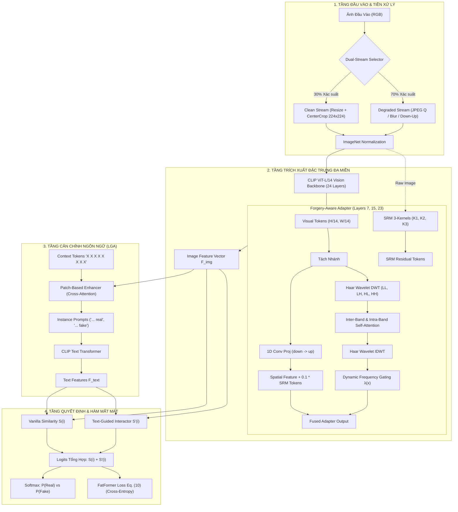
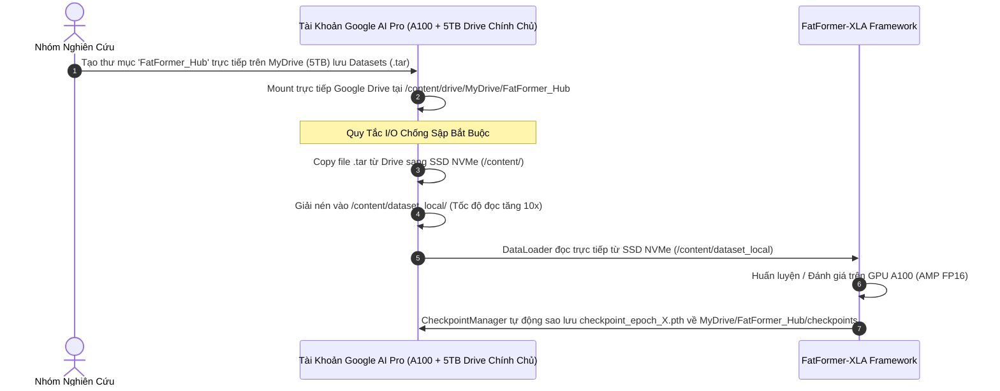

# BẢN THIẾT KẾ KIẾN TRÚC & TỔNG QUAN HỆ THỐNG DỰ ÁN FATFORMER-XLA
> **Đề tài**: Nâng cao Độ bền vững Pháp y (Forensic Robustness) cho Mô hình Phát hiện Ảnh Sinh bởi AI (Synthetic Image Detection) trước Biến dạng Mạng xã hội.  
> **Kiến trúc cải tiến**: **FatFormer + SRM 3-Kernels + Dynamic Frequency Gating $\lambda(x)$ + Dual-Stream Augmentation** (Phương án 2).  
> **Hạ tầng triển khai**: Tài khoản Google AI Pro (GPU A100 SXM4 / L4, 5TB Google Drive trực tiếp và các đặc quyền AI) - Kiến trúc Hợp Nhất (Unified Super-Node).  
> **Nhân sự**: Nhóm 3 thành viên (Member A: Data/Infra, Member B: Architecture/Loss, Member C: Training/Eval).

---

## I. TẦM NHÌN, BỐI CẢNH & ĐỘT PHÁ KỸ THUẬT

### 1. Thách Thức Cốt Lõi (The Problem Statement)
Các mô hình phát hiện ảnh AI tiền nhiệm (bao gồm cả FatFormer gốc trong bài báo CVPR 2024) đạt độ chính xác rất cao ($\approx 95 - 98\%$) khi kiểm thử trên dữ liệu phòng thí nghiệm sạch (Clean Images). Tuy nhiên, khi ảnh bị tải lên và truyền tải qua các nền tảng mạng xã hội (Facebook, Instagram, Telegram, WeChat...):
* **Nén JPEG sâu ($Q \in \{30, 50, 70\}$)**: Cắt tỉa các hệ số tần số cao trong miền DCT.
* **Làm mờ (Gaussian Blur)**: Triệt tiêu các biên cạnh sắc nét và vi sai điểm ảnh lân cận.
* **Thu phóng (Down-Up Resize)**: Phá vỡ cấu trúc lưới nội suy đặc trưng của bộ sinh GAN/Diffusion.

> [!CAUTION]
> **Tử huyệt của FatFormer gốc**: Nhánh tần số của Forgery-Aware Adapter (FAA) sử dụng biến đổi sóng Wavelet (Haar DWT) bị phụ thuộc lớn vào dải tần số cao. Khi gặp nén JPEG $Q \le 50$, các đặc trưng tần số bị biến tính thành nhiễu khối (blocking artifacts), khiến độ chính xác trung bình (mAP) tụt giảm thảm hại từ **>95% xuống dưới 60%**!

### 2. Giải Pháp Đột Phá (The Proposed Innovations - Phương Án 2)
Dự án thực hiện 3 cải tiến kiến trúc mang tính thực chiến cao:
1. **Khối Lọc Vết Dư Không Gian SRM (`SpatialResidualBlock`)**: Tích hợp 3 bộ lọc vi sai pháp y kinh điển (Bậc 1, Bậc 2 Laplacian, Square $5 \times 5$) với trọng số cố định, triệt tiêu hoàn toàn nội dung ngữ nghĩa (màu sắc, vật thể), chỉ trích xuất vết nhiễu nội suy vi mô.
2. **Cổng Tần Số Thích Ứng Động (`DynamicFrequencyGating` $\lambda(x)$)**: Một mạng con trọng lượng nhẹ tự động ước lượng chất lượng ảnh. Khi ảnh sạch, cổng mở $\lambda(x) \approx 1.5$ để khai thác dải tần DWT; khi ảnh bị nén sâu/mờ, cổng tự động đóng $\lambda(x) \rightarrow 0.05$, ngăn "nhiễu độc" xâm nhập mô hình và dồn trọng số sang vết dư SRM.
3. **Pipeline Huấn Luyện Kép (`DualStreamRobustAugmentation`)**: Trong mỗi batch huấn luyện, 30% mẫu giữ nguyên bản (Clean Stream) và 70% mẫu chịu suy thoái ngẫu nhiên (JPEG, Blur, Down-Up) để rèn luyện khả năng thích ứng toàn diện.

---

## II. BẢN ĐỒ CẤU TRÚC TOÀN BỘ DỰ ÁN (MASTER REPOSITORY TAXONOMY)

Toàn bộ workspace được tổ chức theo tiêu chuẩn công nghiệp hiện đại, tách bạch tuyệt đối giữa mã nguồn gốc của tác giả (làm mốc đối chứng) và hệ thống module hóa mới xây dựng dưới [`src/`](file:///d:/GIT%20REPO/.nam4/fatformer-xla/src):

```
d:\GIT REPO\.nam4\fatformer-xla\
├── ViT-L-14.pt                           # Trọng số OpenAI CLIP Backbone (933 MB - Gitignored)
├── fatformer_4class_ckpt.pth             # Checkpoint tác giả FatFormer (1.97 GB - Gitignored)
│
├── FatFormer-main/                       # MÃ NGUỒN GỐC CỦA TÁC GIẢ (Giữ nguyên 100% làm đối chứng)
│   ├── models/                           # Code tác giả (chứa lỗi chính tả patch_basaed_enhancer)
│   ├── utils/                            # dataset.py, misc.py
│   ├── main.py                           # Chỉ có chế độ --eval, phụ thuộc DDP torchrun
│   └── README.md                         # Hướng dẫn gốc của tác giả
│
├── src/                                  # HỆ THỐNG MÃ NGUỒN MỚI CHUẨN HÓA (Phương Án 1A)
│   ├── __init__.py                       # Package root
│   ├── main.py                           # CLI hợp nhất: Hỗ trợ cả --train & --eval trên Single-GPU A100
│   │
│   ├── models/                           # KIẾN TRÚC MÔ HÌNH NÂNG CẤP
│   │   ├── __init__.py                   # Factory build_model(args)
│   │   ├── clip_models.py                # FatFormer CLIPModel (LGA + S(i) + S'(i) contrastive)
│   │   ├── srm.py                        # SpatialResidualBlock (SRM 3-Kernels vi sai)
│   │   ├── gating.py                     # DynamicFrequencyGating (Cổng lambda(x) in [0.0, 2.0])
│   │   └── clip/                         # Backbone CLIP tùy biến
│   │       ├── clip.py                   # PyTorch 2.6+ safe loader (tự động dò tìm ViT-L-14.pt)
│   │       ├── model.py                  # FAA + Haar Wavelet thuần PyTorch (0 external dependency)
│   │       ├── simple_tokenizer.py       # CLIP Tokenizer có cơ chế graceful fallback ftfy
│   │       └── bpe_simple_vocab_16e6.txt.gz # Từ điển BPE chuẩn
│   │
│   ├── datasets/                         # DỮ LIỆU & PIPELINE TĂNG CƯỜNG
│   │   ├── __init__.py
│   │   ├── transforms.py                 # DualStreamRobustAugmentation + Degraded test transforms
│   │   └── dataset.py                    # DatasetCreator hỗ trợ 18 tập test GANs/Diffusion & Subsampling
│   │
│   ├── evaluation/                       # ĐÁNH GIÁ & BENCHMARK
│   │   ├── __init__.py
│   │   ├── metrics.py                    # Tính toán ACC, AP, Real ACC, Fake ACC, Mean
│   │   └── fast_eval.py                  # Chế độ Fast-Eval (500 ảnh/subset trong ~8 phút)
│   │
│   └── training/                         # HUẤN LUYỆN & QUẢN LÝ CHECKPOINT
│       ├── __init__.py
│       ├── loss.py                       # FatFormer Cross-Entropy Loss (Eq. 10) + Label Smoothing
│       ├── checkpoint_manager.py         # Tự động sao lưu và khôi phục từ Google Drive 5TB
│       └── trainer.py                    # Vòng lặp huấn luyện AMP FP16 + Gradient Accumulation
│
├── tools/                                # CÔNG CỤ PHÂN TÍCH & KIỂM THỬ
│   ├── check_weights.py                  # Rà soát cấu trúc 1.116 tensor của checkpoint
│   └── test_src_load.py                  # Smoke test: Xác thực nạp mô hình & forward pass (PASSED 100%)
│
├── notebooks/                            # THỰC THI TRÊN GOOGLE COLAB
│   └── README.md                         # Hướng dẫn thiết lập môi trường Colab Pro A100 trong 1 cell
│
├── configs/                              # Cấu hình huấn luyện và thử nghiệm
│
└── docs/                                 # HỆ THỐNG TÀI LIỆU DỰ ÁN
    ├── overall/                          # TÀI LIỆU TỔNG QUAN TOÀN DIỆN (Thư mục hiện tại)
    │   ├── tong_quan_du_an.md            # Bản thiết kế kiến trúc tổng thể (File này)
    │   └── README.md                     # File chuyển hướng chuẩn GitHub
    │
    ├── plan/                             # KẾ HOẠCH TỔNG THỂ
    │   └── ke_hoach.md                   # Kế hoạch tổng lực 5 tuần phân công 3 thành viên
    │
    ├── tasks/                            # NHIỆM VỤ CHI TIẾT THEO TỪNG THÀNH VIÊN
    │   ├── member_a_data_infra/          # 4 Tasks chi tiết cho Thành viên A (Data & Drive)
    │   ├── member_b_architecture_loss/   # 6 Tasks chi tiết cho Thành viên B (Model, SRM, Loss)
    │   └── member_c_training_eval/       # 10 Tasks chi tiết cho Thành viên C (Colab, Eval, CAM)
    │
    ├── paper_analysis/                   # TÀI LIỆU NGHIÊN CỨU SÂU BÀI BÁO
    │   ├── fatformer_author_monograph.md # Chuyên khảo 90KB phân tích từng dòng code tác giả
    │   ├── checkpoint_inspection_report.md# Báo cáo kiểm định 1.116 tensor
    │   └── dataset_benchmark_evaluation.md# Đặc tả 18 tập test GANs + Diffusion
    │
    └── sources/                          # Nguồn gốc bài báo gốc
        └── arXiv-2312.16649v1/           # Mã nguồn LaTeX bài báo FatFormer
```

---

## III. SƠ ĐỒ LUỒNG DỮ LIỆU & KIẾN TRÚC PIPELINE (END-TO-END DATAFLOW)

Hệ thống hoạt động dựa trên sự phối hợp nhịp nhàng giữa tầng dữ liệu, tầng trích xuất đặc trưng đa miền và tầng căn chỉnh ngôn ngữ:



---

## IV. KIẾN TRÚC VẬN HÀNH HẠ TẦNG (TÀI KHOẢN GOOGLE AI PRO 5TB)

Dự án áp dụng mô hình **Hạ Tầng Hợp Nhất (Unified Super-Node)** nhằm tối ưu hóa toàn diện I/O và đơn giản hóa quản trị tài nguyên:



---

## V. MA TRẬN PHÂN VAI & PHỐI HỢP KỸ THUẬT (3 THÀNH VIÊN)

| Thành viên | Trụ cột kỹ thuật | Phạm vi mã nguồn phụ trách | Sản phẩm bàn giao chính (Deliverables) |
| :--- | :--- | :--- | :--- |
| **Thành viên A**<br>*(Data & Infra Lead)* | **Hạ tầng Drive, Dữ liệu & Data Augmentation** | • [`src/datasets/transforms.py`](file:///d:/GIT%20REPO/.nam4/fatformer-xla/src/datasets/transforms.py)<br>• [`src/datasets/dataset.py`](file:///d:/GIT%20REPO/.nam4/fatformer-xla/src/datasets/dataset.py)<br>• Scripts đóng gói dữ liệu `.tar` | • Cấu trúc thư mục Drive 5TB chuẩn hóa.<br>• Bộ dữ liệu suy thoái test nén ($Q \in \{30, 50, 70\}$).<br>• Pipeline tăng cường Dual-Stream hoạt động 0 nghẽn I/O. |
| **Thành viên B**<br>*(Architecture & Loss Lead)* | **Kiến trúc Mô hình, SRM, Gating & XAI** | • [`src/models/srm.py`](file:///d:/GIT%20REPO/.nam4/fatformer-xla/src/models/srm.py)<br>• [`src/models/gating.py`](file:///d:/GIT%20REPO/.nam4/fatformer-xla/src/models/gating.py)<br>• [`src/training/loss.py`](file:///d:/GIT%20REPO/.nam4/fatformer-xla/src/training/loss.py)<br>• Trực quan hóa Grad-CAM | • Khối SRM 3 bộ lọc vi sai hoạt động ổn định.<br>• Cổng $\lambda(x)$ điều tiết mượt mà theo mức nhiễu.<br>• Bộ ảnh trực quan hóa Grad-CAM chứng minh tính giải thích được (XAI). |
| **Thành viên C**<br>*(Training & Eval Lead)* | **Thực thi Colab A100, Benchmark & Báo Cáo** | • [`src/evaluation/fast_eval.py`](file:///d:/GIT%20REPO/.nam4/fatformer-xla/src/evaluation/fast_eval.py)<br>• [`src/training/trainer.py`](file:///d:/GIT%20REPO/.nam4/fatformer-xla/src/training/trainer.py)<br>• [`notebooks/README.md`](file:///d:/GIT%20REPO/.nam4/fatformer-xla/notebooks/README.md) | • Bảng số liệu đối chứng Baseline Clean vs Degraded.<br>• Checkpoint fine-tuned cải tiến đạt mục tiêu đề tài.<br>• Báo cáo kỹ thuật tổng kết và Slide thuyết trình. |

---

## VI. SỔ TAY QUY CHUẨN VẬNG HÀNH & KỸ THUẬT VÀNG (ENGINEERING RULES)

> [!IMPORTANT]
> **5 NGUYÊN TẮC KỸ THUẬT BẤT DI BẤT DỊCH CỦA DỰ ÁN:**
> 1. **Bảo tồn Lỗi Chính Tả Bắt Buộc**: Biến `self.patch_basaed_enhancer` trong [`src/models/clip_models.py`](file:///d:/GIT%20REPO/.nam4/fatformer-xla/src/models/clip_models.py) **tuyệt đối không được sửa** thành `patch_based_enhancer` để tránh lỗi `Missing key` khi nạp checkpoint tác giả.
> 2. **Số Lượng Adapter Chuẩn**: Cấu hình `--num_vit_adapter 3` (tương ứng các lớp 7, 15, 23 của ViT-L/14) là cấu hình duy nhất khớp 100% với checkpoint `fatformer_4class_ckpt.pth`.
> 3. **Chuẩn Hóa Hình Ảnh**: Sử dụng Mean và Std của ImageNet `[0.485, 0.456, 0.406]` và `[0.229, 0.224, 0.225]`, **không dùng** bộ chuẩn hóa mặc định của OpenAI CLIP.
> 4. **An Toàn Git**: Tuyệt đối không commit file `.pt`, `.pth` hay thư mục `checkpoints/`. Mọi checkpoint lớn chỉ lưu trữ trên Google Drive 5TB hoặc lưu local.
> 5. **Quy Tắc I/O Colab**: Tuyệt đối không để DataLoader đọc trực tiếp từ Drive mount; luôn copy file `.tar` vào `/content/` và giải nén trước khi chạy.

---

## VII. CHEAT-SHEET CÁC LỆNH THỰC THI CHUẨN

```bash
# 1. Kiểm thử tính toàn vẹn (Smoke Test nạp 1.116 tensors & forward pass)
python tools/test_src_load.py

# 2. Chạy đánh giá nhanh Baseline Clean (500 ảnh/subset trong ~8 phút)
python -m src.main --eval --fast_eval --max_samples 500 \
    --pretrained_model "fatformer_4class_ckpt.pth" \
    --dataset_path "./dataset"

# 3. Chạy đánh giá suy thoái nén JPEG Q=50 (Chứng minh sụt giảm hiệu năng)
python -m src.main --eval --fast_eval --max_samples 500 \
    --pretrained_model "fatformer_4class_ckpt.pth" \
    --dataset_path "./dataset" \
    --degradation_type "jpeg" --jpeg_quality 50

# 4. Huấn luyện Fine-Tuning cải tiến (SRM 3-Kernels + Dynamic Gating + Dual-Stream)
python -m src.main --train --epochs 20 --lr 4e-4 --batchsize 64 \
    --use_srm --use_gating \
    --pretrained_model "fatformer_4class_ckpt.pth" \
    --dataset_path "./dataset" \
    --checkpoint_dir "checkpoints" \
    --drive_backup_dir "/content/drive/MyDrive/FatFormer_Hub/checkpoints"
```
