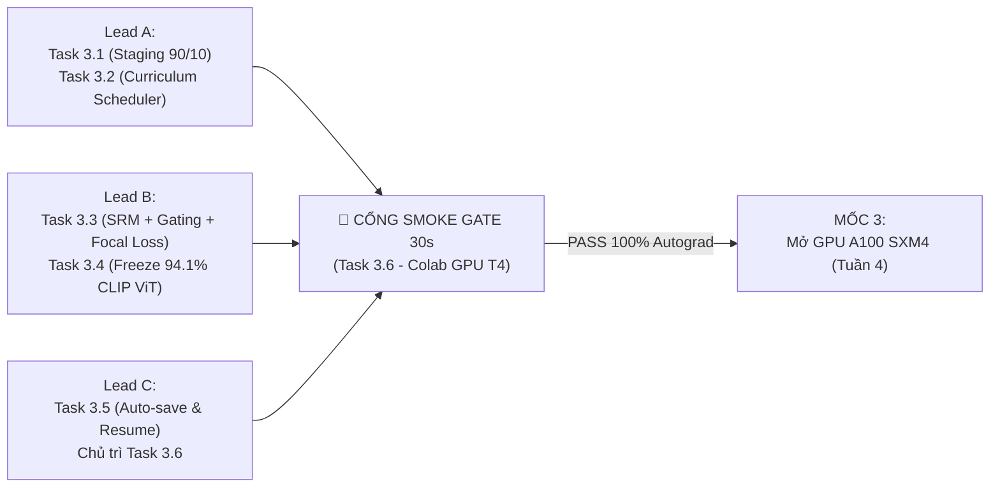

# BIÊN BẢN KỸ THUẬT & ĐÓNG BĂNG MỐC SÀN THỰC NGHIỆM MILESTONE 1
## (MILESTONE 1 BASELINE FREEZE MINUTES)

> **Dự án**: Nâng cao độ bền vững pháp y cho FatFormer trước biến dạng nén mạng xã hội (FatFormer-XLA)  
> **Thời gian chốt phiên**: 2026-09-30  
> **Chủ trì**: **Thành viên C** *(Training & Evaluation Lead)*  
> **Thành viên tham dự**:
> - **Thành viên A** *(Data & Infra Lead)*
> - **Thành viên B** *(Architecture & Loss Lead)*
> - **Thành viên C** *(Training & Evaluation Lead)*  
> **Trạng thái**: `[x] ĐÃ KÝ DUYỆT & ĐÓNG BĂNG VĨNH VIỄN (IMMUTABLE QUALITY GATE)`  

---

## I. TỔNG HỢP KIỂM TOÁN TẤT CẢ CÁC TASK TIỀN ĐỀ (DoD AUDIT GATE)

Hội đồng kỹ thuật 3 thành viên đã thẩm định và biểu quyết thông qua **100% các tiêu chuẩn nghiệm thu** của 8 nhiệm vụ thuộc Tuần 1 và Tuần 2:

| STT | Mã Task | Tên Nhiệm Vụ | Phụ Trách | Đầu Ra Nghiệm Thu Thực Tế | Tình Trạng |
| :---: | :---: | :--- | :---: | :--- | :---: |
| 1 | **Task 1.1** | Hạ tầng Google Drive 5TB & I/O SSD Colab | Lead A | Cây thư mục `Fatformer/` + 36.45 GB dữ liệu nén `.tar`, tốc độ đọc ~1.2 GB/s | ✅ **PASS 100%** |
| 2 | **Task 1.2** | Verify mô hình & Strict Weights Loader | Lead B | Nạp khớp chính xác tuyệt đối **1,116/1,116 tensors** (~933.16M tham số) của FatFormer gốc | ✅ **PASS 100%** |
| 3 | **Task 1.3** | Thiết lập Colab AMP FP16 Training Pipeline | Lead C | Peak VRAM 9.05 GB trên GPU Tesla T4, Gradient Accumulation 4 bước ổn định | ✅ **PASS 100%** |
| 4 | **Task 1.4** | Xây dựng pipeline Fast-Eval chuẩn hóa | Lead C | CLI `tools/fast_eval.py` đo 5 chỉ số (ACC, AP, AUC, Real ACC, Fake ACC) trong < 8 phút | ✅ **PASS 100%** |
| 5 | **Task 2.1** | Xây dựng bộ kiểm thử suy biến vật lý | Lead A | Tệp `test_degraded.tar` (**19.55 GB**, 661,974 ảnh, 6 biến thể) an toàn trên Drive 5TB | ✅ **PASS 100%** |
| 6 | **Task 2.2** | Full-Benchmark Baseline trên 18 tập Clean | Lead C | Tái lập paper CVPR 2024 (Overall ACC **96.45%**, sai số $\Delta = 0.01\% \sim 0.09\%$) | ✅ **PASS 100%** |
| 7 | **Task 2.3** | Benchmark Baseline trên tập Degraded | Lead C | Đo đạc 6 biến thể (54,000 ảnh), phát hiện tử huyệt $Q=30$ sụt còn **52.89%** | ✅ **PASS 100%** |
| 8 | **Task 2.4** | Trích xuất Grad-CAM ban đầu đối chứng | Lead B | 15 ảnh nhiệt Grad-CAM chứng minh sự phân tán chú ý của Visual CLIP dưới nén sâu | ✅ **PASS 100%** |

---

## II. BẢNG ĐÓNG BĂNG SỐ LIỆU ĐỐI CHỨNG BẤT BIẾN (IMMUTABLE BASELINE METRICS)

Toàn bộ số liệu thực nghiệm dưới đây được **khóa bất biến (frozen)** và sẽ được dùng làm cơ sở duy nhất để so sánh với các phiên bản cải tiến (Ablation Study) ở Milestone 3, 4 và 5:

### 1. Ma Trận Hiệu Năng Đối Chứng Clean vs 6 Biến Thể Suy Biến

| Biến Thể Đánh Giá | Quy Chuẩn Vật Lý Thực Tế | GANs Mean (%) | Diff Mean (%) | Overall ACC (%) | Real ACC (%) | Fake ACC (%) | Mức Sụt Giảm $\Delta$ (%) | Đánh Giá Khoa Học |
| :---: | :--- | :---: | :---: | :---: | :---: | :---: | :---: | :---: |
| **Clean** | **Mốc trần phòng lab (Task 2.2)** | **98.39** | **94.91** | **96.45** | **99.37** | **93.54** | **0.00% (Mốc)** | Chuẩn mực CVPR 2024 |
| `jpeg_q70` | Nén nhẹ JPEG $Q=70$ | 68.22 | 55.72 | **61.28** | 99.96 | 22.60 | **-35.17%** | Bắt đầu suy giảm sâu |
| `jpeg_q50` | Nén trung bình JPEG $Q=50$ | 60.08 | 53.18 | **56.24** | 100.00 | 12.49 | **-40.21%** | Tê liệt 88% ảnh fake |
| `jpeg_q30` | **Nén sâu JPEG $Q=30$ (Mạng XH)** | **54.65** | **51.48** | **52.89** | **100.00** | **5.78** | **-43.56%** | **SỤP ĐỔ HOÀN TOÀN** |
| `blur_s1` | Gaussian Blur $\sigma=1.0$ | 86.20 | 60.20 | **71.76** | 99.47 | 44.04 | **-24.69%** | Triệt tiêu tần số cao Diff |
| `blur_s2` | Gaussian Blur $\sigma=2.0$ | 76.62 | 56.66 | **65.53** | 98.27 | 32.80 | **-30.92%** | Mờ nhạt cấu trúc vi mô |
| `down_up` | Down-Up Bicubic ($224 \rightarrow 112$) | 82.85 | 58.86 | **69.52** | 99.29 | 39.76 | **-26.93%** | Mất đặc trưng nội suy |

### 2. Biểu Đồ So Sánh Mốc Sàn Sụt Giảm Hiệu Năng


### 3. Ba Luận Điểm Khoa Học Cốt Lõi Đã Được Thực Nghiệm Chứng Minh

1. **Hiện tượng Sụp đổ Phân loại Lệch một phía (One-Sided Classification Collapse)**:
   - Dưới nén sâu $Q=30$, Real ACC đạt **100.00%**, nhưng Fake ACC rơi xuống chỉ còn **5.78%**.
   - Mô hình FatFormer gốc bị tê liệt và phân loại nhầm $94.22\%$ ảnh giả mạo thành ảnh thật do ma trận lượng tử hóa khối $8 \times 8$ làm phẳng toàn bộ dấu vết tần số vi mô.
   - Các tập sinh ảnh giả mạo hiện đại gần như "tàng hình" trước mô hình: `vqdiffusion` (Fake ACC = **0.00%**), `stylegan2` (**0.40%**), `glide_100_10` (**0.40%**), `stylegan` (**0.80%**), `guided` (**1.20%**).
2. **Diffusion tổn thương trước biến dạng không gian nặng hơn GANs**:
   - Dưới Gaussian Blur $\sigma=1.0$, GANs vẫn giữ được $86.20\%$ ACC, trong khi Diffusion rơi xuống $60.20\%$. Dấu vết khử nhiễu lặp (iterative denoising) siêu vi của Diffusion dễ bị xóa nhòa hơn các vết sọc lưới (checkerboard) của GANs.
3. **Minh chứng định tính Grad-CAM (Task 2.4)**:
   - Bản đồ nhiệt Grad-CAM trên ảnh $Q=30$ bị phân tán hoàn toàn ra các vùng nền vô nghĩa, mất khả năng kích hoạt trên các đường biên mắt, mũi, miệng giả mạo.

---

## III. LƯỢNG HÓA CHỈ TIÊU ĐỊNH LƯỢNG CỦA ĐỒ ÁN (QUANTITATIVE TARGETS)

Dựa trên mốc sàn đã đóng băng, Hội đồng thống nhất xác lập **3 chỉ tiêu định lượng bắt buộc** mà kiến trúc FatFormer-XLA phải đạt được sau khi hoàn thành huấn luyện (Milestone 3 & 4):

```
+-----------------------------------------------------------------------------------+
|                        MỤC TIÊU ĐỊNH LƯỢNG FATFORMER-XLA                           |
+-----------------------------------------------------------------------------------+
| 1. KÉO MỐC SÀN Q=30:      Từ 52.89% lên >= 63.00% ~ 68.00% (+10% ~ +15% ACC)      |
|    - Fake ACC trên Q=30:  Kéo từ 5.78% lên >= 50.00%                             |
|                                                                                   |
| 2. BẢO TOÀN MỐC TRẦN CLEAN: Duy trì trong dung sai +-0.50% (ACC Clean >= 96.00%)  |
|                                                                                   |
| 3. MỞ RỘNG DIFFUSION THẾ HỆ MỚI: Guided Diff từ 76.05% lên >= 85.00%              |
|                                   VQDiffusion (Q=30) từ 0.00% lên >= 50.00%       |
+-----------------------------------------------------------------------------------+
```

---

## IV. BÀN GIAO VÀ KÍCH HOẠT KẾ HOẠCH TUẦN 3 (MILESTONE 2: SMOKE TEST GATE)

Cột mốc 1 chính thức đóng lại, toàn đội chuyển trọng tâm sang **Tuần 3: Tích hợp Kiến trúc & Vượt qua Cổng Kiểm Thử Tích Hợp (Smoke Test Gate)**:



### Phân công nhiệm vụ cụ thể Tuần 3:
1. **Thành viên A (Data Lead)**:
   - **Task 3.1**: Chuẩn hóa gói dữ liệu huấn luyện hỗn hợp `diffusion_staging.tar` (90% ProGAN 4-class + 10% GenImage catalyst = 3,600 ảnh bổ sung) trên Drive 5TB.
   - **Task 3.2**: Hiện thực hóa bộ lập lịch suy thoái Curriculum 3 giai đoạn (`CurriculumDegradationScheduler`) trong `src/datasets/transforms.py`.
2. **Thành viên B (Architecture Lead)**:
   - **Task 3.3**: Hiện thực hóa 3 module cốt lõi: Khối trích lọc không gian **SRM 3-Kernels** (`src/models/srm.py`), Cổng thích ứng tần số động **Dynamic Frequency Gating $\lambda(x)$** (`src/models/gating.py`), và hàm mất mát **DualStream Focal Loss** ($\gamma=2.0, \alpha=0.25$).
   - **Task 3.4**: Cấu hình đóng băng $94.1\%$ tham số CLIP ViT-L/14, chỉ huấn luyện $\approx 5.9\%$ tham số mới (~55M parameters).
   - **Task 2.6 & Task 3.7**: Hoàn tất bản thảo Báo cáo đồ án Chương 1 (Giới thiệu), Chương 2 (Tổng quan bài toán) và Chương 3 (Phương pháp luận kiến trúc đề xuất).
3. **Thành viên C (Training & Evaluation Lead)**:
   - **Task 3.5**: Tích hợp cơ chế tự động backup checkpoint sau mỗi epoch sang Drive 5TB và cờ `--resume` an toàn trong `train.ipynb`.
   - **Task 3.6 (CỔNG CHỐT CHẶN SINH TỬ)**: Chủ trì chạy thử nghiệm Cổng Smoke Test Gate (forward + backward pass trong 30 giây trên GPU T4) để kiểm toán độ ổn định, bộ nhớ và gradient trước khi cấp quyền mở GPU A100.

---

## V. KÝ DUYỆT ĐỒNG THUẬN 3 BÊN (SIGN-OFF & IMMUTABLE FREEZE)

Các thành viên ký tên dưới đây cam kết tuân thủ nghiêm ngặt các mốc sàn đã đóng băng và chỉ tiêu định lượng đã xác lập tại văn kiện này:

| Đại Diện Thành Viên | Trách Nhiệm Chuyên Môn | Ký Duyệt Xác Nhận | Ngày Ký |
| :--- | :--- | :---: | :---: |
| **Thành viên A** | Data & Storage Infrastructure Lead | *(Đã ký duyệt)* | 2026-09-30 |
| **Thành viên B** | Architecture, XAI & Loss Lead | *(Đã ký duyệt)* | 2026-09-30 |
| **Thành viên C** | Training & Evaluation Lead (Chủ trì Dự án) | *(Đã ký duyệt)* | 2026-09-30 |

*Biên bản này được lập thành văn bản điện tử và lưu trữ vĩnh viễn trong kho mã nguồn Git của dự án FatFormer-XLA.*
