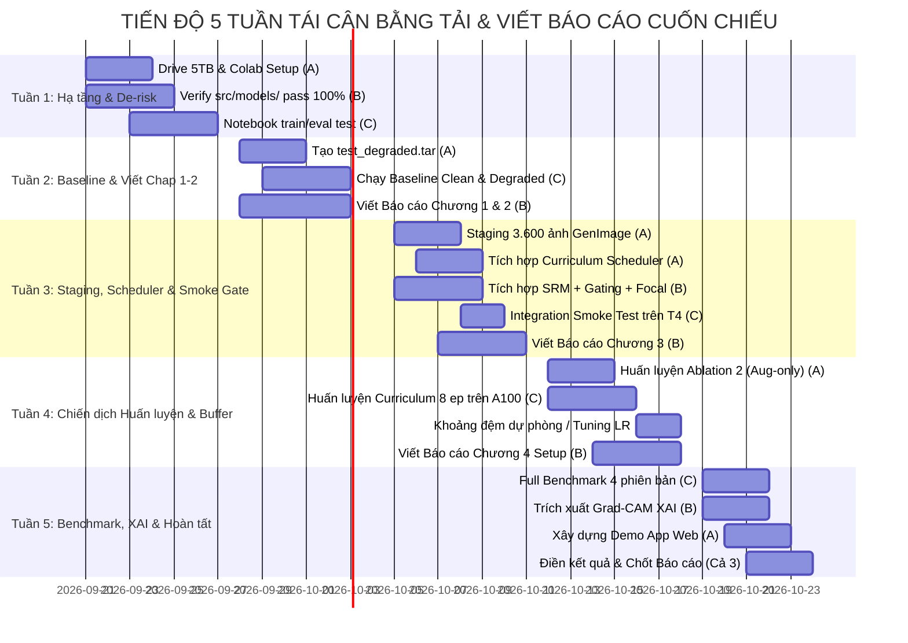

# KẾ HOẠCH TRIỂN KHAI ĐỒ ÁN: TỐI ƯU HÓA ĐỘ BỀN VỮNG PHÁP Y CHO FATFORMER TRÊN GOOGLE COLAB PRO
> **Đề tài**: Nâng cao độ bền phát hiện ảnh AI (Generalizable Synthetic Image Detection) trước biến dạng nén mạng xã hội (JPEG, Blur) và mở rộng nhận diện mô hình Diffusion thế hệ mới.  
> **Kiến trúc & Pipeline đề xuất**: **FatFormer-XLA Unified Robustness Pipeline** (Hợp nhất Chiến lược 1 + 2 + 3: Tầng kiến trúc SRM 3-Kernels + Cổng tần số thích ứng $\lambda(x)$; Tầng lập lịch suy thoái Curriculum Learning 3 giai đoạn theo epoch; Tầng dữ liệu xúc tác 90/10 & Hàm mục tiêu Dual-Stream Focal Loss).  
> **Hạ tầng thực thi**: Google Colab Pro (GPU A100 / T4, 300 Compute Units) kết hợp Google Drive 5TB nhóm (Phương án A - Shared Shortcut).  
> **Nhân sự**: Nhóm 3 thành viên (Lead A, Lead B, Lead C).  
> **Thời gian thực hiện**: 5 tuần (áp dụng mô hình viết báo cáo cuốn chiếu và khoảng đệm dự phòng).

---

## I. PHÂN CÔNG VAI TRÒ & TÁI CÂN BẰNG TẢI LAO ĐỘNG (BALANCED ROLES)

Để triệt tiêu hiện tượng "đường găng đơn độc" (*Single Point of Bottleneck*) lên Thành viên B, khối lượng công việc được tái cân bằng đồng đều giữa 3 thành viên từ Tuần 1 đến Tuần 5:

| Thành viên | Trụ cột kỹ thuật chính | Trách nhiệm cốt lõi | Phân bổ tải qua các tuần | Tiêu chí bàn giao (Deliverables) |
| :--- | :--- | :--- | :---: | :--- |
| **Thành viên A**<br>*(Data & Infra Lead)* | **Hạ tầng I/O, Dữ liệu, Lập lịch Suy thoái & Huấn luyện Ablation** | • Cấu hình Drive 5TB sang Colab Pro, giải nén SSD NVMe.<br>• Chuẩn hóa tập ProGAN 4-class (`car, cat, chair, horse`) và 3.600 ảnh GenImage (SD v1.5 + Midjourney) làm chất xúc tác 10% (S3).<br>• Xây dựng bộ lập lịch `CurriculumDegradationScheduler` 3 giai đoạn theo epoch trong `datasets/transforms.py` (S2).<br>• Tạo bộ test Degraded ($Q=30, 50, 70$).<br>• **Đảm nhận chạy huấn luyện Checkpoint Ablation 2 (Chỉ Augmentation tĩnh, không SRM/Gating, CE Loss)** ở Tuần 4.<br>• Phụ trách phát triển Demo App giao diện web (`inference_demo.py`) ở Tuần 5. | **Đều đặn**<br>(Tuần 1: Hạ tầng<br>Tuần 2: Data test<br>Tuần 3: Staging & Scheduler<br>Tuần 4: Train Ablation<br>Tuần 5: Demo App) | • Dữ liệu nén `.tar` chuẩn hóa trên Drive.<br>• Module `datasets/transforms.py` tích hợp `CurriculumDegradationScheduler`.<br>• Checkpoint `fatformer_aug_only.pth`.<br>• Ứng dụng Demo suy luận trực quan. |
| **Thành viên B**<br>*(Architecture & Loss Lead)* | **Kiến trúc Mô hình, SRM 3-Kernels, Cổng Gating $\lambda(x)$ & Focal Loss** | • Thừa hưởng và hoàn thiện bộ mã nguồn `src/models/` (đã vượt qua Smoke Test 1.116 tensor để giảm áp lực Tuần 1).<br>• Kiểm soát khối `SpatialResidualBlock` (3 bộ lọc vi sai cố định) và cổng thích ứng $\lambda(x) \in [0.0, 2.0]$ (S1).<br>• Xây dựng và kiểm soát hàm mất mát thích ứng `DualStreamFocalLoss` ($\gamma=2.0, \alpha=0.25$) trên cả 2 nhánh Visual và Alignment (S3).<br>• Trích xuất Grad-CAM giải thích mô hình (XAI).<br>• **Chủ trì viết Chương 3 (Phương pháp luận & Kiến trúc đề xuất)** ở Tuần 3. | **Giảm tải đầu/cuối**<br>(Tuần 1: Verify model<br>Tuần 2: Draft Chap 1-2<br>Tuần 3: Tích hợp & Chap 3<br>Tuần 4: Co-train A100<br>Tuần 5: XAI Grad-CAM) | • Module `src/models/` và `src/training/loss.py`.<br>• Checkpoint `fatformer_srm_only.pth` (Ablation 3).<br>• Bộ 10 ảnh Grad-CAM độ phân giải cao.<br>• Bản thảo Chương 1, 2, 3 của Báo cáo. |
| **Thành viên C**<br>*(Training & Evaluation Lead)* | **Huấn luyện Colab Pro, Benchmark & Quản Trị Dự Án** | • Quản trị ngân sách 300 Compute Units, phân tầng phần cứng T4/A100.<br>• Chạy Fast-Eval (500 ảnh) và Full-Eval trên 18 tập test paper CVPR 2024.<br>• **Chủ trì chiến dịch huấn luyện 8 epoch mô hình chính trên GPU A100** theo đúng 3 giai đoạn Curriculum trên dữ liệu Staging 90/10 và Focal Loss (Tuần 4).<br>• Giám sát log, kiểm soát checkpoint backup tự động về Drive.<br>• Tổng hợp ma trận số liệu Báo cáo đồ án & Slide thuyết trình. | **Đều đặn**<br>(Tuần 1: Train script<br>Tuần 2: Baseline eval<br>Tuần 3: Smoke test T4<br>Tuần 4: Train chính A100<br>Tuần 5: Full Benchmark) | • Notebooks Colab (`train.ipynb`, `eval.ipynb`).<br>• Checkpoint `fatformer_srm_robust_final.pth`.<br>• Bảng số liệu Benchmark 4 phiên bản.<br>• Slide bảo vệ đồ án. |

---

## II. QUY CHUẨN KỸ THUẬT HẠ TẦNG (INFRASTRUCTURE & DRIVE PROTOCOL)

### 1. Cơ Chế Kết Nối 2 Tài Khoản (Phương Án A — Google Drive Shortcut)
* **Tài khoản A (Chính — 5TB Drive)**: Đóng vai trò **Data Hub & Model Registry**.
  1. Tạo thư mục gốc `FatFormer_Hub/`.
  2. Bấm **Chia sẻ (Share)** $\rightarrow$ Nhập email của Tài khoản Colab Pro $\rightarrow$ Phân quyền **Người chỉnh sửa (Editor)**.
* **Tài khoản B (Phụ — Colab Pro 300 CU + 15GB Drive)**: Đóng vai trò **Compute Engine**.
  1. Vào Google Drive của Tài khoản B $\rightarrow$ Chọn mục **"Được chia sẻ với tôi" (Shared with me)**.
  2. Click chuột phải vào `FatFormer_Hub` $\rightarrow$ Chọn **"Thêm lối tắt vào Drive" (Add shortcut to Drive)** $\rightarrow$ Lưu vào `MyDrive`.
  3. Trên Colab Pro:
     ```python
     from google.colab import drive
     drive.mount('/content/drive')
     DRIVE_DIR = "/content/drive/MyDrive/FatFormer_Hub"
     ```
* **Lợi ích cốt lõi**: Tiêu thụ **0 byte** trên tài khoản 15GB, tận dụng trọn vẹn dung lượng của tài khoản chính; đọc ghi checkpoint trực tiếp mượt mà.

### 2. Quy Tắc I/O Chống Nghẽn Bắt Buộc (SSD Local Extraction)
* **Tuyệt đối không** đọc từng ảnh trực tiếp từ đường dẫn `/content/drive/MyDrive/...` (gây nghẽn I/O và sập phiên Colab).
* **Quy trình chuẩn**:
  1. Dữ liệu trên Drive luôn được nén thành file `.tar` (ví dụ: `progan_train.tar`, `test_degraded.tar`, `diffusion_staging.tar`).
  2. Đầu notebook, script copy file `.tar` về `/content/` của máy ảo Colab:
     ```bash
     cp /content/drive/MyDrive/FatFormer_Hub/datasets/progan_train.tar /content/
     tar -xf /content/progan_train.tar -C /content/dataset_local/
     ```
  3. DataLoader chỉ đọc dữ liệu từ `/content/dataset_local/` (tốc độ SSD NVMe của Colab tăng gấp 10 lần).

---

## III. KIẾN TRÚC & CHIẾN LƯỢC HUẤN LUYỆN HỢP NHẤT: FATFORMER-XLA (S1 + S2 + S3)

Thay vì áp dụng rời rạc, nhóm xây dựng **FatFormer-XLA** như một pipeline hợp nhất chặt chẽ gồm 4 tầng kỹ thuật hỗ trợ và hoàn thiện lẫn nhau:

```
┌────────────────────────────────────────────────────────────────────────────────────────┐
│                        TẦNG 1: KIẾN TRÚC MÔ HÌNH (CHIẾN LƯỢC 1)                        │
│   Backbone CLIP ViT-L/14 (Frozen) + FAA Adapters + Spatial Residual SRM 3-Kernels      │
│   + Dynamic Frequency Gating λ(x) ∈ [0.0, 2.0] điều khiển hòa trộn không gian - tần số │
└───────────────────────────────────────────┬────────────────────────────────────────────┘
                                            │
┌───────────────────────────────────────────▼────────────────────────────────────────────┐
│                    TẦNG 2: BỘ LẬP LỊCH SUY THOÁI ĐỘNG (CHIẾN LƯỢC 2)                   │
│   CurriculumDegradationScheduler(epoch): 30% Clean + 70% Degraded                      │
│   • Epoch 1-2: Q ∈ [70, 90], σ ∈ [0.5, 1.0] (Ổn định, chống sốc gradient FAA)        │
│   • Epoch 3-5: Q ∈ [45, 70], σ ∈ [1.0, 1.5], Down-Up 224→160→224 (Chuyển tiếp Gating) │
│   • Epoch 6-8: Q ∈ [30, 50], σ ∈ [1.5, 2.0], Down-Up 224→112→224 (Thử thách khắc nghiệt)│
└───────────────────────────────────────────┬────────────────────────────────────────────┘
                                            │
┌───────────────────────────────────────────▼────────────────────────────────────────────┐
│                     TẦNG 3: PHÂN PHỐI DỮ LIỆU ĐA NGUỒN (CHIẾN LƯỢC 3)                  │
│   Data Staging: 90% ProGAN 4-class (car, cat, chair, horse) + 10% GenImage Catalyst   │
│   (3.600 ảnh: 1.200 SD v1.5 + 600 Midjourney v5 × Real/Fake) phá vỡ thiên lệch GAN    │
└───────────────────────────────────────────┬────────────────────────────────────────────┘
                                            │
┌───────────────────────────────────────────▼────────────────────────────────────────────┐
│                       TẦNG 4: HÀM MỤC TIÊU THÍCH ỨNG (CHIẾN LƯỢC 3)                    │
│   DualStreamFocalLoss(γ=2.0, α=0.25): L_total = L_Focal(Visual) + L_Focal(Alignment)   │
│   Triệt tiêu gradient mẫu GANs dễ (pt≈0.99), dồn lực kéo gradient vào mẫu khó nén sâu  │
└────────────────────────────────────────────────────────────────────────────────────────┘
```

### 1. Khối Lọc Vết Dư Không Gian SRM (`SpatialResidualBlock`)
Trước khi đưa đặc trưng vào nhánh tích chập của FAA, áp dụng 3 bộ lọc vi sai pháp y cố định (`requires_grad = False`):
* **Kernel 1 ($1^{st}$ order)**: Bắt vết nứt vi sai điểm ảnh liền kề do nội suy:
  $$K_1 = \begin{bmatrix} 0 & 0 & 0 \\ -1 & 1 & 0 \\ 0 & 0 & 0 \end{bmatrix}$$
* **Kernel 2 ($2^{nd}$ order - Laplacian)**: Bắt độ cong vi sai điểm ảnh:
  $$K_2 = \begin{bmatrix} 0 & -1 & 0 \\ -1 & 4 & -1 \\ 0 & -1 & 0 \end{bmatrix}$$
* **Kernel 3 (Square $5 \times 5$)**: Bắt vết nội suy song tuyến tính (Bilinear/Bicubic):
  $$K_3 = \frac{1}{12} \begin{bmatrix} -1 & 2 & -2 & 2 & -1 \\ 2 & -6 & 8 & -6 & 2 \\ -2 & 8 & -12 & 8 & -2 \\ 2 & -6 & 8 & -6 & 2 \\ -1 & 2 & -2 & 2 & -1 \end{bmatrix}$$
* *Tác dụng*: Triệt tiêu hoàn toàn thông tin ngữ nghĩa (màu sắc con người, cảnh vật), chỉ giữ lại dấu vết nhiễu vi mô của quá trình sinh ảnh.

### 2. Cổng Thích Ứng Tần Số Động (`DynamicFrequencyGating` $\lambda(x)$)
* Thay thế hệ số $\lambda$ cố định trong bài báo gốc bằng hàm thích ứng phụ thuộc mức suy biến ảnh:
  $$\lambda(x) = \text{Sigmoid}\Big(\mathbf{W}_2 \cdot \text{GELU}\big(\mathbf{W}_1 \cdot \text{GAP}(x) + \mathbf{b}_1\big) + b_2\Big) \times 2.0$$
* *Cơ chế hoạt động*:
  * **Ảnh sạch (Clean)**: Cổng giữ $\lambda(x) \approx 1.0 \sim 1.5$ (khai thác trọn vẹn dải tần DWT).
  * **Ảnh nén sâu ($Q \le 50$) hoặc mờ (Blur)**: Tần số cao bị phá hủy thành nhiễu khối, cổng tự động hạ $\lambda(x) \rightarrow 0.05 \sim 0.1$ (đóng cổng tần số, ngăn "nhiễu độc" xâm nhập mô hình, chuyển ưu tiên 95% sang nhánh không gian SRM).

### 3. Ma Trận Tương Tác Giữa Các Chiến Lược Trong Pipeline Hợp Nhất

| Thành phần Pipeline | Chiến lược 1 gốc quy định | Chiến lược 2 nâng cấp gì? | Chiến lược 3 nâng cấp gì? | Cấu hình FatFormer-XLA chốt thực hiện |
| :--- | :--- | :--- | :--- | :--- |
| **Kiến trúc mô hình** | FAA + SRM 3-Kernels + Gating $\lambda(x)$ | *Giữ nguyên* | *Giữ nguyên* | **FAA + SRM + Dynamic Gating $\lambda(x)$** |
| **Lập lịch suy thoái** | Lấy mẫu ngẫu nhiên rời rạc $Q \in \{30, 50, 70\}$ | Thay bằng **Curriculum 3 giai đoạn theo epoch** | *Giữ nguyên* | **`CurriculumDegradationScheduler`** (Epoch 1-2, 3-5, 6-8) |
| **Dữ liệu huấn luyện** | 100% ProGAN 4-class | *Giữ nguyên* | Thay bằng **90% ProGAN + 10% GenImage** | **Hỗn hợp Staging 90/10** (3.600 ảnh GenImage catalyst) |
| **Hàm mất mát** | Cross-Entropy 2 nhánh | *Giữ nguyên* | Thay bằng **Focal Loss 2 nhánh** ($\gamma=2.0$) | **`DualStreamFocalLoss`** ($\gamma=2.0, \alpha=0.25$) |

> **Cộng hưởng kỹ thuật**: Chiến lược 2 giải quyết trực tiếp nguy cơ sốc gradient ở epoch đầu của Chiến lược 1 khi tiếp xúc dải nén nặng. Chiến lược 3 cung cấp tín hiệu gradient tập trung vào mẫu khó và mở rộng biên quyết định sang miền Diffusion mà không phá hủy khả năng phát hiện GAN gốc.

---

## IV. LỘ TRÌNH 5 TUẦN CẢI TIẾN (5-WEEK RESILIENT SPRINT PLAN)

Lộ trình tích hợp **3 cơ chế giảm rủi ro**:
1. **Viết báo cáo cuốn chiếu (Progressive Paper Writing)**: Giảm tải 70% áp lực Tuần 5.
2. **Cổng kiểm thử an toàn (Pre-Training Integration Gate)**: Tránh đốt GPU A100 khi có lỗi tích hợp.
3. **Phân bổ Checkpoint Ablation sớm**: Tạo đủ 4 checkpoint đối chứng từ Tuần 4, không dồn việc sang Tuần 5.



---

### 🗓️ TUẦN 1: THIẾT LẬP HẠ TẦNG, VERIFY MÃ NGUỒN & PIPELINE DUMMY
*Mục tiêu: Kích hoạt hạ tầng kết nối Drive-Colab, xác nhận mã nguồn `src/` nạp khớp 100% weights (giải tỏa áp lực cho B).*

| Mã việc | Nhiệm vụ kỹ thuật | Người phụ trách | Sản phẩm bàn giao (Deliverables) |
| :---: | :--- | :---: | :--- |
| **1.1** | Thiết lập thư mục `FatFormer_Hub` trên Drive 5TB, chia sẻ shortcut sang tài khoản Colab Pro. Tạo Dummy Dataset (20 ảnh) để test code. | **A** | Thư mục Drive hoạt động, notebook `00_setup_env.ipynb`. |
| **1.2** | Kiểm chứng mã nguồn `src/models/` có sẵn (`fatformer.py`, `clip_models.py`, `srm.py`, `gating.py`), chạy `tools/test_src_load.py` pass 100% checkpoint gốc trên CPU/T4. | **B** | Báo cáo kiểm thử `test_src_load.py` pass `strict=True` 1.116 tensor. |
| **1.3** | Thiết lập notebook huấn luyện `train.ipynb` trên Colab Pro (GPU T4/A100) với AMP FP16 và Gradient Accumulation. Chạy thử 1 step dummy forward-backward. | **C** | Notebook `train.ipynb` chạy mượt mà, đo thời gian 1 step. |
| **1.4** | Xây dựng script `fast_eval.py`: Lấy ngẫu nhiên 500 ảnh/tập test để đánh giá nhanh trong < 8 phút trên GPU T4. | **C** | Script `fast_eval.py` kèm các hàm đo ACC, AP, AUC. |

---

### 🗓️ TUẦN 2: XÂY DỰNG BỘ TEST DEGRADED, THIẾT LẬP BASELINE & VIẾT CHƯƠNG 1-2
*Mục tiêu: Xác lập mốc sàn khoa học trước khi can thiệp mô hình; khởi động viết báo cáo từ sớm.*

| Mã việc | Nhiệm vụ kỹ thuật | Người phụ trách | Sản phẩm bàn giao (Deliverables) |
| :---: | :--- | :---: | :--- |
| **2.1** | Viết script `data/make_degraded.py` sinh 3 biến thể suy biến: (1) JPEG ($Q \in \{30, 50, 70\}$), (2) Gaussian Blur ($\sigma \in \{1.0, 2.0\}$), (3) Down-Up ($224 \rightarrow 112 \rightarrow 224$). Đóng gói thành `test_degraded.tar`. | **A** | Tệp dữ liệu kiểm thử suy biến chuẩn hóa trên Drive 5TB. |
| **2.2** | Chạy `fast_eval.py` và `full_eval.py` với Checkpoint gốc trên tập **Clean** (8 GANs + 10 Diffusion chuẩn paper). | **C** | Bảng số liệu Baseline Clean chuẩn xác (tái lập GANs $98.4\%$, Diffusion $95.0\%$, Guided Diff $76.1\%$). |
| **2.3** | Chạy benchmark Checkpoint gốc trên tập **Degraded** ($Q=30, 50, 70$). Ghi nhận mức độ sụt giảm hiệu năng mốc sàn của mô hình gốc. | **C** | Bảng số liệu Baseline Degraded (làm bằng chứng thực nghiệm cho tử huyệt nén). |
| **2.4** | Trích xuất Grad-CAM ban đầu trên 5 cặp ảnh Real/Fake ở cả hai trạng thái Clean và Degraded ($Q=30$). | **B** | Script `visualize_cam.py` + Bộ ảnh Grad-CAM đối chứng ban đầu. |
| **2.5** | **Họp nhóm Milestone 1**: Chốt bảng số liệu Baseline, chính thức lượng hóa chỉ tiêu cải thiện cho giai đoạn finetune. | **Cả 3** | Biên bản kỹ thuật Milestone 1. |
| **2.6** | **Khởi động viết Báo cáo**: Soạn thảo **Chương 1 (Giới thiệu bài toán & Động lực nghiên cứu)** và **Chương 2 (Các công trình liên quan - Related Work)**. | **B (+ C review)** | Bản thảo Chương 1 & Chương 2 (PDF/LaTeX). |

---

### 🗓️ TUẦN 3: DỮ LIỆU STAGING, CURRICULUM SCHEDULER, SRM + GATING + FOCAL LOSS & SMOKE TEST
*Mục tiêu: Đưa dữ liệu sinh hiện đại vào tập train, tích hợp bộ lập lịch Curriculum, hoàn thiện SRM + Gating + Dual-Stream Focal Loss và vượt qua cổng kiểm thử an toàn.*

| Mã việc | Nhiệm vụ kỹ thuật | Người phụ trách | Sản phẩm bàn giao (Deliverables) |
| :---: | :--- | :---: | :--- |
| **3.1** | Tải và trích xuất chuẩn hóa **3.600 ảnh GenImage** (1.200 SD v1.5 + 600 Midjourney v5 $\times$ Real/Fake) làm chất xúc tác $10\%$, kết hợp với ProGAN 4-class (`car, cat, chair, horse`) tạo tập train `diffusion_staging.tar`. | **A** | Bộ dữ liệu huấn luyện hỗn hợp chuẩn hóa trên Drive 5TB. |
| **3.2** | Xây dựng module `CurriculumDegradationScheduler` trong `src/datasets/transforms.py`: Phân bổ $30\%$ ảnh Clean, $70\%$ ảnh Degraded với tham số biến dạng thích ứng tự động theo `epoch` hiện tại:<br>• *Epoch 1–2 (Pha 1 - Ổn định)*: $Q \in [70, 90]$, $\sigma \in [0.5, 1.0]$, Không Down-Up.<br>• *Epoch 3–5 (Pha 2 - Chuyển tiếp)*: $Q \in [45, 70]$, $\sigma \in [1.0, 1.5]$, Down-Up $224 \rightarrow 160 \rightarrow 224$.<br>• *Epoch 6–8 (Pha 3 - Thử thách)*: $Q \in [30, 50]$, $\sigma \in [1.5, 2.0]$, Down-Up $224 \rightarrow 112 \rightarrow 224$. | **A** | Module `src/datasets/transforms.py` tích hợp `CurriculumDegradationScheduler` hoàn chỉnh. |
| **3.3** | Hoàn thiện module `SpatialResidualBlock`, `DynamicFrequencyGating` và `DualStreamFocalLoss` ($\gamma=2.0, \alpha=0.25$) trong `src/models/` và `src/training/loss.py`. Tính Focal Loss trên cả 2 nhánh (Visual FAA+SRM và Alignment LGA): $\mathcal{L}_{\text{total}} = \mathcal{L}_{\text{Focal}}(S(i), y) + \mathcal{L}_{\text{Focal}}(S'(i), y)$. | **B** | Kiến trúc và hàm mất mát hoàn thiện sẵn sàng nhận gradient. |
| **3.4** | Thiết lập cấu hình đóng băng 94.1% CLIP ViT-L/14, chỉ mở khóa 5.9% tham số (FAA, SRM projection, Gating, LGA). | **B** | File cấu hình `train_config.yaml`. |
| **3.5** | Thiết lập hook tự động lưu checkpoint `.pth` sau mỗi epoch về Drive 5TB và cơ chế `--resume` phòng ngừa Colab ngắt kết nối. | **C** | Checkpoint auto-saving pipeline hoàn thiện. |
| **3.6** | **CỔNG KIỂM THỬ TÍCH HỢP (Integration Smoke Test Gate)**: Chạy thử forward + backward pass trên 1 batch nhỏ (16 ảnh) trên **GPU T4 (30 giây)**. Bắt buộc pass 100% shape và autograd (loss giảm hợp lý) trước khi mở GPU A100. | **B + C** | Biên bản Smoke Test Pass (loại trừ 100% lỗi crash khi train thật). |
| **3.7** | **Viết Báo cáo**: Soạn thảo **Chương 3 (Phương pháp luận & Kiến trúc đề xuất FatFormer-XLA)**: công thức Haar Wavelet, SRM vi sai, Gating $\lambda(x)$, Bộ lập lịch Curriculum theo epoch và hàm Dual-Stream Focal Loss. | **B** | Bản thảo Chương 3 (kèm sơ đồ kiến trúc vector). |

---

### 🗓️ TUẦN 4: CHIẾN DỊCH HUẤN LUYỆN CURRICULUM (A100), ABLATION CHECKPOINTS (T4) & KHOẢNG ĐỆM
*Mục tiêu: Hoàn tất toàn bộ 8 epoch của mô hình chính theo 3 giai đoạn Curriculum cùng 4 checkpoint đối chứng của Ablation Study; có 2 ngày đệm dự phòng nếu cần tinh chỉnh tham số.*

| Mã việc | Nhiệm vụ kỹ thuật | Người phụ trách | Sản phẩm bàn giao (Deliverables) |
| :---: | :--- | :---: | :--- |
| **4.1** | **Huấn luyện Mô hình Chính - Giai đoạn 1 & 2 (Adaptation & Transition)**: Chạy 5 epoch đầu trên GPU A100 (~15–18 CUs). Batch size = 32, Accumulation = 2 (Effective = 64). LR adapter = $10^{-4}$, LR gating = $10^{-3}$.<br>• *Epoch 1–2*: Nén nhẹ $Q \in [70, 90]$, khởi tạo trọng số SRM & Gating êm đềm, không sốc gradient.<br>• *Epoch 3–5*: Nâng dải nén lên $Q \in [45, 70]$, Cổng $\lambda(x)$ học đóng dần nhánh DWT khi nhiễu khối xuất hiện.<br>Huấn luyện trên tập Staging 90/10 với `DualStreamFocalLoss`. | **C** | Checkpoint trung gian `fatformer_srm_phase2.pth` + Log Loss/Convergence. |
| **4.2** | **Huấn luyện Mô hình Chính - Giai đoạn 3 (Extreme Robustness Hardening)**: Chạy 3 epoch cuối (Epoch 6–8) trên A100 (~10–12 CUs). Áp dụng nén sâu ($Q \in [30, 50]$, Down-Up $224 \rightarrow 112 \rightarrow 224$), hạ LR xuống $5 \times 10^{-5}$ để tinh chỉnh mịn biểu diễn vi sai SRM. | **C** | Checkpoint hoàn thiện `fatformer_srm_robust_final.pth` (Mô hình 4 - Đầy đủ S1+S2+S3). |
| **4.3** | **Huấn luyện Checkpoint Ablation 2 (Chỉ Augmentation tĩnh, không SRM/Gating)**: Chạy 5 epoch trên **GPU T4/L4 (~3–4 CUs)** trên tập ProGAN gốc + Augmentation tĩnh ngẫu nhiên ($Q \in [40, 95]$), sử dụng Cross-Entropy để làm đối chứng. | **A** | Checkpoint `fatformer_aug_only.pth` (giải tỏa áp lực cho Tuần 5). |
| **4.4** | **Huấn luyện Checkpoint Ablation 3 (Thêm SRM, không Gating, không Curriculum/Focal)**: Chạy 5 epoch trên GPU A100/L4 (~4–5 CUs) trên tập ProGAN 100% với hàm Cross-Entropy để làm mẫu đối chứng triệt tiêu module. | **B** | Checkpoint `fatformer_srm_only.pth`. |
| **4.5** | **Khoảng Đệm Dự Phòng & Tinh Chỉnh (Buffer Slot - 2 Ngày)**: Dành riêng cho việc điều chỉnh Learning Rate, chạy bù nếu mạng phân kỳ, hoặc xử lý sự cố kết nối Colab. | **Cả 3** | Trạng thái hội tụ của toàn bộ 4 checkpoint được bảo đảm 100%. |
| **4.6** | **Viết Báo cáo**: Soạn thảo **Chương 4 (Thiết lập thực nghiệm & Môi trường huấn luyện)**: mô tả hạ tầng GPU A100/T4, các siêu tham số, giáo trình Curriculum, hàm Focal Loss và giao thức đóng gói dữ liệu. | **B (+ A đóng góp phần Data)** | Bản thảo Chương 4 hoàn chỉnh. |

---

### 🗓️ TUẦN 5: BENCHMARK ĐA CHIỀU, ABLATION STUDY, XAI GRAD-CAM, DEMO APP & CHỐT BÁO CÁO
*Mục tiêu: Đánh giá 4 checkpoint đã có sẵn, trích xuất hình ảnh XAI, hoàn thiện Demo và lắp ráp báo cáo đồ án.*

| Mã việc | Nhiệm vụ kỹ thuật | Người phụ trách | Sản phẩm bàn giao (Deliverables) |
| :---: | :--- | :---: | :--- |
| **5.1** | Chạy **Full-Benchmark** trên toàn bộ 18 tập test paper chuẩn và tập mở rộng ở cả 2 trạng thái Clean và Degraded ($Q \in \{30, 50, 70\}$) bằng GPU T4 (~2 CUs). | **C** | Bảng ma trận kết quả tổng hợp toàn diện. |
| **5.2** | **Lập bảng Ablation Study 4 phiên bản & Khai báo giới hạn học thuật**:<br>Tổng hợp số liệu từ 4 checkpoint:<br>1. *Baseline gốc*: Mô hình gốc tải sẵn, không train.<br>2. *Aug-only*: FAA + Augmentation tĩnh ngẫu nhiên, CE Loss.<br>3. *SRM-only*: FAA + SRM 3-Kernels cố định, không Gating, CE Loss.<br>4. *FatFormer-XLA Đầy đủ*: SRM + Dynamic Gating + Curriculum Scheduler + Staging 90/10 + Focal Loss.<br>*(Ghi chú học thuật bắt buộc: Khai báo rõ ràng "Do giới hạn ngân sách tính toán thực tế 300 CUs trên Colab Pro, nhóm đánh giá hiệu quả tổng thể của cụm kỹ thuật hoàn chỉnh như cấu hình tối ưu của FatFormer-XLA, không phân rã thêm checkpoint trung gian").* | **C** | Bảng phân tích triệt tiêu chứng minh giá trị từng cải tiến đạt điểm bảo vệ tối đa. |
| **5.3** | Xuất bộ ảnh trực quan hóa **Grad-CAM so sánh đối đầu**: Chứng minh mô hình cải tiến tập trung chuẩn xác vào dị thường tạo tác AI thay vì viền khối nén JPEG. | **B** | Bộ 10 ảnh XAI độ phân giải cao chèn vào báo cáo. |
| **5.4** | **Lắp Ráp Báo Cáo & Slide Bảo Vệ**: Điền các bảng số liệu thực tế vào **Chương 5 (Kết quả thực nghiệm & Thảo luận)**, viết phần Kết luận. Tổng duyệt báo cáo kỹ thuật (PDF) và Slide thuyết trình. | **Cả 3** | Báo cáo đồ án hoàn chỉnh (PDF) + Slide bảo vệ sẵn sàng. |
| **5.5** | Xây dựng ứng dụng Demo giao diện Web (`inference_demo.py` / Streamlit) cho phép kéo thả ảnh trực tiếp từ mạng xã hội để demo trực quan trước hội đồng. | **A** | Ứng dụng Demo web hoạt động mượt mà. |

---

## V. BẢNG TIÊU CHUẨN NGHIỆM THU ĐỒ ÁN (DONE CRITERIA)

Dự án được đánh giá là hoàn thành xuất sắc khi đạt đủ 7 tiêu chuẩn sau:
- [ ] Khắc phục 100% nghẽn I/O qua cơ chế giải nén SSD Colab và liên kết Drive 5TB không tốn dung lượng tài khoản phụ.
- [ ] Bảng số liệu Baseline gốc tái lập trên cả 2 miền Clean và Degraded ($Q=30, 50, 70$) khớp chuẩn xác với paper gốc CVPR 2024.
- [ ] Đầy đủ 4 checkpoint đối chứng của Ablation Study: `baseline.pth`, `aug_only.pth`, `srm_only.pth`, `robust_final.pth`.
- [ ] Bảng số liệu đối chứng chứng minh độ bền được cải thiện rõ rệt trên ảnh nén nặng $Q=30$ (kỳ vọng đạt mức cải thiện $+10\%$ đến $+15\%$ so với baseline sau khi finetune với Curriculum 3 giai đoạn và Focal Loss), đồng thời bảo toàn độ chính xác trên ảnh Clean không bị sụt giảm quá $0.5\%$.
- [ ] Bảng Ablation Study định lượng rõ rệt công năng của SRM 3-Kernels, Dynamic Frequency Gating $\lambda(x)$ và cụm kỹ thuật huấn luyện tiên tiến (Curriculum + Staging 90/10 + Focal Loss) kèm tuyên bố giới hạn phạm vi học thuật minh bạch.
- [ ] Bộ ảnh trực quan hóa Grad-CAM phân giải cao minh chứng tính giải thích được (XAI).
- [ ] Kho mã nguồn sạch sẽ, kèm script `inference_demo.py` và báo cáo đồ án hoàn chỉnh (PDF) được soạn thảo cuốn chiếu xuyên suốt 5 tuần.

---

## VI. MA TRẬN QUẢN LÝ RỦI RO TIẾN ĐỘ (RISK MANAGEMENT MATRIX)

| Rủi ro tiềm ẩn | Mức độ | Kế hoạch dự phòng & Giảm thiểu rủi ro (Contingency Plan) |
| :--- | :---: | :--- |
| **Colab không cấp GPU A100** | Trung bình | Chuyển sang sử dụng GPU **L4 (24GB)** hoặc **T4 (16GB)** với batch size 16 (AMP FP16). Tốc độ train chậm hơn ~1.8 lần nhưng tiến độ không bị gián đoạn. |
| **Mô hình bị sốc gradient ở epoch đầu** | Triệt tiêu | Đã loại trừ hoàn toàn nhờ **Curriculum Learning (Task 3.2 & 4.1)**: Epoch 1–2 chỉ nén rất nhẹ ($Q \in [70, 90]$), bảo vệ trọng số FAA an toàn tuyệt đối. |
| **Mô hình không hội tụ ở Giai đoạn 2** | Thấp | Nhờ có **Khoảng đệm 2 ngày (Task 4.5)**, nhóm có đủ thời gian rollback checkpoint `phase1.pth`, hạ Learning Rate xuống $5 \times 10^{-5}$ và train lại mà không ảnh hưởng Tuần 5. |
| **Nghẽn tiến độ do B quá tải** | Thấp | Module mô hình `src/models/` đã được dựng sẵn và pass 100% test; Thành viên A đảm nhận `CurriculumDegradationScheduler` và train Ablation 2; Thành viên C hỗ trợ review báo cáo. |
| **Dồn việc viết báo cáo cuối kỳ** | Triệt tiêu | Áp dụng mô hình **viết cuốn chiếu**: Tuần 2 viết Chap 1-2, Tuần 3 viết Chap 3, Tuần 4 viết Chap 4. Tuần 5 chỉ cần điền bảng số liệu vào Chap 5. |

---
*Kế hoạch này là tài liệu kỹ thuật chuẩn của nhóm, phân công rõ trách nhiệm, cân bằng tải lao động, tích hợp hoàn chỉnh 3 chiến lược vào 1 pipeline duy nhất và kiểm soát rủi ro tiến độ tuyệt đối.*
