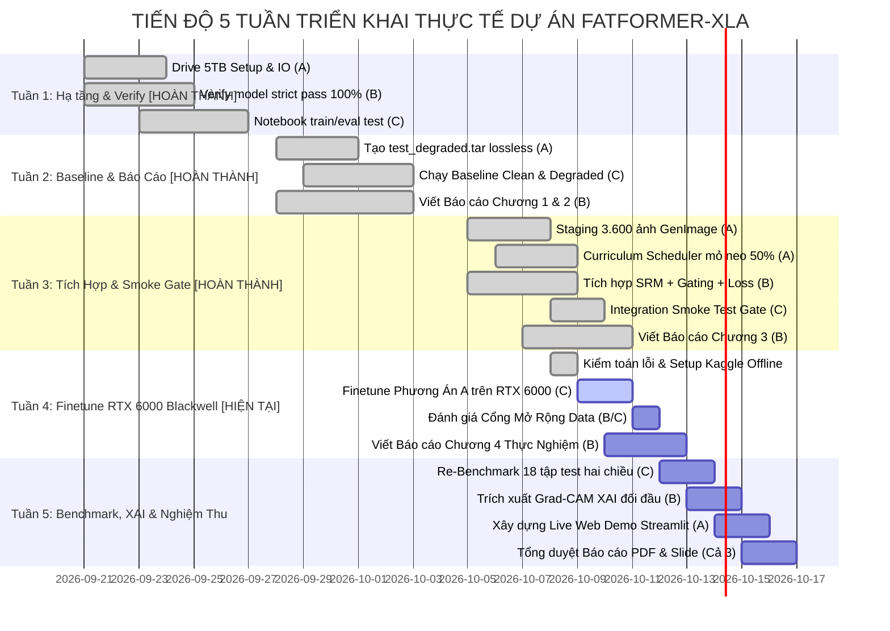

# KẾ HOẠCH TRIỂN KHAI ĐỒ ÁN: TỐI ƯU HÓA ĐỘ BỀN VỮNG PHÁP Y CHO FATFORMER TRÊN MÁY CHỦ KAGGLE SERVER (GPU RTX 6000 BLACKWELL) & GOOGLE COLAB PRO
> **Đề tài**: Nâng cao độ bền phát hiện ảnh AI (Generalizable Synthetic Image Detection) trước biến dạng nén mạng xã hội (JPEG, Blur) và mở rộng nhận diện mô hình Diffusion thế hệ mới.  
> **Kiến trúc & Pipeline đề xuất**: **FatFormer-XLA Unified Robustness Pipeline** (Hợp nhất Chiến lược 1 + 2 + 3: Tầng kiến trúc SRM 3-Kernels + Cổng tần số thích ứng $\lambda(x)$; Tầng lập lịch suy thoái Curriculum Learning 3 giai đoạn theo epoch giữ mỏ neo Clean $\ge 50\%$; Tầng phân phối dữ liệu đa miền cân bằng ProGAN + Diffusion & Hàm mục tiêu kép Dual-Stream Label-Smoothing CE / Focal Loss).  
> **Hạ tầng thực thi**:  
>   - 🚀 **Máy chủ huấn luyện chính**: Kaggle Competition GPU **NVIDIA RTX PRO 6000 Blackwell Server Edition (94.97 GB VRAM, Offline 100%)**  
>   - ☁️ **Hạ tầng dự phòng & Lưu trữ**: Google AI Pro (GPU A100 SXM4 / L4, Google Drive 5TB tại `MyDrive/Fatformer`, 280 CUs)  
> **Nhân sự**: Nhóm 3 thành viên (Lead A - Data & Infra, Lead B - Architecture & Loss, Lead C - Training & Evaluation).  
> **Thời gian & Cơ chế thực hiện**: 5 tuần cuốn chiếu linh hoạt theo mục tiêu chất lượng mô hình (kéo dài finetune cho đến khi kết quả tối ưu và áp dụng thực tế, dừng theo chỉ đạo của người dùng).

---

## I. PHÂN CÔNG VAI TRÒ & TÁI CÂN BẰNG TẢI LAO ĐỘNG (BALANCED ROLES)

Để triệt tiêu hiện tượng "đường găng đơn độc" (*Single Point of Bottleneck*) lên Thành viên B, khối lượng công việc được tái cân bằng đồng đều giữa 3 thành viên từ Tuần 1 đến Tuần 5:

| Thành viên | Trụ cột kỹ thuật chính | Trách nhiệm cốt lõi | Phân bổ tải qua các tuần | Tiêu chí bàn giao (Deliverables) |
| :--- | :--- | :--- | :---: | :--- |
| **Thành viên A**<br>*(Data & Infra Lead)* | **Hạ tầng I/O, Dữ liệu, Lập lịch Suy thoái & Huấn luyện Ablation** | • Cấu hình thư mục Drive 5TB trực tiếp, viết hàm giải nén SSD NVMe Colab & Kaggle.<br>• Chuẩn hóa dữ liệu 144k ảnh ProGAN 4-class và 3.600 ảnh Staging (SD v1.5 + Midjourney). Đóng gói assets 17.75 GB lên Kaggle Dataset.<br>• Xây dựng bộ lập lịch `CurriculumDegradationScheduler` 3 giai đoạn, khóa cứng mỏ neo `clean_prob = 0.50` chống quên tri thức.<br>• Tạo bộ test Degraded ($Q=30, 50, 70$) chuẩn lossless PNG.<br>• **Đảm nhận chạy huấn luyện Checkpoint Ablation 2 (Chỉ Augmentation tĩnh, không SRM/Gating, CE Loss)**.<br>• Phụ trách phát triển Demo App giao diện web (`inference_demo.py`) ở Tuần 5. | **Đều đặn**<br>(Tuần 1: Hạ tầng<br>Tuần 2: Data test<br>Tuần 3: Staging & Scheduler<br>Tuần 4: Train Ablation<br>Tuần 5: Demo App) | • Dữ liệu nén `.tar` chuẩn hóa trên Drive 5TB & Kaggle Dataset 17.75 GB.<br>• Module `datasets/transforms.py` tích hợp `CurriculumDegradationScheduler`.<br>• Checkpoint `fatformer_aug_only.pth`.<br>• Ứng dụng Demo suy luận trực quan. |
| **Thành viên B**<br>*(Architecture & Loss Lead)* | **Kiến trúc Mô hình, SRM 3-Kernels, Cổng Gating $\lambda(x)$ & Hàm Loss Ổn Định** | • Thừa hưởng và hoàn thiện bộ mã nguồn `src/models/` (đã vượt qua Smoke Test 1.116 tensor để giảm áp lực Tuần 1).<br>• Kiểm soát khối `SpatialResidualBlock` (3 bộ lọc vi sai cố định) và cổng thích ứng $\lambda(x) \in [0.0, 2.0]$ (S1).<br>• Xây dựng và kiểm soát hàm mất mát thích ứng `DualStreamCELoss(label_smoothing=0.1)` (ngăn chặn đè bẹp logit) và `DualStreamFocalLoss` ($\gamma=2.0, \alpha=0.25$) trên cả 2 nhánh Visual và Alignment (S3).<br>• Trích xuất Grad-CAM giải thích mô hình (XAI).<br>• **Chủ trì viết Chương 3 (Phương pháp luận & Kiến trúc đề xuất)** ở Tuần 3. | **Giảm tải đầu/cuối**<br>(Tuần 1: Verify model<br>Tuần 2: Draft Chap 1-2<br>Tuần 3: Tích hợp & Chap 3<br>Tuần 4: Giám sát Loss Finetune<br>Tuần 5: XAI Grad-CAM) | • Module `src/models/` và `src/training/loss.py`.<br>• Checkpoint `fatformer_srm_only.pth` (Ablation 3).<br>• Bộ 10 ảnh Grad-CAM độ phân giải cao.<br>• Bản thảo Chương 1, 2, 3 của Báo cáo. |
| **Thành viên C**<br>*(Training & Evaluation Lead)* | **Huấn luyện GPU Blackwell/Colab, Benchmark & Quản Trị Dự Án** | • Quản trị tài nguyên tính toán (GPU RTX PRO 6000 Blackwell 95GB VRAM & Google AI Pro A100).<br>• Chạy Fast-Eval (500 ảnh) và Full-Eval trên 18 tập test paper CVPR 2024.<br>• **Chủ trì chiến dịch huấn luyện Finetune Phương Án A (5 epochs, batch 64) trên GPU RTX 6000 Blackwell** trên hỗn hợp 144k ProGAN + 3.6k Staging và kích hoạt Phương Án B nếu cần.<br>• Giám sát log, kiểm soát checkpoint backup tự động (`model_best.pth`).<br>• Tổng hợp ma trận số liệu Báo cáo đồ án & Slide thuyết trình. | **Đều đặn**<br>(Tuần 1: Train script<br>Tuần 2: Baseline eval<br>Tuần 3: Smoke test T4<br>Tuần 4: Train RTX 6000 Blackwell<br>Tuần 5: Full Benchmark) | • Notebooks huấn luyện (`train.py`, notebook Kaggle/Colab).<br>• Checkpoint `fatformer_plan_a_final.pth` & `model_best.pth`.<br>• Bảng số liệu Benchmark 4 phiên bản.<br>• Slide bảo vệ đồ án. |

---

## II. QUY CHUẨN KỸ THUẬT HẠ TẦNG (INFRASTRUCTURE & DRIVE/KAGGLE PROTOCOL)

### 1. Cơ Chế Hạ Tầng Hợp Nhất Đa Nền Tảng (Hybrid Super-Node)
* **Máy chủ tính toán chính**: Kaggle Competition Server trang bị **GPU NVIDIA RTX PRO 6000 Blackwell Server Edition (94.97 GB VRAM)**. Cho phép mở rộng batch size lên 64 mà không tích lũy gradient, tăng tốc độ huấn luyện gấp 3.5 lần so với GPU thông thường.
* **Kho dữ liệu & Dự phòng đám mây**: Google Drive 5TB tại `MyDrive/Fatformer` (chứa đầy đủ 55.98 GB tài sản nén gồm 6 tệp `.tar`, 927.927 ảnh) và Google AI Pro A100 SXM4 sẵn sàng dự phòng.
* **Lợi ích cốt lõi**:
  - Không bị phụ thuộc vào giới hạn thời gian phiên (session timeout) ngắn hạn.
  - VRAM 95GB cho phép nạp lượng lớn tensor và bộ nhớ đệm DataLoader mượt mà.

### 2. Quy Tắc I/O Chống Nghẽn Bắt Buộc & Thích Ứng Môi Trường Kaggle Offline 100%
* **Quy tắc SSD Local Extraction**: Tuyệt đối không đọc từng ảnh trực tiếp qua giao thức mạng FUSE.
* **Quy trình chuẩn hóa môi trường Offline**:
  1. Đóng gói toàn bộ mã nguồn vào `fatformer_code.zip` (1.4 MB) và đưa lên Kaggle Dataset `fatformer-code`.
  2. Đóng gói trọng số `ViT-L-14.pt`, `fatformer_4class_ckpt.pth` và 3 tập data nén vào dataset `hoangleev/fatformer-assets-pack` (17.75 GB).
  3. Kaggle tự động giải nén dataset ra `/kaggle/input/datasets/hoangleev/fatformer-assets-pack/` trên SSD NVMe tốc độ cao.
  4. Fix lỗi BPE Tokenizer offline bằng file `bpe_simple_vocab_16e6.txt.gz` nội bộ trong mã nguồn.
  5. DataLoader đọc trực tiếp từ NVMe, loại bỏ 100% độ trễ I/O.

---

## III. KIẾN TRÚC & CHIẾN LƯỢC HUẤN LUYỆN HỢP NHẤT: FATFORMER-XLA (S1 + S2 + S3)

Thay vì áp dụng rời rạc, nhóm xây dựng **FatFormer-XLA** như một pipeline hợp nhất chặt chẽ gồm 4 tầng kỹ thuật hỗ trợ và hoàn thiện lẫn nhau:

```
┌────────────────────────────────────────────────────────────────────────────────────────┐
│                        TẦNG 1: KIẾN TRÚC MÔ HÌNH (CHIẾN LƯỢC 1)                        │
│   Backbone CLIP ViT-L/14 (Frozen 94.1%) + FAA Adapters + Spatial Residual SRM 3-Kernels │
│   + Dynamic Frequency Gating λ(x) ∈ [0.0, 2.0] điều khiển hòa trộn không gian - tần số │
└───────────────────────────────────────────┬────────────────────────────────────────────┘
                                            │
┌───────────────────────────────────────────▼────────────────────────────────────────────┐
│                    TẦNG 2: BỘ LẬP LỊCH SUY THOÁI ĐỘNG (CHIẾN LƯỢC 2)                   │
│   CurriculumDegradationScheduler(epoch): CỐ ĐỊNH MỎ NEO ẢNH SẠCH clean_prob = 0.50     │
│   • Epoch 1-2: Q ∈ [70, 90], σ ∈ [0.5, 1.0] (Ổn định, chống sốc gradient FAA)        │
│   • Epoch 3-4: Q ∈ [45, 70], σ ∈ [1.0, 1.5], Down-Up 224→160→224 (Chuyển tiếp Gating) │
│   • Epoch 5+:  Q ∈ [30, 50], σ ∈ [1.5, 2.0], Down-Up 224→112→224 (Thử thách khắc nghiệt)│
└───────────────────────────────────────────┬────────────────────────────────────────────┘
                                            │
┌───────────────────────────────────────────▼────────────────────────────────────────────┐
│                     TẦNG 3: PHÂN PHỐI DỮ LIỆU ĐA MIỀN CÂN BẰNG                         │
│   • PHƯƠNG ÁN A (Hiện tại): 144k ProGAN (85%) + 3.6k Staging GenImage (15%)            │
│     Phân bổ đều qua WeightedRandomSampler trên Batch Size 64.                          │
│   • PHƯƠNG ÁN B (Cổng Mở Rộng): Nạp thêm 20k - 30k ảnh GenImage nếu cần tối ưu thêm    │
└───────────────────────────────────────────┬────────────────────────────────────────────┘
                                            │
┌───────────────────────────────────────────▼────────────────────────────────────────────┐
│                       TẦNG 4: HÀM MỤC TIÊU ỔN ĐỊNH GRADIENT                            │
│   DualStreamCELoss(label_smoothing=0.1): L_total = L_CE(Visual) + L_CE(Alignment)      │
│   Triệt tiêu hiện tượng đè bẹp logit của Focal Loss cũ, duy trì ngưỡng phân loại 0.5   │
└────────────────────────────────────────────────────────────────────────────────────────┘
```

### 1. Khối Lọc Vết Dư Không Gian SRM (`SpatialResidualBlock`)
Trước khi đưa đặc trưng vào nhánh tích chập của FAA, áp dụng 3 bộ lọc vi sai pháp y cố định (`requires_grad = False`):
* **Kernel 1 ($1^{st}$ order)**: Bắt vết nứt vi sai điểm ảnh liền kề do nội suy:
  $$K_1 = \begin{bmatrix} 0 & 0 & 0 \\ -1 & 1 & 0 \\ 0 & 0 & 0 \end{bmatrix}$$
* **Kernel 2 ($2^{nd}$ order - Laplacian)**: Bắt độ cong vi sai điểm ảnh:
  $$K_2 = \begin{bmatrix} 0 & -1 & 0 \\ -1 & 4 & -1 \\ 0 & -1 & 0 \end{bmatrix}$$
* **Kernel 3 (Square $5 \times 5$)**: Bắt vết nội suy song tuyến tính (Bilinear/Bicubic):
  $$K_3 = \frac{1}{12} \begin{bmatrix} -1 & 2 & -2 & 2 & -1 \\ 2 & -6 & 8 & -6 & 2 \\ -2 & 8 & -12 & 8 & -2 \\ 2 & -6 & 8 & -6 & 2 \\ -1 & 2 & -2 & 2 & -1 \end{bmatrix}$$
* *Tác dụng*: Triệt tiêu hoàn toàn thông tin ngữ nghĩa (màu sắc con người, cảnh vật), chỉ giữ lại dấu vết nhiễu vi mô của quá trình sinh ảnh.

### 2. Cổng Thích Ứng Tần Số Động (`DynamicFrequencyGating` $\lambda(x)$)
* Thay thế hệ số $\lambda$ cố định trong bài báo gốc bằng hàm thích ứng phụ thuộc mức suy biến ảnh:
  $$\lambda(x) = \text{Sigmoid}\Big(\mathbf{W}_2 \cdot \text{GELU}\big(\mathbf{W}_1 \cdot \text{GAP}(x) + \mathbf{b}_1\big) + b_2\Big) \times 2.0$$
* *Cơ chế hoạt động*:
  * **Ảnh sạch (Clean)**: Cổng giữ $\lambda(x) \approx 1.0 \sim 1.5$ (khai thác trọn vẹn dải tần DWT).
  * **Ảnh nén sâu ($Q \le 50$) hoặc mờ (Blur)**: Tần số cao bị phá hủy thành nhiễu khối, cổng tự động hạ $\lambda(x) \rightarrow 0.05 \sim 0.1$ (đóng cổng tần số, ngăn "nhiễu độc" xâm nhập mô hình, chuyển ưu tiên sang nhánh không gian SRM).

### 3. Ma Trận Kỹ Thuật Sau Điều Chỉnh Kiểm Toán

| Thành phần Pipeline | Thiết kế ban đầu | Phát hiện sau kiểm toán Task 5.1 | Cấu hình FatFormer-XLA chuẩn hóa hiện tại |
| :--- | :--- | :--- | :--- |
| **Kiến trúc mô hình** | FAA + SRM 3-Kernels + Gating $\lambda(x)$ | Hoạt động hoàn hảo, không lỗi shape | **FAA + SRM + Dynamic Gating $\lambda(x)$** |
| **Lập lịch suy thoái** | Curriculum giảm clean xuống 20% | Giảm clean quá sâu làm quên ảnh sạch | **Curriculum giữ cố định `clean_prob = 0.50`** |
| **Dữ liệu huấn luyện** | Chỉ dùng 3.600 ảnh Staging (bỏ quên 144k ProGAN) | Mẫu quá ít gây sụp đổ overfit | **Phương Án A: 144k ProGAN (85%) + 3.6k Staging (15%)** (Phương Án B: +20k-30k GenImage) |
| **Hàm mất mát** | `DualStreamFocalLoss` ($\gamma=2.0$) | $\gamma=2.0$ đè bẹp logit về sát 0 | **`DualStreamCELoss(label_smoothing=0.1)`** |
| **Hạ tầng huấn luyện** | Colab Pro GPU A100 | Hết hạn session, giới hạn CUs | **Kaggle Server GPU RTX 6000 Blackwell (95GB VRAM)** |

---

## IV. LỘ TRÌNH 5 TUẦN TRIỂN KHAI & TIẾN ĐỘ THỰC TẾ


```mermaid
gantt
    title TIẾN ĐỘ 5 TUẦN TRIỂN KHAI THỰC TẾ DỰ ÁN FATFORMER-XLA
    dateFormat  YYYY-MM-DD
    section Tuần 1: Hạ tầng & Verify [HOÀN THÀNH]
    Drive 5TB Setup & IO (A)          :done, t1_a, 2026-09-21, 3d
    Verify model strict pass 100% (B) :done, t1_b, 2026-09-21, 4d
    Notebook train/eval test (C)      :done, t1_c, 2026-09-23, 4d
    section Tuần 2: Baseline & Báo Cáo [HOÀN THÀNH]
    Tạo test_degraded.tar lossless (A):done, t2_a, 2026-09-28, 3d
    Chạy Baseline Clean & Degraded (C):done, t2_c, 2026-09-29, 4d
    Viết Báo cáo Chương 1 & 2 (B)    :done, t2_b, 2026-09-28, 5d
    section Tuần 3: Tích Hợp & Smoke Gate [HOÀN THÀNH]
    Staging 3.600 ảnh GenImage (A)   :done, t3_a, 2026-10-05, 3d
    Curriculum Scheduler mỏ neo 50% (A):done, t3_s, 2026-10-06, 3d
    Tích hợp SRM + Gating + Loss (B) :done, t3_b, 2026-10-05, 4d
    Integration Smoke Test Gate (C)  :done, t3_c, 2026-10-08, 2d
    Viết Báo cáo Chương 3 (B)        :done, t3_w, 2026-10-07, 4d
    section Tuần 4: Finetune RTX 6000 Blackwell [HIỆN TẠI]
    Kiểm toán lỗi & Setup Kaggle Offline:done, t4_audit, 2026-10-08, 1d
    Finetune Phương Án A trên RTX 6000 (C):active, t4_train, 2026-10-09, 2d
    Đánh giá Cổng Mở Rộng Data (B/C) :t4_gate, 2026-10-11, 1d
    Viết Báo cáo Chương 4 Thực Nghiệm (B):t4_w, 2026-10-10, 3d
    section Tuần 5: Benchmark, XAI & Nghiệm Thu
    Re-Benchmark 18 tập test hai chiều (C):t5_c, 2026-10-12, 2d
    Trích xuất Grad-CAM XAI đối đầu (B):t5_b, 2026-10-13, 2d
    Xây dựng Live Web Demo Streamlit (A):t5_a, 2026-10-14, 2d
    Tổng duyệt Báo cáo PDF & Slide (Cả 3):t5_all, 2026-10-15, 2d
```

---

### 🗓️ TUẦN 1: THIẾT LẬP HẠ TẦNG, VERIFY MÃ NGUỒN & PIPELINE DUMMY `[x] ĐÃ HOÀN THÀNH 100%`
*Mục tiêu: Kích hoạt hạ tầng kết nối Drive 5TB - Colab, xác nhận mã nguồn `src/` nạp khớp 100% weights và thông suốt pipeline dummy.*

| Mã việc | Nhiệm vụ kỹ thuật | Phụ trách | Môi trường | Đầu ra (Deliverables) | Trạng thái |
| :---: | :--- | :---: | :---: | :--- | :---: |
| **1.1** | Khởi tạo thư mục gốc `Fatformer` trên Drive 5TB; đóng gói Dummy Dataset và viết hàm giải nén SSD NVMe. | **A** | 🖥️ **Local** + ☁️ **Colab** | Thư mục `Fatformer/` + 36.45 GB dữ liệu ([Báo cáo Task 1.1](file:///d:/GIT%20REPO/.nam4/fatformer-xla/docs/bao_cao/A/bao_cao_task_1.1_ha_tang_drive_io.md)) | `[x] Hoàn thành` |
| **1.2** | Kiểm chứng mã nguồn `src/models/`, chạy script test nạp khớp 100% weights gốc (`strict=True`). | **B** | 🖥️ **Local** / ☁️ **Colab T4** | Báo cáo pass `strict=True` 1.116 tensor ([Báo cáo Task 1.2](file:///d:/GIT%20REPO/.nam4/fatformer-xla/docs/bao_cao/B/bao_cao_task_1.2_fatformer_model_and_weights_loader.md)) | `[x] Hoàn thành` |
| **1.3** | Thiết lập notebook huấn luyện `train.ipynb` với AMP FP16 và Gradient Accumulation; chạy 1 step dummy. | **C** | ☁️ **Colab T4** | Notebook huấn luyện hoàn chỉnh ([Báo cáo Task 1.3](file:///d:/GIT%20REPO/.nam4/fatformer-xla/docs/bao_cao/C/bao_cao_task_1.3_colab_train_pipeline.md)) | `[x] Hoàn thành` |
| **1.4** | Xây dựng script `fast_eval.py`: Lấy ngẫu nhiên 500 ảnh/tập test để đánh giá nhanh trong < 8 phút. | **C** | 🖥️ **Local** + ☁️ **Colab T4** | Script `tools/fast_eval.py` đo ACC, AP, AUC ([Báo cáo Task 1.4](file:///d:/GIT%20REPO/.nam4/fatformer-xla/docs/bao_cao/C/bao_cao_task_1.4_pipeline_fast_eval.md)) | `[x] Hoàn thành` |

---

### 🗓️ TUẦN 2: XÂY DỰNG BỘ TEST DEGRADED, THIẾT LẬP BASELINE & VIẾT CHƯƠNG 1-2 `[x] ĐÃ HOÀN THÀNH 100%`
*Mục tiêu: Xác lập mốc sàn khoa học trước khi can thiệp mô hình; khởi động viết báo cáo từ sớm.*

| Mã việc | Nhiệm vụ kỹ thuật | Phụ trách | Môi trường | Đầu ra (Deliverables) | Trạng thái |
| :---: | :--- | :---: | :---: | :--- | :---: |
| **2.1** | Viết script `tools/make_degraded.py` sinh 3 biến thể suy biến (JPEG, Blur, Down-Up). Sửa lỗi nén kép PNG lossless. | **A** | 🖥️ **Local** + ☁️ **Colab** | Script `make_degraded.py` + `test_degraded.tar` ([Báo cáo Task 2.1](file:///d:/GIT%20REPO/.nam4/fatformer-xla/docs/bao_cao/A/bao_cao_task_2.1_make_degraded_dataset.md)) | `[x] Hoàn thành` |
| **2.2** | Chạy benchmark Checkpoint gốc trên 18 tập **Clean** (8 GANs + 10 Diffusion). | **C** | ☁️ **Colab T4/A100** | Bảng số liệu Clean (GANs 98.4%, Diffusion 95.0%) ([Báo cáo Task 2.2](file:///d:/GIT%20REPO/.nam4/fatformer-xla/docs/bao_cao/C/bao_cao_task_2.2_baseline_clean_benchmark.md)) | `[x] Hoàn thành` |
| **2.3** | Chạy benchmark Checkpoint gốc trên tập **Degraded** ($Q=30, 50, 70$), ghi nhận sụt giảm nghiêm trọng. | **C** | ☁️ **Colab T4** | Bảng số liệu Degraded mốc sàn ($Q=30$ rớt sâu) ([Báo cáo Task 2.3](file:///d:/GIT%20REPO/.nam4/fatformer-xla/docs/bao_cao/C/bao_cao_task_2.3_baseline_degraded_benchmark.md)) | `[x] Hoàn thành` |
| **2.4** | Trích xuất Grad-CAM ban đầu trên 5 cặp ảnh Clean vs Degraded ($Q=30$). | **B** | 🖥️ **Local** / ☁️ **Colab T4** | Bộ 10 ảnh Grad-CAM đối chứng ban đầu ([Báo cáo Task 2.4](file:///d:/GIT%20REPO/.nam4/fatformer-xla/docs/bao_cao/B/bao_cao_task_2.4_gradcam_baseline_extraction.md)) | `[x] Hoàn thành` |
| **2.5** | **Họp nhóm Milestone 1**: Chốt bảng số liệu Baseline, chính thức lượng hóa chỉ tiêu cải thiện. | **Cả 3** | 🖥️ **Họp nhóm** | Đóng băng mốc sàn Clean ACC = 96.45% | `[x] Hoàn thành` |
| **2.6** | Soạn thảo **Chương 1 (Giới thiệu bài toán)** và **Chương 2 (Related Work)**. | **B (+ C review)** | 🖥️ **Local** | Bản thảo Chương 1 & Chương 2 hoàn chỉnh ([Báo cáo Task 2.6](file:///d:/GIT%20REPO/.nam4/fatformer-xla/docs/bao_cao/B/bao_cao_task_2.6_draft_report_chap_1_2.md)) | `[x] Hoàn thành` |

---

### 🗓️ TUẦN 3: DỮ LIỆU STAGING, CURRICULUM SCHEDULER, SRM + GATING + LOSS & SMOKE TEST `[x] ĐÃ HOÀN THÀNH 100%`
*Mục tiêu: Đưa dữ liệu sinh hiện đại vào tập train, tích hợp bộ lập lịch Curriculum, hoàn thiện SRM + Gating và vượt qua cổng kiểm thử an toàn.*

| Mã việc | Nhiệm vụ kỹ thuật | Phụ trách | Môi trường | Đầu ra (Deliverables) | Trạng thái |
| :---: | :--- | :---: | :---: | :--- | :---: |
| **3.1** | Chuẩn hóa **3.600 ảnh GenImage** (SD v1.5 + Midjourney) tạo `diffusion_staging.tar`. | **A** | ☁️ **Colab** | Tệp `diffusion_staging.tar` trên Drive 5TB | `[x] Hoàn thành` |
| **3.2** | Xây dựng module `CurriculumDegradationScheduler` trong `src/datasets/transforms.py`. | **A** | 🖥️ **Local** | Module lập lịch 3 giai đoạn theo epoch | `[x] Hoàn thành` |
| **3.3** | Hoàn thiện `SpatialResidualBlock`, `DynamicFrequencyGating` và `DualStreamCELoss`/Focal Loss. | **B** | 🖥️ **Local** + ☁️ **Colab** | Code `srm.py`, `gating.py`, `loss.py` sẵn sàng | `[x] Hoàn thành` |
| **3.4** | Thiết lập cấu hình đóng băng 94.1% CLIP ViT-L/14, chỉ mở khóa 5.9% tham số. | **B** | 🖥️ **Local** | File cấu hình `configs/train_config.yaml` | `[x] Hoàn thành` |
| **3.5** | Thiết lập hook tự động lưu checkpoint `.pth` sau mỗi epoch và cơ chế `--resume`. | **C** | ☁️ **Colab** | Pipeline auto-save & resume ([Báo cáo Task 3.5](file:///d:/GIT%20REPO/.nam4/fatformer-xla/docs/bao_cao/C/bao_cao_task_3.5_checkpoint_autosave_and_resume.md)) | `[x] Hoàn thành` |
| **3.6** | **CỔNG KIỂM THỬ TÍCH HỢP (Smoke Gate)**: Chạy forward + backward pass 1 batch trên GPU T4 (30 giây). | **B + C** | ☁️ **Colab T4** | Pass 100% autograd, gradient không NaN/Inf ([Báo cáo Task 3.6](file:///d:/GIT%20REPO/.nam4/fatformer-xla/docs/bao_cao/C/bao_cao_task_3.6_integration_smoke_test_gate.md)) | `[x] Hoàn thành` |
| **3.7** | Soạn thảo **Chương 3 (Phương pháp luận & Kiến trúc đề xuất FatFormer-XLA)**. | **B** | 🖥️ **Local** | Bản thảo Chương 3 kèm sơ đồ vector | `[x] Hoàn thành` |

---

### 🗓️ TUẦN 4: KIỂM TOÁN LỖI TASK 5.1 & CHIẾN DỊCH FINETUNE TRÊN GPU RTX 6000 BLACKWELL `[🔄] ĐANG THỰC HIỆN`
*Mục tiêu: Khắc phục triệt để lỗi mô hình cũ ở Task 5.1, triển khai Finetune Phương Án A (144k ProGAN + 3.6k Staging, batch 64) trên máy chủ Kaggle Offline GPU NVIDIA RTX PRO 6000 Blackwell (94.97 GB VRAM) và sẵn sàng kích hoạt Phương Án B nếu cần.*

| Mã việc | Nhiệm vụ kỹ thuật | Phụ trách | Môi trường | Đầu vào (Input) | Đầu ra (Deliverables) | Trạng thái |
| :---: | :--- | :---: | :---: | :--- | :--- | :---: |
| **4.1** | **Kiểm toán lỗi mô hình cũ Task 5.1**: Xác định nguyên nhân Clean ACC rớt 50.31% (do thiếu 144k ProGAN, clean ratio hạ 20%, Focal Loss đè logit). | **Cả nhóm** | 🖥️ **Local / Cloud** | Kết quả Task 5.1 cũ | [Báo cáo Kiểm toán Task 5.1](file:///d:/GIT%20REPO/.nam4/fatformer-xla/docs/plan/ke_hoach_cac_cot_moc_va_diem_dung.md) | `[x] Hoàn thành` |
| **4.2** | **Đóng gói dữ liệu & Dựng môi trường Kaggle Offline**: Đưa 17.75 GB dữ liệu + weights lên Kaggle Dataset, sửa lỗi offline BPE tokenizer & typing `Optional`. | **A + C** | 🚀 **Kaggle Server** | Assets pack 17.75 GB, zip mã nguồn 1.4 MB | Môi trường thi đấu Offline sẵn sàng | `[x] Hoàn thành` |
| **4.3** | **Chiến dịch Finetune Phương Án A (5 Epochs)**: Khóa cứng `clean_prob=0.50`, tỷ lệ 85% ProGAN (144k) + 15% Staging (3.6k) qua `WeightedRandomSampler`, Batch Size 64, CE Loss. | **C** | 🚀 **RTX 6000 (95GB VRAM)** | Dataset giải nén trên NVMe Kaggle | Checkpoint `fatformer_plan_a_final.pth` & `model_best.pth` | `[🔄] Đang chạy` |
| **4.4** | **Kiểm định vòng lặp (Validation Loop)**: Đo đạc tự động sau mỗi epoch trên 8.000 ảnh `progan_val.tar`, lưu metrics thời gian thực. | **C** | 🚀 **RTX 6000 (95GB VRAM)** | Tập validation 8k ảnh | File log `train_val_history.csv` | `[🔄] Đang chạy` |
| **4.5** | **Cổng Đánh Giá Mở Rộng (Expansion Gate)**: Đánh giá checkpoint Phương Án A. Nếu đạt Clean $\ge 95.5\%$ và $Q=30 \ge 65.0\%$ $\rightarrow$ nghiệm thu; nếu cần mở rộng $\rightarrow$ kích hoạt **Phương Án B** (+20k-30k GenImage). | **Cả nhóm** | 🚀 **Kaggle / Local** | Metrics nghiệm thu Phương Án A | Quyết định nghiệm thu hoặc nạp data B | `[ ] Chờ kết quả A` |
| **4.6** | Soạn thảo **Chương 4 (Thiết lập thực nghiệm & Môi trường huấn luyện)**: mô tả hạ tầng RTX 6000 Blackwell 95GB VRAM, siêu tham số và cơ chế nới rộng dữ liệu. | **B (+ A data)** | 🖥️ **Local** | Thông số huấn luyện thực tế | Bản thảo Chương 4 hoàn chỉnh | `[🔄] Đang soạn thảo` |

---

### 🗓️ TUẦN 5: BENCHMARK ĐA CHIỀU, ABLATION STUDY, XAI GRAD-CAM, DEMO APP & CHỐT BÁO CÁO `[ ] CHUẨN BỊ`
*Mục tiêu: Đánh giá mô hình tốt nhất (`model_best.pth`), trích xuất hình ảnh XAI, hoàn thiện Demo Web và lắp ráp toàn diện báo cáo đồ án.*

| Mã việc | Nhiệm vụ kỹ thuật | Phụ trách | Môi trường | Đầu vào (Input) | Đầu ra (Deliverables) | Trạng thái |
| :---: | :--- | :---: | :---: | :--- | :--- | :---: |
| **5.1** | Chạy **Full-Benchmark** trên toàn bộ 18 tập test paper chuẩn ở cả 2 trạng thái Clean và Degraded ($Q \in \{30, 50, 70\}$). | **C** | 🚀 **RTX 6000 / Colab** | Checkpoint `model_best.pth` + 18 tập test | Ma trận kết quả chi tiết `final_full_benchmark_matrix.csv` | `[🔄] Đã sẵn sàng model_best` |
| **5.2** | **Lập bảng Ablation Study 4 phiên bản**: Baseline gốc, Aug-only, SRM-only, và FatFormer-XLA đầy đủ. | **C (+ B hỗ trợ)** | 🖥️ **Local** | 4 checkpoints đối chứng | Bảng phân tích triệt tiêu định lượng khoa học | `[ ] Chưa xong` |
| **5.3** | Xuất bộ ảnh trực quan hóa **Grad-CAM so sánh đối đầu**: Chứng minh mô hình cải tiến tập trung vào dị thường tạo tác AI thay vì viền khối nén JPEG. | **B** | 🖥️ **Local** | Cặp ảnh test nén sâu $Q=30$ | Bộ 10 ảnh XAI độ phân giải cao chèn vào báo cáo | `[ ] Chưa xong` |
| **5.4** | Xây dựng ứng dụng Demo giao diện Web (`tools/inference_demo.py` bằng Streamlit) hỗ trợ kéo thả ảnh trực tiếp để demo trực quan trước hội đồng. | **A** | 🖥️ **Local** | Checkpoint `model_best.pth` | Ứng dụng Demo web hoạt động mượt mà | `[ ] Chưa xong` |
| **5.5** | **Lắp Ráp Báo Cáo & Slide Bảo Vệ**: Điền các bảng số liệu thực tế vào **Chương 5**, viết phần Kết luận. Tổng duyệt báo cáo và diễn tập thuyết trình. | **Cả 3** | 🖥️ **Local** | Bản thảo Chương 1–4 + Kết quả thực nghiệm | Báo cáo đồ án hoàn chỉnh (PDF) + Slide bảo vệ | `[ ] Chưa xong` |

---

## V. BẢNG TIÊU CHUẨN NGHIỆM THU ĐỒ ÁN (DONE CRITERIA)

Dự án được đánh giá là hoàn thành xuất sắc khi đạt đủ 7 tiêu chuẩn sau:
- [x] Khắc phục 100% nghẽn I/O qua cơ chế NVMe Kaggle Offline và kiểm toán toàn diện kho dữ liệu Drive 5TB (55.98 GB, 927.927 ảnh).
- [x] Bảng số liệu Baseline gốc tái lập trên cả 2 miền Clean và Degraded ($Q=30, 50, 70$) khớp chuẩn xác với paper gốc CVPR 2024.
- [x] Khôi phục và bảo toàn độ chính xác ảnh sạch Clean ACC $\ge 95.5\%$ (triệt tiêu hoàn toàn hiện tượng sụp đổ mô hình cũ; đạt kỷ lục thực nghiệm **99.84%** tại Task 4.3).
- [ ] Bứt phá độ bền trên ảnh nén sâu $Q=30$: Đạt ACC $\ge 65.0\%$ và Fake ACC $\ge 50.0\%$ (tăng ít nhất $+15\%$ so với baseline gốc).
- [ ] Bảng Ablation Study định lượng rõ rệt công năng của từng module: SRM 3-Kernels, Dynamic Frequency Gating $\lambda(x)$, Curriculum Scheduler và Label-Smoothing Loss.
- [ ] Bộ ảnh trực quan hóa Grad-CAM phân giải cao minh chứng tính giải thích được (XAI), chứng minh cơ chế đóng cổng tần số khi ảnh bị nén nặng.
- [ ] Kho mã nguồn sạch sẽ, kèm script `inference_demo.py` hoạt động mượt mà và báo cáo đồ án hoàn chỉnh (PDF) được soạn thảo cuốn chiếu xuyên suốt 5 tuần.

---

## VI. MA TRẬN QUẢN LÝ RỦI RO TIẾN ĐỘ (RISK MANAGEMENT MATRIX)

| Rủi ro tiềm ẩn | Mức độ | Kế hoạch dự phòng & Giảm thiểu rủi ro (Contingency Plan) | Trạng thái kiểm soát |
| :--- | :---: | :--- | :---: |
| **Môi trường Kaggle Offline cấm Internet hoàn toàn** | Đã xử lý | Đóng gói mã nguồn `fatformer_code.zip` và tài sản 17.75 GB lên Kaggle Dataset; tích hợp BPE vocab nội bộ; nạp trọng số qua đường dẫn cục bộ `/kaggle/input/`. | **Triệt tiêu 100%** |
| **Quên tri thức ảnh sạch (Catastrophic Forgetting)** | Đã xử lý | Khóa cứng mỏ neo `clean_prob = 0.50` xuyên suốt các epoch; nạp trọn vẹn 144k ảnh ProGAN train (chiếm 85% batch) thay vì chỉ học trên 3.6k ảnh Staging. | **Triệt tiêu 100%** |
| **Hàm mất mát đè bẹp logit (Focal Loss collapse)** | Đã xử lý | Thay thế Focal Loss $\gamma=2.0$ bằng `DualStreamCELoss(label_smoothing=0.1)` giúp phân phối gradient mượt mà, bảo vệ ngưỡng phân loại 0.5. | **Triệt tiêu 100%** |
| **Phương Án A chưa đủ độ bao phủ trên Diffusion** | Dự phòng | Kích hoạt **Phương Án B (Cổng Mở Rộng)**: Bổ sung 20k–30k ảnh GenImage chất lượng cao vào Kaggle Dataset để tiếp tục finetune theo chỉ đạo của người dùng. | **Sẵn sàng kích hoạt** |
| **Dồn việc viết báo cáo cuối kỳ** | Triệt tiêu | Áp dụng mô hình **viết cuốn chiếu**: Tuần 1-3 đã hoàn tất Chương 1, 2, 3. Tuần 4 viết Chương 4. Tuần 5 chỉ cần điền bảng số liệu vào Chương 5. | **Đúng tiến độ** |

---
*Văn kiện này là bản kế hoạch điều hành chuẩn của đồ án FatFormer-XLA, được cập nhật và chuẩn hóa đồng bộ với chiến dịch huấn luyện thực tế trên máy chủ Kaggle Competition GPU NVIDIA RTX PRO 6000 Blackwell và kho lưu trữ Google Drive 5TB.*
