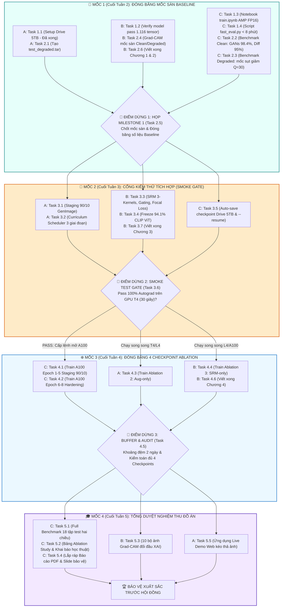

# KẾ HOẠCH CÁC CỘT MỐC CHIẾN LƯỢC & ĐIỂM DỪNG NGHIỆM THU DỰ ÁN
> **Văn Kiện Điều Hành & Quản Trị Của Trưởng Dự Án (Lead C - Training & Evaluation Lead)**  
> **Dự án**: Nâng cao độ bền vững pháp y cho FatFormer trước biến dạng nén mạng xã hội (FatFormer-XLA)  
> **Hạ tầng thực thi**: Tài khoản Google AI Pro (GPU A100 SXM4 / L4, Google Drive 5TB trực tiếp tại `MyDrive/Fatformer`)  
> **Thời gian thực hiện**: 5 tuần cuốn chiếu  

---

## I. TRIẾT LÝ QUẢN TRỊ ĐIỂM DỪNG (QUALITY GATES PROTOCOL)

Để triệt tiêu hiện tượng làm việc dàn trải, trôi tiến độ hoặc lãng phí ngân sách tài nguyên tính toán (Compute Units trên Colab Pro), Trưởng dự án áp dụng **Cơ chế Cổng Nghiệm Thu Kỹ Thuật (Quality Gates)**:

1. **Nguyên tắc "Điểm dừng cứng" (Hard Checkpoints)**: Toàn bộ lộ trình 5 tuần được chia thành **4 Cột Mốc Chiến Lược**. Trước mỗi cột mốc, tất cả các thành viên phải hoàn thành đầy đủ các task phụ thuộc và nộp báo cáo nghiệm thu.
2. **Nguyên tắc "Không đốt GPU khi chưa pass cổng"**: Tuyệt đối không kích hoạt GPU A100 đắt đỏ khi chưa vượt qua Cổng kiểm thử tích hợp (Smoke Test Gate trên GPU T4 ở Mốc 2).
3. **Kế thừa thông số thực tế (Tuân thủ Nguyên Tắc 4)**: Mọi quyết định tại các mốc sau bắt buộc phải kế thừa thông số kỹ thuật thực tế đã được nghiệm thu ở các mốc trước (như hạ tầng Drive 5TB `MyDrive/Fatformer`, tên các tệp `.tar`, kết quả Baseline).

---

## II. SƠ ĐỒ 4 CỘT MỐC CHIẾN LƯỢC (MASTER MILESTONE FLOWCHART)

---

## III. NỘI DUNG CHI TIẾT TỪNG ĐIỂM DỪNG CHIẾN LƯỢC

### 🏁 ĐIỂM DỪNG 1: MỐC 1 (CUỐI TUẦN 2) - ĐÓNG BĂNG MỐC SÀN BASELINE
*Mục đích: Thiết lập nền móng khoa học không thể tranh cãi về tử huyệt nén của mô hình gốc CVPR 2024; khởi động viết báo cáo từ sớm.*

| Phân công | Mã Task | Tên Nhiệm Vụ | Đầu Ra Nghiệm Thu | Trạng Thái Hiện Tại |
| :--- | :---: | :--- | :--- | :---: |
| **Thành viên A** | **Task 1.1** | Setup Google Drive 5TB & I/O SSD Colab | Cây thư mục `Fatformer/` + 36.45 GB dữ liệu `.tar` | `[x] Đã xong` ([Báo cáo Task 1.1](file:///d:/GIT%20REPO/.nam4/fatformer-xla/docs/bao_cao/A/bao_cao_task_1.1_ha_tang_drive_io.md)) |
| **Thành viên A** | **Task 2.1** | Xây dựng bộ kiểm thử suy biến vật lý | Script `make_degraded.py` + `test_degraded.tar` | `[ ] Chờ thực thi` |
| **Thành viên B** | **Task 1.2** | Verify model & Loader khớp 1.116 tensor | Pass `strict=True` 1.116 tensor trên T4 | `[ ] Chờ thực thi` |
| **Thành viên B** | **Task 2.4** | Trích xuất Grad-CAM ban đầu đối chứng | 10 ảnh Grad-CAM mốc sàn Clean vs Degraded | `[ ] Chờ thực thi` |
| **Thành viên B** | **Task 2.6** | Soạn thảo Báo cáo Chương 1 & Chương 2 | Bản thảo Chương 1 (Giới thiệu) & Chương 2 (Related Work) | `[ ] Chờ thực thi` |
| **Thành viên C (Lead)**| **Task 1.3** | Thiết lập Notebook Huấn Luyện Colab | `train.ipynb` chạy thử 1 step dummy mượt mà | `[ ] Đang triển khai` |
| **Thành viên C (Lead)**| **Task 1.4** | Xây dựng pipeline Fast-Eval (< 8 phút) | Script `fast_eval.py` đo ACC, AP, AUC | `[ ] Đang triển khai` |
| **Thành viên C (Lead)**| **Task 2.2** | Benchmark Baseline trên 18 tập Clean | Bảng số liệu Clean (GANs 98.4%, Diff 95.0%) | `[ ] Chờ thực thi` |
| **Thành viên C (Lead)**| **Task 2.3** | Benchmark Baseline trên tập Degraded | Bảng số liệu Degraded mốc sàn ($Q=30, 50, 70$) | `[ ] Chờ thực thi` |

#### 🛑 Hoạt Động Chốt Tại Điểm Dừng 1 (Task 2.5 - Họp Toàn Nhóm Milestone 1):
1. **Rà soát & Đóng băng số liệu**: Cả nhóm kiểm tra bảng số liệu Clean và Degraded, đóng băng toàn bộ mốc sàn (không thay đổi sau cuộc họp).
2. **Lượng hóa chỉ tiêu cải tiến**: Xác nhận mục tiêu finetune: kéo độ chính xác trên tập nén sâu $Q=30$ tăng từ $+10\%$ đến $+15\%$.
3. **Ký duyệt đầu ra**: Ký biên bản `docs/milestones/milestone_1_freeze.md` và nghiệm thu bản thảo Chương 1–2.

---

### 🚪 ĐIỂM DỪNG 2: MỐC 2 (CUỐI TUẦN 3) - CỔNG KIỂM THỬ TÍCH HỢP AN TOÀN (SMOKE GATE)
*Mục đích: "Chốt chặn sinh tử" trước khi mở GPU A100. Đảm bảo toàn bộ 4 tầng kỹ thuật (S1 + S2 + S3) khớp nối trơn tru, không có lỗi tiềm ẩn làm cháy Compute Units.*

| Phân công | Mã Task | Tên Nhiệm Vụ | Đầu Ra Nghiệm Thu | Tiêu Chuẩn Pass |
| :--- | :---: | :--- | :--- | :--- |
| **Thành viên A** | **Task 3.1** | Chuẩn hóa dữ liệu Staging 90/10 | `diffusion_staging.tar` trên Drive 5TB | 3.600 ảnh GenImage catalyst chuẩn |
| **Thành viên A** | **Task 3.2** | Module lập lịch Curriculum 3 giai đoạn | `src/datasets/transforms.py` | 30% Clean, 70% Degraded theo epoch |
| **Thành viên B** | **Task 3.3** | SRM 3-Kernels, Dynamic Gating, Focal Loss | `srm.py`, `gating.py`, `loss.py` | SRM `requires_grad=False`, Focal $\gamma=2.0$ |
| **Thành viên B** | **Task 3.4** | Đóng băng 94.1% CLIP ViT & config YAML | `configs/train_config.yaml` | Trainable parameters $\approx 5.9\%$ (~55M) |
| **Thành viên B** | **Task 3.7** | Soạn thảo Báo cáo Chương 3 | Bản thảo Chương 3 (Phương pháp luận) | Đầy đủ công thức toán & sơ đồ vector |
| **Thành viên C (Lead)**| **Task 3.5** | Auto-save Checkpoint Drive & --resume | Pipeline auto-save trong `train.ipynb` | Thử nghiệm ngắt kết nối và resume thành công |

#### 🛑 Hoạt Động Chốt Tại Điểm Dừng 2 (Task 3.6 - Cổng Kiểm Thử Tích Hợp Smoke Gate):
1. **Thực thi kiểm thử thực tế**: Trưởng dự án (Lead C) cùng Lead B chạy thử nghiệm forward + backward pass trên 1 batch 16 ảnh trên **GPU T4 trong đúng 30 giây** (tiêu tốn < 0.05 CU).
2. **Tiêu chí phê duyệt**:
   - [ ] Shape tensor qua SRM, Gating và LGA chuẩn xác $100\%$.
   - [ ] Loss và gradient không xuất hiện `NaN` hoặc `Inf`.
   - [ ] Không xảy ra lỗi tràn bộ nhớ (Out-Of-Memory).
3. **Quyết định của Trưởng dự án**: Chỉ khi pass $100\%$ các tiêu chí trên, Trưởng dự án mới ký biên bản cấp lệnh mở GPU A100 cho chiến dịch huấn luyện Tuần 4.

---

### ❄️ ĐIỂM DỪNG 3: MỐC 3 (CUỐI TUẦN 4) - ĐÓNG BĂNG 4 CHECKPOINT ABLATION & KHOẢNG ĐỆM
*Mục đích: Hoàn tất 100% khối lượng tính toán nặng của toàn bộ đồ án; triệt tiêu nguy cơ trễ hạn nhờ khoảng đệm 2 ngày.*

| Phân công | Mã Task | Tên Nhiệm Vụ | GPU Thực Thi | Sản Phẩm Checkpoint Nghiệm Thu |
| :--- | :---: | :--- | :---: | :--- |
| **Thành viên C (Lead)**| **Task 4.1** | Train Mô hình Chính Giai đoạn 1 & 2 (Ep 1-5) | ☁️ **A100 SXM4** | `fatformer_srm_phase2.pth` trên Drive 5TB |
| **Thành viên C (Lead)**| **Task 4.2** | Train Mô hình Chính Giai đoạn 3 (Ep 6-8) | ☁️ **A100 SXM4** | `fatformer_srm_robust_final.pth` (Mô hình chính) |
| **Thành viên A** | **Task 4.3** | Train Checkpoint Ablation 2 (Aug-only) | ☁️ **T4 / L4** | `fatformer_aug_only.pth` trên Drive 5TB |
| **Thành viên B** | **Task 4.4** | Train Checkpoint Ablation 3 (SRM-only) | ☁️ **L4 / A100** | `fatformer_srm_only.pth` trên Drive 5TB |
| **Thành viên B** | **Task 4.6** | Soạn thảo Báo cáo Chương 4 | 🖥️ **Local** | Bản thảo Chương 4 (Thiết lập thực nghiệm) |

#### 🛑 Hoạt Động Chốt Tại Điểm Dừng 3 (Task 4.5 - Quản Lý Khoảng Đệm & Kiểm Toán Checkpoint):
1. **Kiểm toán kho checkpoint**: Trưởng dự án kiểm tra trực tiếp thư mục `MyDrive/Fatformer/checkpoint/`.
2. **Tiêu chuẩn nghiệm thu điểm dừng**:
   - [ ] Có đầy đủ 4 checkpoint đối chứng: `baseline.pth`, `aug_only.pth`, `srm_only.pth`, `robust_final.pth`.
   - [ ] Nạp thử nghiệm cả 4 checkpoint thành công trên GPU T4, xác nhận không file nào bị lỗi Corrupted weights.
3. **Ý nghĩa chiến lược**: Giải phóng $100\%$ gánh nặng huấn luyện mô hình. Bước sang Tuần 5, toàn bộ nhóm chỉ tập trung chạy suy luận nhẹ, trích xuất ảnh XAI và hoàn thiện văn bản báo cáo.

---

### 🎓 ĐIỂM DỪNG 4: MỐC 4 (CUỐI TUẦN 5) - TỔNG DUYỆT NGHIỆM THU ĐỒ ÁN & DIỄN TẬP BẢO VỆ
*Mục đích: Lắp ráp các sản phẩm thành quả của 5 tuần thành tài liệu học thuật hoàn chỉnh và bài thuyết trình xuất sắc trước Hội đồng.*

| Phân công | Mã Task | Tên Nhiệm Vụ | Sản Phẩm Bàn Giao |
| :--- | :---: | :--- | :--- |
| **Thành viên C (Lead)**| **Task 5.1** | Chạy Full-Benchmark trên 18 tập test hai chiều | Ma trận kết quả chi tiết `final_full_benchmark_matrix.csv` |
| **Thành viên C (Lead)**| **Task 5.2** | Lập Bảng Ablation Study 4 phiên bản & Khai báo học thuật | Bảng triệt tiêu định lượng + Tuyên bố giới hạn 300 CUs |
| **Thành viên B** | **Task 5.3** | Xuất bộ 10 ảnh Grad-CAM đối đầu XAI | Bộ ảnh Grad-CAM độ phân giải cao phân tích cơ chế đóng cổng |
| **Thành viên A** | **Task 5.5** | Xây dựng ứng dụng Live Demo Web kéo thả ảnh | App Streamlit `tools/inference_demo.py` hoạt động mượt mà |
| **Cả 3 thành viên** | **Task 5.4** | Lắp ráp hoàn thiện Báo cáo đồ án (PDF) và Slide bảo vệ | Báo cáo đồ án hoàn chỉnh (~40 trang) + Bộ Slide thuyết trình |

#### 🛑 Hoạt Động Chốt Tại Điểm Dừng 4 (Tổng Duyệt Nghiệm Thu & Diễn Tập):
1. **Nghiệm thu Báo cáo đồ án**: Rà soát lần cuối toàn bộ 5 chương, kiểm tra mục lục, bảng biểu và danh mục tài liệu tham khảo.
2. **Tổng duyệt Slide & Diễn tập bảo vệ (Rehearsal)**:
   - Cả 3 thành viên diễn tập thuyết trình đúng khung thời gian quy định (15–20 phút).
   - Phân vai rõ ràng: Lead A (Mở đầu & Demo), Lead B (Kiến trúc & XAI), Lead C (Thực nghiệm & Trả lời phản biện).

---

## IV. BẢNG CHECKLIST ĐIỀU HÀNH DÀNH RIÊNG CHO TRƯỞNG DỰ ÁN (LEAD C)

- [ ] **Giai đoạn hiện tại (Tuần 1)**: Đôn đốc Thành viên B hoàn thành Task 1.2; bản thân tập trung hoàn thành Task 1.3 và 1.4.
- [ ] **Trước khi chốt Mốc 1 (Ngày 14)**: Kiểm tra file `test_degraded.tar` của A và số liệu baseline của C đã khớp chưa trước khi họp Task 2.5.
- [ ] **Trước khi mở GPU A100 (Ngày 21)**: Trực tiếp giám sát và ký biên bản Smoke Test Gate (Task 3.6).
- [ ] **Cuối Tuần 4 (Ngày 28)**: Chạy script kiểm toán 4 checkpoint trên Drive 5TB, đảm bảo không có task train nào bị dồn sang Tuần 5.
- [ ] **Tuần 5 (Ngày 34)**: Chủ trì buổi tổng duyệt diễn tập bảo vệ thử trước hội đồng.
