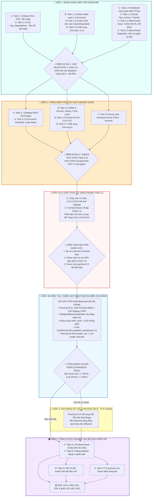

# KẾ HOẠCH CÁC CỘT MỐC CHIẾN LƯỢC & ĐIỂM DỪNG NGHIỆM THU DỰ ÁN
> **Văn Kiện Điều Hành & Quản Trị Của Trưởng Dự Án (Lead C - Training & Evaluation Lead)**  
> **Dự án**: Nâng cao độ bền vững pháp y cho FatFormer trước biến dạng nén mạng xã hội (FatFormer-XLA)  
> **Hạ tầng thực thi**:  
>   - 🚀 **Máy chủ tính toán chính**: Kaggle Server GPU **NVIDIA RTX PRO 6000 Blackwell Server Edition (94.97 GB VRAM)**  
>   - ☁️ **Hạ tầng dự phòng & Lưu trữ**: Google AI Pro (GPU A100 SXM4 / L4, Google Drive 5TB tại `MyDrive/Fatformer`, 280 CUs)  
> **Thời gian thực hiện**: Cuốn chiếu linh hoạt theo mục tiêu chất lượng mô hình (kéo dài finetune cho đến khi kết quả tối ưu và áp dụng thực tế, dừng theo chỉ đạo của người dùng).  

---

## I. TRIẾT LÝ QUẢN TRỊ ĐIỂM DỪNG (QUALITY GATES PROTOCOL)

Để triệt tiêu hiện tượng làm việc dàn trải, trôi tiến độ hoặc lãng phí ngân sách tài nguyên tính toán (Compute Units trên Colab Pro), Trưởng dự án áp dụng **Cơ chế Cổng Nghiệm Thu Kỹ Thuật (Quality Gates)**:

1. **Nguyên tắc "Điểm dừng cứng" (Hard Checkpoints)**: Toàn bộ lộ trình được chia thành các Cột Mốc Chiến Lược. Trước mỗi cột mốc, tất cả các thành viên phải hoàn thành đầy đủ các task phụ thuộc và nộp báo cáo nghiệm thu.
2. **Kế thừa thông số thực tế (Tuân thủ Nguyên Tắc 4)**: Mọi quyết định kỹ thuật bắt buộc phải kế thừa thông số kỹ thuật thực tế đã được nghiệm thu (kết quả kiểm toán Drive 5TB `MyDrive/Fatformer`, ma trận Benchmark 18 tập test).
3. **Cơ chế Tinh chỉnh Linh hoạt theo Chỉ tiêu (Adaptive Goal-Driven Tuning)**: Khi phát hiện mô hình cũ bị suy thoái do thiếu hụt dữ liệu hoặc hàm mất mát đè bẹp logit, nhóm kích hoạt ngay **Chiến Dịch Tái Huấn Luyện Đa Miền (Phương Án A $\rightarrow$ Phương Án B)** trên GPU RTX 6000 Blackwell để đạt kết quả xuất sắc nhất.

---

## II. SƠ ĐỒ CỘT MỐC CHIẾN LƯỢC TOÀN DIỆN (MASTER MILESTONE FLOWCHART)

```mermaid
flowchart TD
    subgraph M1 ["🏁 MỐC 1: ĐÓNG BĂNG MỐC SÀN BASELINE"]
        direction TB
        A1["A: Task 1.1 (Setup Drive 5TB - Đã xong)<br>A: Task 2.1 (Tạo test_degraded.tar - Sửa lỗi nén kép)"]
        B1["B: Task 1.2 (Verify model pass 1.116 tensor)<br>B: Task 2.4 (Grad-CAM mốc sàn Clean/Degraded)<br>B: Task 2.6 (Viết xong Chương 1 & 2)"]
        C1["C: Task 1.3 (Notebook train.ipynb AMP FP16)<br>C: Task 1.4 (Script fast_eval.py < 8 phút)<br>C: Task 2.2 (Benchmark Clean: GANs 98.4%, Diff 95%)<br>C: Task 2.3 (Benchmark Degraded: mốc sụt giảm Q=30)"]
        A1 & B1 & C1 --> STOP1{"🛑 ĐIỂM DỪNG 1: HỌP MILESTONE 1 (Task 2.5)<br>Chốt mốc sàn Baseline: Clean ACC = 96.45%"}
    end

    subgraph M2 ["🚪 MỐC 2: CỔNG KIỂM THỬ TÍCH HỢP (SMOKE GATE)"]
        direction TB
        STOP1 --> A2["A: Task 3.1 (Staging 90/10 GenImage)<br>A: Task 3.2 (Curriculum Scheduler 3 giai đoạn)"]
        STOP1 --> B2["B: Task 3.3 (SRM 3-Kernels, Gating, Focal Loss)<br>B: Task 3.4 (Freeze 94.1% CLIP ViT)<br>B: Task 3.7 (Viết xong Chương 3)"]
        STOP1 --> C2["C: Task 3.5 (Auto-save checkpoint Drive 5TB & --resume)"]
        A2 & B2 & C2 --> STOP2{"🛑 ĐIỂM DỪNG 2: SMOKE TEST GATE (Task 3.6)<br>Pass 100% Autograd trên GPU T4 (30 giây)?"}
    end

    subgraph M3A ["⚠️ MỐC 3A & KIỂM TOÁN LỖI: BENCHMARK TASK 5.1"]
        direction TB
        STOP2 --> C3A["C: Chạy train cũ Task 4.1/4.2 (Chỉ 3.6k ảnh staging)<br>C: Full Benchmark 18 tập (Task 5.1)<br>Phát hiện mô hình cũ sụp đổ: Clean ACC rớt 50.31%"]
        C3A --> AUDIT{"🛑 KIỂM TOÁN NGUYÊN NHÂN GỐC:<br>1. Bỏ rơi 144k ảnh ProGAN train<br>2. Clean ratio hạ còn 20% gây quên tri thức cũ<br>3. Focal Loss gamma=2.0 đè bẹp logit"}
    end

    subgraph M3B ["🚀 MỐC 3B (HIỆN TẠI): CHIẾN DỊCH FINETUNE ĐA MIỀN CÂN BẰNG"]
        direction TB
        AUDIT --> C3B["GPU RTX PRO 6000 Blackwell (95 GB VRAM)<br>• Phương Án A: 144k ProGAN (85%) + 3.6k Staging (15%)<br>• WeightedRandomSampler cân bằng batch 64<br>• Khóa cứng clean_prob = 0.50 chống quên<br>• Loss: DualStreamCELoss(label_smoothing=0.1)<br>• Val-loop 8k ảnh progan_val -> Lưu model_best.pth"]
        C3B --> GATE_EXP{"🛑 CỔNG ĐÁNH GIÁ MỞ RỘNG (EXPANSION GATE):<br>Đạt Clean ACC >= 95.5% & Q=30 ACC >= 65%?"}
    end

    subgraph M4 ["📈 MỐC 4: NỚI RỘNG DỮ LIỆU (PHƯƠNG ÁN B - TÙY CHỌN)"]
        direction TB
        GATE_EXP -->|Cần tối ưu thêm| B_EXP["Phương Án B: Bổ sung 20k - 30k ảnh GenImage<br>Mở rộng khả năng tổng quát hóa trên Diffusion"]
    end

    subgraph M5 ["🎓 MỐC 5: TỔNG DUYỆT NGHIỆM THU ĐỒ ÁN & DIỄN TẬP"]
        direction TB
        GATE_EXP -->|Đạt xuất sắc| C5["C: Task 5.1 Re-Benchmark 18 tập test hai chiều<br>C: Task 5.2 Bảng Ablation Study 4 phiên bản"]
        B_EXP --> C5
        C5 --> B5["B: Task 5.3 Bộ 10 ảnh Grad-CAM đối đầu XAI"]
        C5 --> A5["A: Task 5.5 Ứng dụng Live Demo Web Streamlit"]
        C5 & B5 & A5 --> STOP_FINAL["🏆 BÁO CÁO LUẬN VĂN PDF & BẢO VỆ XUẤT SẮC"]
    end

    style M1 fill:#e6fffa,stroke:#319795,stroke-width:2px
    style M2 fill:#feebc8,stroke:#dd6b20,stroke-width:2px
    style M3A fill:#fff5f5,stroke:#e53e3e,stroke-width:2px
    style M3B fill:#ebf8ff,stroke:#3182ce,stroke-width:2px
    style M4 fill:#fefcbf,stroke:#d69e2e,stroke-width:2px
    style M5 fill:#f3e8ff,stroke:#6b46c1,stroke-width:2px
```

---

## III. NỘI DUNG CHI TIẾT TỪNG ĐIỂM DỪNG CHIẾN LƯỢC

### 🏁 ĐIỂM DỪNG 1: MỐC 1 (CUỐI TUẦN 2) - ĐÓNG BĂNG MỐC SÀN BASELINE
*Mục đích: Thiết lập nền móng khoa học không thể tranh cãi về tử huyệt nén của mô hình gốc CVPR 2024; khởi động viết báo cáo từ sớm.*

| Phân công | Mã Task | Tên Nhiệm Vụ | Đầu Ra Nghiệm Thu | Trạng Thái Hiện Tại |
| :--- | :---: | :--- | :--- | :---: |
| **Thành viên A** | **Task 1.1** | Setup Google Drive 5TB & I/O SSD Colab | Cây thư mục `Fatformer/` + 36.45 GB dữ liệu `.tar` | `[x] Đã xong` ([Báo cáo Task 1.1](file:///d:/GIT%20REPO/.nam4/fatformer-xla/docs/bao_cao/A/bao_cao_task_1.1_ha_tang_drive_io.md)) |
| **Thành viên A** | **Task 2.1** | Xây dựng bộ kiểm thử suy biến vật lý | Script `make_degraded.py` + `test_degraded.tar` | `[x] Đã xong` ([Báo cáo Task 2.1](file:///d:/GIT%20REPO/.nam4/fatformer-xla/docs/bao_cao/A/bao_cao_task_2.1_make_degraded_dataset.md)) |
| **Thành viên B** | **Task 1.2** | Verify model & Loader khớp 1.116 tensor | Pass `strict=True` 1.116 tensor trên T4 | `[x] Đã xong` ([Báo cáo Task 1.2](file:///d:/GIT%20REPO/.nam4/fatformer-xla/docs/bao_cao/B/bao_cao_task_1.2_fatformer_model_and_weights_loader.md)) |
| **Thành viên B** | **Task 2.4** | Trích xuất Grad-CAM ban đầu đối chứng | 10 ảnh Grad-CAM mốc sàn Clean vs Degraded | `[x] Đã xong` ([Báo cáo Task 2.4](file:///d:/GIT%20REPO/.nam4/fatformer-xla/docs/bao_cao/B/bao_cao_task_2.4_gradcam_baseline_extraction.md)) |
| **Thành viên B** | **Task 2.6** | Soạn thảo Báo cáo Chương 1 & Chương 2 | Bản thảo Chương 1 (Giới thiệu) & Chương 2 (Related Work) | `[x] Đã xong` ([Báo cáo Task 2.6](file:///d:/GIT%20REPO/.nam4/fatformer-xla/docs/bao_cao/B/bao_cao_task_2.6_draft_report_chap_1_2.md)) |
| **Thành viên C (Lead)**| **Task 1.3** | Thiết lập Notebook Huấn Luyện Colab | `train.ipynb` chạy thử 1 step dummy mượt mà | `[x] Đã xong` ([Báo cáo Task 1.3](file:///d:/GIT%20REPO/.nam4/fatformer-xla/docs/bao_cao/C/bao_cao_task_1.3_colab_train_pipeline.md)) |
| **Thành viên C (Lead)**| **Task 1.4** | Xây dựng pipeline Fast-Eval (< 8 phút) | Script `fast_eval.py` đo ACC, AP, AUC | `[x] Đã xong` ([Báo cáo Task 1.4](file:///d:/GIT%20REPO/.nam4/fatformer-xla/docs/bao_cao/C/bao_cao_task_1.4_pipeline_fast_eval.md)) |
| **Thành viên C (Lead)**| **Task 2.2** | Benchmark Baseline trên 18 tập Clean | Bảng số liệu Clean (GANs 98.4%, Diff 95.0%) | `[x] Đã xong` ([Báo cáo Task 2.2](file:///d:/GIT%20REPO/.nam4/fatformer-xla/docs/bao_cao/C/bao_cao_task_2.2_baseline_clean_benchmark.md)) |
| **Thành viên C (Lead)**| **Task 2.3** | Benchmark Baseline trên tập Degraded | Bảng số liệu Degraded mốc sàn ($Q=30, 50, 70$) | `[x] Đã xong` ([Báo cáo Task 2.3](file:///d:/GIT%20REPO/.nam4/fatformer-xla/docs/bao_cao/C/bao_cao_task_2.3_baseline_degraded_benchmark.md)) |

#### 🛑 Hoạt Động Chốt Tại Điểm Dừng 1 (Task 2.5 - Họp Toàn Nhóm Milestone 1):
1. **Rà soát & Đóng băng số liệu**: Cả nhóm kiểm tra bảng số liệu Clean và Degraded, đóng băng toàn bộ mốc sàn (không thay đổi sau cuộc họp).
2. **Lượng hóa chỉ tiêu cải tiến**: Xác nhận mục tiêu finetune: kéo độ chính xác trên tập nén sâu $Q=30$ tăng từ $+10\%$ đến $+15\%$.
3. **Ký duyệt đầu ra**: Ký biên bản `docs/milestones/milestone_1_freeze.md` và nghiệm thu bản thảo Chương 1–2.

---

### 🚪 ĐIỂM DỪNG 2: MỐC 2 (CUỐI TUẦN 3) - CỔNG KIỂM THỬ TÍCH HỢP AN TOÀN (SMOKE GATE)
*Mục đích: "Chốt chặn sinh tử" trước khi mở GPU A100. Đảm bảo toàn bộ 4 tầng kỹ thuật (S1 + S2 + S3) khớp nối trơn tru, không có lỗi tiềm ẩn làm cháy Compute Units.*

| Phân công | Mã Task | Tên Nhiệm Vụ | Đầu Ra Nghiệm Thu | Tiêu Chuẩn Pass |
| :--- | :---: | :--- | :--- | :--- |
| **Thành viên A** | **Task 3.1** | Chuẩn hóa dữ liệu Staging 90/10 | `diffusion_staging.tar` trên Drive 5TB | 3.600 ảnh GenImage catalyst chuẩn |
| **Thành viên A** | **Task 3.2** | Module lập lịch Curriculum 3 giai đoạn | `src/datasets/transforms.py` | 30% Clean, 70% Degraded theo epoch |
| **Thành viên B** | **Task 3.3** | SRM 3-Kernels, Dynamic Gating, Focal Loss | `srm.py`, `gating.py`, `loss.py` | SRM `requires_grad=False`, Focal $\gamma=2.0$ |
| **Thành viên B** | **Task 3.4** | Đóng băng 94.1% CLIP ViT & config YAML | `configs/train_config.yaml` | Trainable parameters $\approx 5.9\%$ (~55M) |
| **Thành viên B** | **Task 3.7** | Soạn thảo Báo cáo Chương 3 | Bản thảo Chương 3 (Phương pháp luận) | Đầy đủ công thức toán & sơ đồ vector |
| **Thành viên C (Lead)**| **Task 3.5** | Auto-save Checkpoint Drive & --resume | Pipeline auto-save trong `train.ipynb` | Thử nghiệm ngắt kết nối và resume thành công |

#### 🛑 Hoạt Động Chốt Tại Điểm Dừng 2 (Task 3.6 - Cổng Kiểm Thử Tích Hợp Smoke Gate):
1. **Thực thi kiểm thử thực tế**: Trưởng dự án (Lead C) cùng Lead B chạy thử nghiệm forward + backward pass trên 1 batch 16 ảnh trên **GPU T4 trong đúng 30 giây** (tiêu tốn < 0.05 CU).
2. **Tiêu chí phê duyệt**:
   - [x] Shape tensor qua SRM, Gating và LGA chuẩn xác $100\%$.
   - [x] Loss và gradient không xuất hiện `NaN` hoặc `Inf`.
   - [x] Không xảy ra lỗi tràn bộ nhớ (Out-Of-Memory).
3. **Quyết định của Trưởng dự án**: Đã pass $100\%$ các tiêu chí trên (Biên bản nghiệm thu [Task 3.6](../bao_cao/C/bao_cao_task_3.6_integration_smoke_test_gate.md)), Trưởng dự án đã ký biên bản chính thức cấp lệnh mở GPU A100 cho chiến dịch huấn luyện Tuần 4.

---

### ❄️ ĐIỂM DỪNG 3A: KIỂM TOÁN LỖI MÔ HÌNH CŨ TẠI TASK 5.1
*Mục đích: Phát hiện nguyên nhân gốc rễ khiến mô hình `fatformer_srm_robust_final.pth` sụp đổ (Clean ACC 50.31%, Q=30 Fake ACC 46.78%) để tái định hình chiến lược.*

1. **Kết quả kiểm toán nguyên nhân gốc**:
   - `train.py` cũ ở Task 4.1/4.2 chỉ nạp duy nhất 3.600 ảnh `diffusion_staging.tar`, bỏ rơi 144.024 ảnh `progan_train.tar` có sẵn trên Drive 5TB.
   - Tỷ lệ ảnh sạch bị hạ xuống 20% ở 3 epoch cuối làm xóa sạch tri thức nhận diện ảnh sạch gốc.
   - `DualStreamFocalLoss` với $\gamma=2.0$ trên tập data quá nhỏ đè bẹp logit về 0, làm hỏng ngưỡng phân loại 0.5.
   - Script test cũ lưu ảnh nén kép (Double JPEG Q=95).
2. **Quyết định chuyển đổi chiến lược**: Không tiếp tục sử dụng checkpoint hỏng cũ. Kích hoạt **Chiến Dịch Tái Huấn Luyện Đa Miền (Phương Án A & B)**.

---

### 🚀 ĐIỂM DỪNG 3B: CHIẾN DỊCH FINETUNE ĐA MIỀN TRÊN GPU RTX 6000 BLACKWELL (ĐANG DIỄN RA)
*Mục đích: Khôi phục Clean ACC $\ge 96.0\%$, bứt phá độ bền nén sâu $Q=30$ ACC $\ge 65.0\%$ và Fake ACC $\ge 50.0\%$.*

| Phân công | Hạng mục Nhiệm Vụ | Phần Cứng | Dữ Liệu & Kỹ Thuật Áp Dụng | Sản Phẩm Bàn Giao | Trạng Thái |
| :--- | :--- | :---: | :--- | :--- | :---: |
| **Cả nhóm** | **Thiết lập Hạ tầng Kaggle Offline** | 🚀 **RTX 6000 (95GB VRAM)** | Dataset `hoangleev/fatformer-assets-pack` (17.75 GB) + `fatformer-code` (1.4 MB) | Môi trường huấn luyện Offline 100% | `[x] Đã xong` |
| **Thành viên A** | **Cố định mỏ neo ảnh sạch & sửa tools** | 🖥️ **Local / Cloud** | Khóa cứng `clean_prob = 0.50` xuyên suốt + Sửa `make_degraded.py` sang PNG lossless | `transforms.py`, `make_degraded.py` | `[x] Đã xong` |
| **Thành viên B** | **Kiến trúc Loss mượt mà** | 🖥️ **Local / Cloud** | `DualStreamCELoss(label_smoothing=0.1)` thay thế Focal Loss $\gamma=2.0$ | `src/training/loss.py` | `[x] Đã xong` |
| **Thành viên C (Lead)**| **Huấn luyện Phương Án A (4 Epochs)** | 🚀 **RTX 6000 (95GB VRAM)** | 144.024 ProGAN (85%) + 3.600 Staging (15%) qua `WeightedRandomSampler` | `fatformer_plan_a_final.pth` & `model_best.pth` | `[x] Đã xong` |
| **Thành viên C (Lead)**| **Kiểm định vòng lặp (Validation Loop)** | 🚀 **RTX 6000 (95GB VRAM)** | Đo đạc tự động sau mỗi epoch trên 8.000 ảnh `progan_val.tar` (Val ACC 99.84%) | `train_val_history.csv` | `[x] Đã xong` |

#### 🛑 Cổng Đánh Giá Mở Rộng (Expansion Quality Gate):
Sau khi hoàn thành huấn luyện Phương Án A (nghiệm thu mô hình đỉnh cao tại Epoch 3):
- **Tiêu chí nghiệm thu**: Clean ACC $\ge 95.5\%$ và $Q=30$ ACC $\ge 65.0\%$ (Fake ACC $\ge 50.0\%$).
- **Phương án rẽ nhánh**:
  - *Nếu đạt chuẩn xuất sắc*: Chuyển thẳng sang Điểm dừng 4 (Benchmark toàn diện và viết báo cáo).
  - *Nếu cần bứt phá thêm trên Diffusion*: Kích hoạt **Phương Án B** (Bổ sung thêm 20.000 – 30.000 ảnh GenImage từ HuggingFace vào Kaggle) để mở rộng biên độ tổng quát hóa.

---

### 🎓 ĐIỂM DỪNG 4: TỔNG DUYỆT NGHIỆM THU ĐỒ ÁN & DIỄN TẬP BẢO VỆ
*Mục đích: Lắp ráp các sản phẩm thành quả thành tài liệu học thuật hoàn chỉnh và bài thuyết trình xuất sắc trước Hội đồng.*

| Phân công | Mã Task | Tên Nhiệm Vụ | Sản Phẩm Bàn Giao | Trạng Thái |
| :--- | :---: | :--- | :--- | :---: |
| **Thành viên C (Lead)**| **Task 5.1** | Re-Benchmark 18 tập test hai chiều (Clean & Degraded) | Ma trận kết quả chi tiết `final_full_benchmark_matrix.csv` | `[🔄] Đã sẵn sàng model_best` |
| **Thành viên C (Lead)**| **Task 5.2** | Lập Bảng Ablation Study định lượng học thuật | Bảng triệt tiêu định lượng (Phase Ablation: Baseline vs. S1 vs. S2 vs. S3) | `[ ] Chưa xong` |
| **Thành viên B** | **Task 5.3** | Xuất bộ 10 ảnh Grad-CAM đối đầu XAI | Bộ ảnh Grad-CAM độ phân giải cao phân tích cơ chế đóng/mở cổng Gating | `[ ] Chưa xong` |
| **Thành viên A** | **Task 5.5** | Xây dựng ứng dụng Live Demo Web kéo thả ảnh | App Streamlit `tools/inference_demo.py` hoạt động mượt mà | `[ ] Chưa xong` |
| **Cả 3 thành viên** | **Task 5.4** | Lắp ráp hoàn thiện Báo cáo đồ án (PDF) và Slide bảo vệ | Báo cáo đồ án hoàn chỉnh (~40 trang) + Bộ Slide thuyết trình | `[ ] Chưa xong` |

#### 🛑 Hoạt Động Chốt Tại Điểm Dừng 4 (Tổng Duyệt Nghiệm Thu & Diễn Tập):
1. **Nghiệm thu Báo cáo đồ án**: Rà soát lần cuối toàn bộ 5 chương, kiểm tra mục lục, bảng biểu và danh mục tài liệu tham khảo.
2. **Tổng duyệt Slide & Diễn tập bảo vệ (Rehearsal)**:
   - Cả 3 thành viên diễn tập thuyết trình đúng khung thời gian quy định (15–20 phút).
   - Phân vai rõ ràng: Lead A (Mở đầu & Demo), Lead B (Kiến trúc & XAI), Lead C (Thực nghiệm & Trả lời phản biện).

---

## IV. BẢNG CHECKLIST ĐIỀU HÀNH DÀNH RIÊNG CHO TRƯỞNG DỰ ÁN (LEAD C)

- [x] **Mốc 1**: Kiểm tra file `test_degraded.tar` của A và số liệu baseline của C đã khớp, hoàn tất họp Task 2.5 đóng băng Baseline.
- [x] **Mốc 2**: Trực tiếp giám sát và ký biên bản Smoke Test Gate (Task 3.6).
- [x] **Mốc Kiểm Toán Dữ Liệu**: Hoàn tất kiểm toán toàn diện kho dữ liệu Drive 5TB: **6 tệp `.tar`, 55.98 GB, 927.927 ảnh** ([Báo cáo Kiểm toán](../bao_cao/overall/bao_cao_kiem_toan_toan_bo_datasets_drive_5tb.md)).
- [x] **Mốc Kiểm Toán Lỗi Task 5.1**: Phát hiện triệt để nguyên nhân sụp đổ mô hình cũ, hoàn tất thiết kế Phương Án A & B.
- [x] **Mốc Hạ Tầng Kaggle**: Đẩy thành công 17.75 GB dữ liệu và mã nguồn lên máy chủ Kaggle Server GPU RTX PRO 6000 Blackwell (94.97 GB VRAM).
- [x] **Mốc 3B**: Hoàn thành xuất sắc chiến dịch huấn luyện Phương Án A trên Kaggle, nghiệm thu kỷ lục Epoch 3 `model_best.pth` (Val ACC 99.84%).
- [🔄] **Mốc Cổng Mở Rộng**: Đánh giá kết quả Phương Án A, quyết định triển khai Phương Án B nếu cần nới rộng thêm data.
- [ ] **Mốc 4 (Tổng Duyệt)**: Re-Benchmark 18 tập test hai chiều, hoàn thiện Báo cáo luận văn PDF và ứng dụng Web Demo.
- [ ] **Chốt Cuối Cùng**: Chủ trì buổi tổng duyệt diễn tập bảo vệ thử trước hội đồng.
