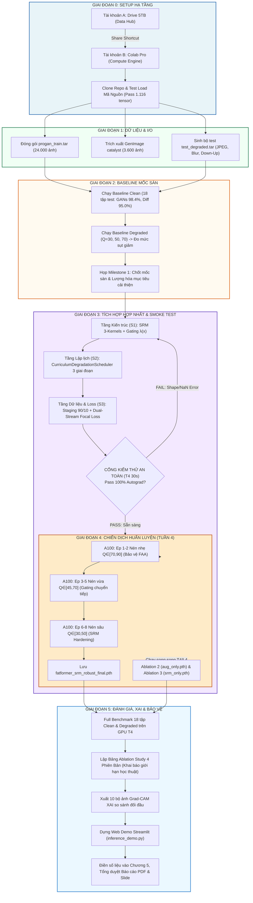

# SỔ TAY QUY TRÌNH THỰC HIỆN DỰ ÁN TỪ ĐẦU ĐẾN CUỐI (END-TO-END WORKFLOW SOP)
# DỰ ÁN: NÂNG CẤP ĐỘ BỀN VỮNG PHÁP Y CHO FATFORMER (FATFORMER-XLA)

> **Mục tiêu tài liệu**: Cung cấp cẩm nang tác chiến từng bước (*Standard Operating Procedure - SOP*) cho nhóm 3 thành viên, hướng dẫn chi tiết từ con số 0: từ khâu dựng hạ tầng Google Drive/Colab, xử lý dữ liệu, thiết lập mốc sàn Baseline, tích hợp kiến trúc & lập lịch tăng tiến (S1+S2+S3), đến chiến dịch huấn luyện A100, đo đạc Benchmark đa chiều, trích xuất XAI và bảo vệ đồ án.

---

## MỤC LỤC TỔNG QUAN

1. [Sơ Đồ Luồng Tác Chiến Toàn Diện (Master Pipeline Flowchart)](#1-so-do-luong-tac-chien-toan-dien)
2. [Giai Đoạn 0: Khởi Tạo Hạ Tầng & Môi Trường (Day 0 Setup)](#2-giai-doan-0-khoi-tao-ha-tang--moi-truong)
3. [Giai Đoạn 1: Chuẩn Bị Dữ Liệu & Quy Tắc I/O Chống Nghẽn SSD](#3-giai-doan-1-chuan-bi-du-lieu--quy-tac-io-chong-nghen-ssd)
4. [Giai Đoạn 2: Tái Lập Mốc Sàn Khoa Học (Baseline Benchmark & Milestone 1)](#4-giai-doan-2-tai-lap-moc-san-khoa-hoc)
5. [Giai Đoạn 3: Tích Hợp Kỹ Thuật Hợp Nhất (Unified Pipeline S1 + S2 + S3) & Cổng Smoke Test](#5-giai-doan-3-tich-hop-ky-thuat-hop-nhat)
6. [Giai Đoạn 4: Chiến Dịch Huấn Luyện Thực Chiến Trên Colab Pro (A100 & T4)](#6-giai-doan-4-chien-dich-huan-luyen-thuc-chien)
7. [Giai Đoạn 5: Full Benchmark Đa Chiều, XAI Grad-CAM, Demo App & Bảo Vệ](#7-giai-doan-5-full-benchmark-xai-demo-app--bao-ve)
8. [Bảng Tra Cứu Lệnh Nhanh Theo Trình Tự Thực Thi (Command Cheat Sheet)](#8-bang-tra-cuu-lenh-nhanh-theo-trinh-tu-thuc-thi)

---

<a name="1-so-do-luong-tac-chien-toan-dien"></a>
## 1. SƠ ĐỒ LUỒNG TÁC CHIẾN TOÀN DIỆN (MASTER PIPELINE FLOWCHART)



---

<a name="2-giai-doan-0-khoi-tao-ha-tang--moi-truong"></a>
## 2. GIAI ĐOẠN 0: KHỞI TẠO HẠ TẦNG & MÔI TRƯỜNG (DAY 0 SETUP)

### 2.1 Cấu Hình Liên Kết 2 Tài Khoản (Phương Án A — Google Drive Shortcut)
Dự án sử dụng cơ chế liên kết **Zero-Byte Consumption** để khai thác tối đa tài nguyên:
* **Tài khoản A (Chính - 5TB Drive)**: Lưu trữ toàn bộ dữ liệu thô, các file `.tar`, checkpoint và logs.
  1. Tạo thư mục gốc `FatFormer_Hub/` trên `MyDrive`.
  2. Tạo các thư mục con:
     ```
     FatFormer_Hub/
     ├── datasets/       # Chứa các file .tar (progan_train.tar, test_degraded.tar,...)
     ├── pretrained/     # Chứa fatformer_author.pth gốc từ CVPR 2024
     ├── checkpoints/    # Nơi tự động lưu trọng số sau mỗi epoch
     └── logs/           # Log huấn luyện, tensorboard, csv metrics
     ```
  3. Bấm **Share** thư mục `FatFormer_Hub` $\rightarrow$ Nhập email Tài khoản B (Colab Pro) $\rightarrow$ Cấp quyền **Editor**.
* **Tài khoản B (Phụ - Colab Pro 300 CUs + 15GB Drive)**:
  1. Mở Drive của Tài khoản B $\rightarrow$ Vào mục **"Được chia sẻ với tôi" (Shared with me)**.
  2. Click chuột phải vào `FatFormer_Hub` $\rightarrow$ Chọn **"Thêm lối tắt vào Drive" (Add shortcut to Drive)** $\rightarrow$ Đặt vào `MyDrive`.
  3. Khi mount Drive trên Colab:
     ```python
     from google.colab import drive
     drive.mount('/content/drive')
     # Đường dẫn truy cập dữ liệu không tốn 1 byte nào của tài khoản B:
     HUB_DIR = "/content/drive/MyDrive/FatFormer_Hub"
     ```

### 2.2 Clone Mã Nguồn & Kiểm Thử Nạp Model Sẵn Sàng (Day 1 Verify)
Trước khi viết thêm bất kỳ tính năng nào, nhóm bắt buộc phải kiểm chứng mã nguồn hiện có:
1. Mở Colab (GPU T4 miễn phí hoặc CPU):
   ```bash
   !git clone https://github.com/your-team/fatformer.git /content/fatformer
   %cd /content/fatformer
   !pip install -q ftfy regex tqdm timm pytorch-wavelets
   ```
2. Chạy script kiểm tra nạp checkpoint gốc:
   ```bash
   python tools/test_src_load.py --checkpoint /content/drive/MyDrive/FatFormer_Hub/pretrained/fatformer_author.pth
   ```
3. **Tiêu chuẩn vượt qua (Pass Criteria)**: Phải hiển thị thông báo `strict=True: Loaded 1,116 tensors successfully! Output shapes match expected dimensions.` (Loại bỏ 100% rủi ro lệch kiến trúc ngay từ ngày đầu).

---

<a name="3-giai-doan-1-chuan-bi-du-lieu--quy-tac-io-chong-nghen-ssd"></a>
## 3. GIAI ĐOẠN 1: CHUẨN BỊ DỮ LIỆU & QUY TẮC I/O CHỐNG NGHẼN SSD

### 3.1 Chuẩn Hóa Bộ Train ProGAN 4-Class (Cốt Lõi)
* **Quy chuẩn danh mục lớp**: Phải dùng đúng 4 lớp theo CVPR 2024 (mục 620): **`car, cat, chair, horse`** (tuyệt đối không dùng `airplane`).
* **Số lượng mẫu khuyến nghị cho Colab Pro**:
  * 4 lớp $\times$ 3.000 ảnh Real / 3.000 ảnh Fake = **24.000 ảnh** (hoặc 72.000 ảnh nếu chọn phương án Full).
  * Cấu trúc thư mục trước khi nén:
    ```
    progan_train/
    ├── train/
    │   ├── 0_real/   [12.000 ảnh thật định dạng jpg/png]
    │   └── 1_fake/   [12.000 ảnh giả ProGAN]
    └── val/
        ├── 0_real/   [1.000 ảnh đối chứng validation]
        └── 1_fake/   [1.000 ảnh đối chứng validation]
    ```
  * Nén thành file duy nhất: `tar -cf progan_train.tar progan_train/` và upload lên `FatFormer_Hub/datasets/`.

### 3.2 Chuẩn Bị Bộ Xúc Tác GenImage 10% (Chiến Lược 3 Data Staging)
* Trích xuất chính xác **3.600 ảnh** từ bộ *GenImage* (Zhu et al., NeurIPS 2023):
  * **Stable Diffusion v1.5**: 1.200 ảnh Real + 1.200 ảnh Fake.
  * **Midjourney v5**: 600 ảnh Real + 600 ảnh Fake.
* Trộn với ProGAN 4-class theo tỷ lệ $90\%$ ProGAN + $10\%$ GenImage, đóng gói thành `diffusion_staging.tar`.

### 3.3 Sinh Bộ Dữ Liệu Kiểm Thử Suy Thoái (Degraded Testset)
Chạy script tự động hóa trên máy trạm hoặc Colab CPU để tạo tập test suy biến:
```bash
python data/make_degraded.py     --input_dir /path/to/clean_testset     --output_dir /path/to/test_degraded     --jpeg_qualities 30 50 70     --blur_sigmas 1.0 2.0     --downup_sizes 112
```
Đóng gói thành `test_degraded.tar` (~6.2 GB) và lưu lên Drive 5TB.

### 3.4 Quy Tắc Vàng: Chống Nghẽn I/O Bằng SSD Local Extraction
> [!CAUTION]
> **Tuyệt đối không bao giờ** cho DataLoader đọc ảnh trực tiếp từ đường dẫn `/content/drive/MyDrive/...`. Việc này sẽ làm chậm tốc độ huấn luyện 10 đến 15 lần, gây nghẽn I/O và chắc chắn làm Colab ngắt kết nối giữa chừng!

**Đoạn code bắt buộc ở đầu mỗi Notebook huấn luyện/đánh giá**:
```python
import os
import shutil

# 1. Tạo thư mục làm việc trên ổ SSD NVMe cục bộ của máy ảo Colab
os.makedirs("/content/dataset_local", exist_ok=True)

# 2. Copy file nén từ Drive về máy ảo (tốc độ copy nội bộ cực nhanh ~100MB/s)
print("Đang sao chép tệp dữ liệu về SSD cục bộ...")
shutil.copy("/content/drive/MyDrive/FatFormer_Hub/datasets/progan_train.tar", "/content/progan_train.tar")

# 3. Giải nén trực tiếp trên SSD máy ảo
print("Đang giải nén dữ liệu...")
os.system("tar -xf /content/progan_train.tar -C /content/dataset_local/")

# 4. Trỏ DataLoader vào SSD cục bộ
TRAIN_DIR = "/content/dataset_local/progan_train/train"
print(f"Dữ liệu sẵn sàng tại {TRAIN_DIR} trên ổ SSD NVMe siêu tốc!")
```

---

<a name="4-giai-doan-2-tai-lap-moc-san-khoa-hoc"></a>
## 4. GIAI ĐOẠN 2: TÁI LẬP MỐC SÀN KHOA HỌC (BASELINE BENCHMARK & MILESTONE 1)

Mục tiêu của Tuần 2: **Đo đạc chính xác hiệu năng mô hình gốc trước khi can thiệp bất kỳ dòng code kiến trúc nào**. Đây là bằng chứng thực nghiệm bắt buộc phải có trong đồ án.

### 4.1 Đo Baseline Trên Miền Ảnh Sạch (Clean Benchmark)
Chạy đánh giá mô hình gốc trên 18 tập test paper chuẩn bằng GPU T4 (~1.5 CUs):
```bash
python eval.py     --checkpoint /content/drive/MyDrive/FatFormer_Hub/pretrained/fatformer_author.pth     --data_root /content/dataset_local/clean_benchmark/     --mode clean     --output_csv /content/drive/MyDrive/FatFormer_Hub/logs/baseline_clean.csv
```
* **Chỉ tiêu đối chiếu chuẩn paper CVPR 2024**:
  * Trung bình 8 họ GANs: **$98.4\%$** (ProGAN 99.9%, StyleGAN 97.2%, Deepfake 93.2%).
  * Trung bình 10 họ Diffusion: **$95.0\%$** (VQ-Diffusion 100%, PNDM 99.3%, LDM 98.6%).
  * **"Tử huyệt" Guided Diffusion**: **$76.1\%$** (điểm trũng sâu nhất, làm cơ sở khoa học cho Chiến lược 3).

### 4.2 Đo Baseline Trên Miền Ảnh Suy Thoái (Degraded Benchmark)
Tiếp tục đo Checkpoint gốc trên bộ test suy biến:
```bash
python eval.py     --checkpoint /content/drive/MyDrive/FatFormer_Hub/pretrained/fatformer_author.pth     --data_root /content/dataset_local/test_degraded/     --mode degraded     --qualities 30 50 70     --output_csv /content/drive/MyDrive/FatFormer_Hub/logs/baseline_degraded.csv
```
* **Hiện tượng quan sát được**: Hiệu năng trên ảnh nén JPEG $Q=30$ sụt giảm nghiêm trọng (dự kiến tụt xuống dưới $70-75\%$).
* **Ý nghĩa khoa học**: Đây là bằng chứng thép chứng minh biến dạng nén phá hủy các thành phần tần số cao $HH, HL, LH$ của phép biến đổi sóng Haar DWT trong mô hình gốc.

### 4.3 Họp Nhóm Milestone 1 (Cuối Tuần 2)
1. Xác nhận số liệu Baseline Clean và Degraded đã được ghi nhận đầy đủ vào file CSV.
2. Chính thức lượng hóa chỉ tiêu nghiệm thu:
   * Mục tiêu: Đưa độ chính xác trên tập nén sâu $Q=30$ tăng từ **$+10\%$ đến $+15\%$**.
   * Ràng buộc an toàn: Không làm suy giảm độ chính xác trên ảnh Clean quá **$0.5\%$**.
3. Bàn giao bản thảo **Chương 1 (Động lực nghiên cứu)** và **Chương 2 (Công trình liên quan)** của Báo cáo.

---

<a name="5-giai-doan-3-tich-hop-ky-thuat-hop-nhat"></a>
## 5. GIAI ĐOẠN 3: TÍCH HỢP KỸ THUẬT HỢP NHẤT (UNIFIED PIPELINE S1 + S2 + S3) & CỔNG SMOKE TEST

Tại Tuần 3, nhóm không áp dụng rời rạc mà tích hợp thành một cấu hình huấn luyện hoàn chỉnh:

```
FatFormer-XLA = Kiến trúc S1 (SRM + Gating) 
              + Lập lịch S2 (Curriculum 3 giai đoạn) 
              + Dữ liệu & Hàm mất mát S3 (Staging 90/10 + Dual-Stream Focal Loss)
```

### 5.1 Tích Hợp Module Kiến Trúc (Thành Viên B)
1. **Khối SRM Vi Sai Cố Định** (`src/models/srm.py`):
   * Tích hợp 3 bộ lọc đạo hàm bậc 1 ($K_1$), Laplacian bậc 2 ($K_2$) và bộ lọc vuông $5 \times 5$ ($K_3$) cố định trọng số (`requires_grad=False`).
   * Trích xuất vết nứt vi sai điểm ảnh ở không gian thực, bù đắp phần tần số cao bị JPEG phá hủy.
2. **Cổng Tần Số Thích Ứng** (`src/models/gating.py`):
   * Định nghĩa cổng $\lambda(x) \in [0.0, 2.0]$ dựa trên Global Average Pooling:
     $$\lambda(x) = \text{Sigmoid}\Big(\mathbf{W}_2 \cdot \text{GELU}\big(\mathbf{W}_1 \cdot \text{GAP}(x) + \mathbf{b}_1\big) + b_2\Big) \times 2.0$$
   * Khi ảnh sạch $\lambda(x) \approx 1.2 \sim 1.5$; khi ảnh nén nát $Q=30$, cổng tự động hạ $\lambda(x) \rightarrow 0.05 \sim 0.1$, chuyển ưu tiên nhận diện sang nhánh SRM.
3. **Hàm Tổn Thất Dual-Stream Focal Loss** (`src/training/loss.py`):
   * Thay thế Cross-Entropy bằng Focal Loss trên cả 2 nhánh (Visual $S(i)$ và Alignment LGA $S'(i)$):
     $$\mathcal{L}_{\text{total}} = \mathcal{L}_{\text{Focal}}(S(i), y) + \mathcal{L}_{\text{Focal}}(S'(i), y) \quad (\gamma=2.0, \alpha=0.25)$$
   * Triệt tiêu gradient từ các mẫu GANs dễ, dồn xung lực AdamW vào các mẫu bị nén nát hoặc mẫu Diffusion tinh vi trong tập train.

### 5.2 Tích Hợp Bộ Lập Lịch Tăng Tiến (Thành Viên A)
Xây dựng lớp `CurriculumDegradationScheduler` trong `src/datasets/transforms.py`:
```python
class CurriculumDegradationScheduler:
    def __init__(self):
        pass

    def get_transform(self, epoch):
        # 30% Clean stream luôn được giữ nguyên
        # 70% Degraded stream thay đổi dải biến dạng theo epoch:
        if 1 <= epoch <= 2:
            # Giai đoạn 1: Nén nhẹ, bảo vệ FAA khỏi sốc gradient
            return RandomDegradation(q_range=(70, 90), blur_sigma=(0.5, 1.0), down_up=False)
        elif 3 <= epoch <= 5:
            # Giai đoạn 2: Nén vừa, rèn cổng Gating đóng/mở
            return RandomDegradation(q_range=(45, 70), blur_sigma=(1.0, 1.5), down_up_size=160)
        else: # epoch 6 to 8
            # Giai đoạn 3: Nén khắc nghiệt, tối ưu hóa SRM vi sai
            return RandomDegradation(q_range=(30, 50), blur_sigma=(1.5, 2.0), down_up_size=112)
```

### 5.3 CỔNG KIỂM THỬ TÍCH HỢP BẮT BUỘC (Integration Smoke Test Gate)
> [!IMPORTANT]
> **Quy tắc an toàn**: Không được phép mở GPU A100 khi chưa vượt qua cổng kiểm thử an toàn này trên GPU T4 miễn phí.

* **Thực thi trên GPU T4 (Thời gian chạy: 30 giây, tiêu thụ 0 CU)**:
  ```bash
  python train.py       --config configs/train_config.yaml       --smoke_test       --batch_size 16       --device cuda
  ```
* **Yêu cầu kiểm định**:
  - [x] Forward pass chạy trơn tru qua FAA, SRM, Gating và LGA.
  - [x] `DualStreamFocalLoss` tính ra giá trị hữu hạn (không bị NaN, không bị Inf).
  - [x] Backward pass kích hoạt autograd thành công, gradient tồn tại ở tất cả các trọng số mở khóa (5.9% trainable parameters).
  - [x] Checkpoint giả lập ghi thành công file `.pth` thử nghiệm lên Drive.

---

<a name="6-giai-doan-4-chien-dich-huan-luyen-thuc-chien"></a>
## 6. GIAI ĐOẠN 4: CHIẾN DỊCH HUẤN LUYỆN THỰC CHIẾN TRÊN COLAB PRO (A100 & T4)

Chiến dịch huấn luyện Tuần 4 sử dụng chiến lược **Phân Tầng Phần Cứng (Tiered Hardware Strategy)** để tối ưu hóa triệt để 300 Compute Units.

### 6.1 Huấn Luyện Mô Hình Chính: 8 Epoch Trên GPU A100 (~28 CUs)
Tập lệnh huấn luyện chính thức với tập dữ liệu Staging 90/10 và Focal Loss:
```bash
python train.py \
    --config configs/train_config.yaml     --data_dir /content/dataset_local/diffusion_staging/train     --epochs 8     --batch_size 32     --grad_accum 2     --lr_adapter 1e-4     --lr_gating 1e-3     --save_dir /content/drive/MyDrive/FatFormer_Hub/checkpoints     --resume_auto
```

#### Tiến Trình 3 Giai Đoạn Chi Tiết:
* **Giai đoạn 1 (Epoch 1 – 2 | ~7 CUs)**:
  * Áp dụng dải nén nhẹ $Q \in [70, 90]$.
  * Trọng số SRM và Gating thích nghi êm đềm; FAA được bảo toàn an toàn tuyệt đối, triệt tiêu nguy cơ sốc gradient.
* **Giai đoạn 2 (Epoch 3 – 5 | ~10 CUs)**:
  * Nâng dải nén lên $Q \in [45, 70]$, bắt đầu áp dụng Down-Up $224 \rightarrow 160 \rightarrow 224$.
  * Cổng $\lambda(x)$ học đóng dần nhánh DWT và chuyển dịch trọng số sang nhánh SRM.
  * Tự động lưu checkpoint `fatformer_srm_phase2.pth` về Drive.
* **Giai đoạn 3 (Epoch 6 – 8 | ~11 CUs)**:
  * Áp dụng nén sâu khắc nghiệt $Q \in [30, 50]$, Down-Up $224 \rightarrow 112 \rightarrow 224$.
  * Tự động giảm Learning Rate xuống $5 \times 10^{-5}$ để tinh chỉnh mịn các đặc trưng vi mô.
  * Hoàn tất và lưu checkpoint cốt lõi: **`fatformer_srm_robust_final.pth`**.

### 6.2 Huấn Luyện Các Mô Hình Đối Chứng (Ablation Checkpoints)
Để giải phóng GPU A100 cho mô hình chính, 2 checkpoint đối chứng được phân công như sau:
1. **Checkpoint Ablation 2 - Chỉ Augmentation tĩnh (`fatformer_aug_only.pth`)**:
   * Do **Thành viên A** phụ trách, chạy 5 epoch trên **GPU T4/L4 (~3–4 CUs)**.
   * Cấu hình: FAA gốc + Augmentation tĩnh ngẫu nhiên ($Q \in [40, 95]$), không có SRM/Gating, dùng hàm mất mát Cross-Entropy.
2. **Checkpoint Ablation 3 - Thêm SRM, không Gating (`fatformer_srm_only.pth`)**:
   * Do **Thành viên B** phụ trách, chạy 5 epoch trên GPU A100/L4 (~4–5 CUs).
   * Cấu hình: FAA + SRM 3-Kernels cố định, cổng $\lambda$ cố định = 1.0 (không có Gating thích ứng), dùng Cross-Entropy.

### 6.3 Sử Dụng Khoảng Đệm 2 Ngày (Buffer Slot - Cuối Tuần 4)
* Dành riêng 2 ngày cuối Tuần 4 để xử lý sự cố ngoài dự kiến (Colab ngắt kết nối, cần tinh chỉnh lại Learning Rate hoặc chạy bù epoch nếu loss chưa hội tụ mượt mà).
* Đảm bảo bước sang Tuần 5 nhóm đã có sẵn đầy đủ **4 checkpoint** trên Drive:
  1. `fatformer_baseline.pth`
  2. `fatformer_aug_only.pth`
  3. `fatformer_srm_only.pth`
  4. `fatformer_srm_robust_final.pth`

---

<a name="7-giai-doan-5-full-benchmark-xai-demo-app--bao-ve"></a>
## 7. GIAI ĐOẠN 5: FULL BENCHMARK ĐA CHIỀU, XAI GRAD-CAM, DEMO APP & BẢO VỆ

Tuần 5 là tuần thu hoạch thành quả thực nghiệm và đóng gói sản phẩm.

### 7.1 Chạy Full Benchmark Đa Chiều Trên GPU T4 (~2 CUs)
Thành viên C chạy script benchmark tổng hợp trên cả 4 checkpoint:
```bash
python tools/full_benchmark_matrix.py \
    --checkpoints_dir /content/drive/MyDrive/FatFormer_Hub/checkpoints     --data_root /content/dataset_local/test_degraded     --output_report /content/drive/MyDrive/FatFormer_Hub/logs/full_benchmark_report.csv
```
* Báo cáo tự động kết xuất ma trận kết quả: Accuracy, Average Precision (AP), AUC trên 18 tập test paper gốc và tập mở rộng thế hệ mới (SD v1.4, SD v1.5, Midjourney v5).

### 7.2 Lập Bảng Phân Tích Triệt Tiêu (Ablation Study) & Tuyên Bố Học Thuật
* Tổng hợp số liệu vào Bảng Ablation 4 phiên bản:
  * *Phiên bản 1 (Baseline gốc)*: Chứng minh nhược điểm khi gặp nén sâu.
  * *Phiên bản 2 (Aug-only)*: Tăng độ bền nén nhẹ nhưng làm sụt giảm độ chính xác ảnh Clean (do học vẹt nhiễu nén).
  * *Phiên bản 3 (SRM-only)*: Bắt đầu khôi phục vết vi sai không gian, giảm phụ thuộc vào DWT.
  * *Phiên bản 4 (FatFormer-XLA Đầy đủ)*: Hiệu năng vượt trội toàn diện trên ảnh nén sâu $Q=30$ mà vẫn bảo toàn độ chính xác ảnh Clean nhờ cổng đóng/mở $\lambda(x)$.
* **Tuyên bố phạm vi học thuật bắt buộc (Academic Scope Limitation)**:
  > *"Do giới hạn ngân sách tính toán thực tế (300 Compute Units trên Colab Pro), nhóm đánh giá hiệu quả tổng hợp của cụm kỹ thuật hoàn chỉnh (Dynamic Gating + Curriculum Scheduler + Multi-Gen Staging + Dual-Stream Focal Loss) như một cấu hình tối ưu của FatFormer-XLA, không phân rã thêm các checkpoint trung gian để tránh lãng phí tài nguyên."*

### 7.3 Trích Xuất Ảnh Trực Quan Hóa Grad-CAM (XAI)
Thành viên B chạy script XAI trên các cặp ảnh đối đầu:
```bash
python tools/visualize_cam.py \
    --model_baseline /content/drive/MyDrive/FatFormer_Hub/pretrained/fatformer_author.pth     --model_robust /content/drive/MyDrive/FatFormer_Hub/checkpoints/fatformer_srm_robust_final.pth     --image_path samples/sd_v15_compressed_q30.jpg     --output_dir /content/drive/MyDrive/FatFormer_Hub/logs/cam_results
```
* **Kỳ vọng trực quan**: Heatmap của mô hình gốc bị phân tán và bám theo các đường lưới khối JPEG $8 \times 8$. Trong khi đó, heatmap của FatFormer-XLA tập trung sắc nét vào các vùng mắt, tóc, nếp vải (dị thường nội tại của thuật toán sinh AI).

### 7.4 Xây Dựng Ứng Dụng Demo Web (Thành Viên A)
Khởi chạy giao diện trực quan Streamlit để demo thực tế trước hội đồng:
```bash
streamlit run tools/inference_demo.py
```
* Tính năng Demo: Cho phép kéo thả trực tiếp một ảnh bất kỳ từ Facebook/Zalo/Telegram $\rightarrow$ Hiển thị thanh trượt mô phỏng nén JPEG $Q \in [10, 100]$ $\rightarrow$ Xuất xác suất Real/Fake kèm Heatmap Grad-CAM thời gian thực trong 1.5 giây.

### 7.5 Lắp Ráp Báo Cáo Cuốn Chiếu & Tổng Duyệt Slide Bảo Vệ
* Nhờ áp dụng **mô hình viết cuốn chiếu**:
  * Tuần 2: Đã hoàn tất Chương 1 (Mở đầu) & Chương 2 (Công trình liên quan).
  * Tuần 3: Đã hoàn tất Chương 3 (Phương pháp luận & Kiến trúc đề xuất).
  * Tuần 4: Đã hoàn tất Chương 4 (Thiết lập thực nghiệm & Hạ tầng Colab).
* Tại Tuần 5: Cả nhóm chỉ cần điền bảng số liệu thực tế và ảnh Grad-CAM vào **Chương 5 (Kết quả thực nghiệm & Thảo luận)** và viết phần Kết luận.
* Xuất file báo cáo chuẩn PDF và hoàn tất 25 slide thuyết trình bảo vệ đồ án.

---

<a name="8-bang-tra-cuu-lenh-nhanh-theo-trinh-tu-thuc-thi"></a>
## 8. BẢNG TRA CỨU LỆNH NHANH THEO TRÌNH TỰ THỰC THI (COMMAND CHEAT SHEET)

| Bước | Mục đích tác chiến | Câu lệnh thực thi trên Terminal / Notebook Colab | Người phụ trách |
| :---: | :--- | :--- | :---: |
| **0.1** | Kiểm thử nạp model gốc | `python tools/test_src_load.py --checkpoint /path/to/fatformer_author.pth` | **B** |
| **1.1** | Giải nén SSD NVMe local | `tar -xf /content/progan_train.tar -C /content/dataset_local/` | **A** |
| **1.2** | Sinh dữ liệu suy thoái test | `python data/make_degraded.py --input_dir ... --jpeg_qualities 30 50 70` | **A** |
| **2.1** | Đánh giá nhanh Baseline (500 ảnh) | `python tools/fast_eval.py --checkpoint ... --mode clean --samples 500` | **C** |
| **2.2** | Đánh giá Full Baseline Clean | `python eval.py --checkpoint ... --mode clean --output_csv baseline_clean.csv` | **C** |
| **2.3** | Đánh giá Full Baseline Degraded | `python eval.py --checkpoint ... --mode degraded --qualities 30 50 70` | **C** |
| **3.1** | **Cổng kiểm thử an toàn (Smoke Gate)** | `python train.py --config configs/train_config.yaml --smoke_test --batch_size 16` | **B + C** |
| **4.1** | Huấn luyện chính 8 epoch A100 | `python train.py --config configs/train_config.yaml --epochs 8 --batch_size 32 --grad_accum 2` | **C** |
| **4.2** | Huấn luyện Ablation 2 (T4) | `python train.py --ablation aug_only --epochs 5 --device cuda` | **A** |
| **4.3** | Huấn luyện Ablation 3 (A100/L4) | `python train.py --ablation srm_only --epochs 5 --device cuda` | **B** |
| **5.1** | Chạy ma trận Full Benchmark | `python tools/full_benchmark_matrix.py --checkpoints_dir ... --mode all` | **C** |
| **5.2** | Trích xuất Grad-CAM XAI | `python tools/visualize_cam.py --model_robust ... --image_path ...` | **B** |
| **5.3** | Khởi chạy Web Demo App | `streamlit run tools/inference_demo.py` | **A** |

---
*Tài liệu này là cẩm nang quy trình tác chiến chuẩn của dự án FatFormer-XLA, đảm bảo mọi thành viên nắm vững lộ trình kỹ thuật và phối hợp nhịp nhàng từ con số 0 đến ngày bảo vệ thành công.*
