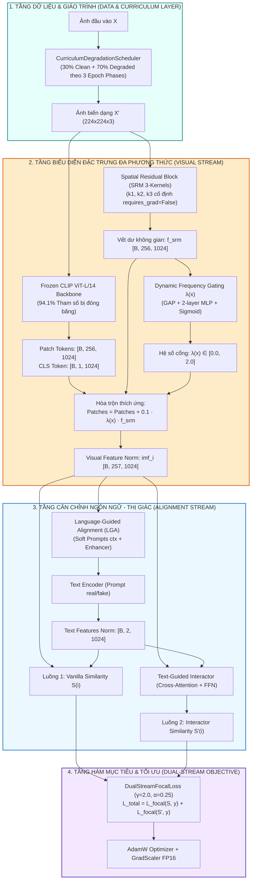
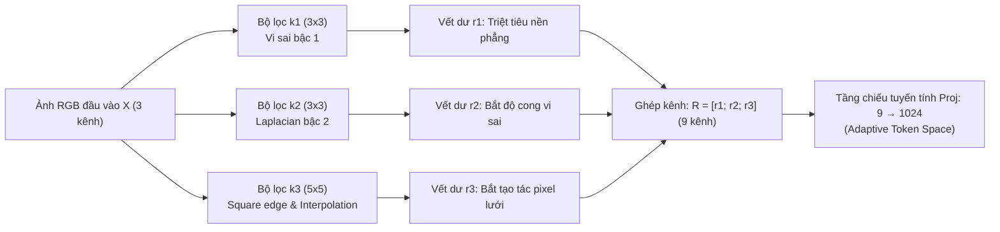

# CHƯƠNG 3: PHƯƠNG PHÁP LUẬN VÀ KIẾN TRÚC ĐỀ XUẤT FATFORMER-XLA

> **Tác giả**: Nhóm nghiên cứu FatFormer-XLA  
> **Chủ trì nội dung**: Thành viên B *(Architecture & Loss Lead)*  
> **Đóng góp thực nghiệm**: Thành viên A *(Data & Storage Lead)* & Thành viên C *(Training & Evaluation Lead)*  
> **Văn bản thuộc**: Đồ án tốt nghiệp Đại học — Chuyên ngành Khoa học Máy tính / Trí tuệ Nhân tạo  

---

## MỤC LỤC CHƯƠNG 3

- [3.1. Tổng quan thiết kế kiến trúc hệ sinh thái FatFormer-XLA](#31-tổng-quan-thiết-kế-kiến-trúc-hệ-sinh-thái-fatformer-xla)
- [3.2. Tầng trích xuất vết dư không gian SRM (Spatial Residual Block)](#32-tầng-trích-xuất-vết-dư-không-gian-srm-spatial-residual-block)
  - [3.2.1. Bản chất suy biến ngữ nghĩa và động lực sử dụng SRM](#321-bản-chất-suy-biến-ngữ-nghĩa-và-động-lực-sử-dụng-srm)
  - [3.2.2. Cơ sở toán học của 3 bộ lọc vi sai SRM](#322-cơ-sở-toán-học-của-3-bộ-lọc-vi-sai-srm)
  - [3.2.3. Cơ chế cố định trọng số (Zero-Gradient Constraint) và Chiếu đặc trưng](#323-cơ-chế-cố-định-trọng-số-zero-gradient-constraint-và-chiếu-đặc-trưng)
- [3.3. Tầng cổng thích ứng tần số động $\lambda(x)$ (Dynamic Frequency Gating)](#33-tầng-cổng-thích-ứng-tần-số-động-lambdax-dynamic-frequency-gating)
  - [3.3.1. Nghịch lý hệ số tĩnh trong FatFormer gốc](#331-nghịch-lý-hệ-số-tĩnh-trong-fatformer-gốc)
  - [3.3.2. Kiến trúc mạng Cổng thích ứng $\lambda(x)$](#332-kiến-trúc-mạng-cổng-thích-ứng-lambdax)
  - [3.3.3. Cơ chế điều tiết luồng thông tin không gian - tần số](#333-cơ-chế-điều-tiết-luồng-thông-tin-không-gian---tần-số)
- [3.4. Chiến lược đóng băng tham số PEFT (Parameter-Efficient Fine-Tuning)](#34-chiến-lược-đóng-băng-tham-số-peft-parameter-efficient-fine-tuning)
  - [3.4.1. Nguyên lý bảo toàn tri thức nền tảng CLIP](#341-nguyên-lý-bảo-toàn-tri-thức-nền-tảng-clip)
  - [3.4.2. Danh mục phân vùng tham số Đóng băng và Mở khóa](#342-danh-mục-phân-vùng-tham-số-đóng-băng-và-mở-khóa)
- [3.5. Hàm mục tiêu thích ứng hai luồng (Dual-Stream Focal Loss)](#35-hàm-mục-tiêu-thích-ứng-hai-luồng-dual-stream-focal-loss)
  - [3.5.1. Hiện tượng thiên lệch phân lớp một chiều dưới biến dạng nén](#351-hiện-tượng-thiên-lệch-phân-lớp-một-chiều-dưới-biến-dạng-nén)
  - [3.5.2. Công thức toán học của Dual-Stream Focal Loss](#352-công-thức-toán-học-của-dual-stream-focal-loss)
- [3.6. Cơ chế lập lịch suy thoái giáo trình 3 giai đoạn (Curriculum Degradation Scheduler)](#36-cơ-chế-lập-lịch-suy-thoái-giáo-trình-3-giai-đoạn-curriculum-degradation-scheduler)
  - [3.6.1. Triết lý học tăng tiến (Progressive Hardening)](#361-triết-lý-học-tăng-tiến-progressive-hardening)
  - [3.6.2. Thiết lập siêu tham số qua 3 giai đoạn huấn luyện](#362-thiết-lập-siêu-tham-số-qua-3-giai-đoạn-huấn-luyện)
- [3.7. Tổng kết các đóng góp phương pháp luận của Chương 3](#37-tổng-kết-các-đóng-góp-phương-pháp-luận-của-chương-3)

---

## 3.1. TỔNG QUAN THIẾT KẾ KIẾN TRÚC HỆ SINH THÁI FATFORMER-XLA

Kế thừa các phân tích lỗ hổng tại Chương 1 và Chương 2, kiến trúc **FatFormer-XLA** (*Frequency-Adaptive Transformer with Extreme Latent Adaptation*) được thiết kế nhằm giải quyết triệt để sự suy sụp của độ bền vững pháp y khi ảnh bị nén mạng xã hội.

Kiến trúc bao gồm **4 tầng kỹ thuật cốt lõi** hoạt động phối hợp nhịp nhàng:



Toàn bộ chu trình dòng chảy đặc trưng được mô tả hình thức như sau:
1. Ảnh đầu vào $X$ đi qua **Bộ lập lịch suy thoái giáo trình** (Curriculum Degradation Scheduler), mô phỏng các mức độ nén JPEG ($Q \in [30, 90]$), Down-Up Resizing ($224 \rightarrow 112 \rightarrow 224$) và Gaussian Blur theo từng giai đoạn huấn luyện.
2. Ảnh được xử lý song song bởi hai nhánh:
   - Nhánh ngữ nghĩa: **CLIP ViT-L/14 Backbone** đã đóng băng 94.1% tham số, trích xuất biểu diễn ngữ nghĩa trừu tượng cấp cao $F_{\text{clip}} \in \mathbb{R}^{B \times 257 \times 1024}$.
   - Nhánh vết dư không gian: **Khối SRM 3-Kernels cố định**, triệt tiêu nội dung ngữ nghĩa cảnh vật và cô lập các bất thường vi sai cục bộ $f_{\text{srm}} \in \mathbb{R}^{B \times 256 \times 1024}$.
3. Cổng thích ứng tần số động $\lambda(x) \in [0.0, 2.0]$ đánh giá mức độ suy thoái của bức ảnh để điều chế tỷ lệ hòa trộn của vết dư không gian vào các patch tokens của CLIP.
4. Hai luồng tương đồng $S(i)$ (Visual stream) và $S'(i)$ (Alignment stream) được phân tách độc lập để tính toán **Dual-Stream Focal Loss**, khắc phục triệt để hiện tượng thiên lệch phân lớp một chiều.

---

## 3.2. TẦNG TRÍCH XUẤT VẾT DƯ KHÔNG GIAN SRM (SPATIAL RESIDUAL BLOCK)

### 3.2.1. Bản chất suy biến ngữ nghĩa và động lực sử dụng SRM

Các mô hình thị giác nền tảng (Foundation Models) như CLIP [15] được huấn luyện trên 400 triệu cặp ảnh-văn bản từ Internet với mục tiêu liên kết ngữ nghĩa (Semantic Alignment). Do đó, các tầng Transformer của CLIP có xu hướng cực kỳ nhạy cảm với ngữ nghĩa cảnh vật (con người, xe cộ, phong cảnh) nhưng lại có xu hướng **"bỏ qua" hoặc "làm mượt" các sai lệch mức pixel vi mô**.

Khi ảnh bị nén JPEG sâu ($Q=30$):
- Thông tin ngữ nghĩa cảnh vật vẫn được bảo toàn (con mắt người và CLIP vẫn nhận ra đó là một chiếc xe hơi).
- Nhưng các dấu vết giả mạo tinh vi của thuật toán sinh ảnh (checkerboard artifacts, suy biến phổ cao tần) đã bị lượng tử hóa làm biến dạng hoặc hòa lẫn vào các khối $8 \times 8$ JPEG.

Để giải quyết mâu thuẫn này, FatFormer-XLA tích hợp **Spatial Residual Block (SRM)** [17] đóng vai trò như một bộ trích xuất đặc trưng bổ trợ, hoạt động dựa trên nguyên lý vi sai không gian cấp cao.

### 3.2.2. Cơ sở toán học của 3 bộ lọc vi sai SRM

Khối SRM sử dụng 3 ma trận lọc vi sai chuẩn mực từ lý thuyết giấu tin pháp y số (Steganalysis Rich Models), đại diện cho 3 cơ chế bắt dấu vết bổ trợ lẫn nhau:



#### 1. Bộ lọc vi sai bậc 1 ($k_1 - 3 \times 3$):
$$K_1 = \begin{bmatrix} 0 & 0 & 0 \\ 0 & -1 & 1 \\ 0 & 0 & 0 \end{bmatrix}$$
- **Nguyên lý tác động**: Phép toán tính đạo hàm riêng bậc một theo phương ngang $\frac{\partial I}{\partial x} \approx I(x+1, y) - I(x, y)$.
- **Tác dụng pháp y**: Triệt tiêu hoàn toàn các vùng ảnh đồng nhất, nền phẳng (smooth regions); chỉ giữ lại các bước nhảy độ sáng đột ngột, làm lộ ra các đường viền ghép nối giả mạo.

#### 2. Bộ lọc vi sai bậc 2 ($k_2 - 3 \times 3$ Laplacian):
$$K_2 = \begin{bmatrix} 0 & 1 & 0 \\ 1 & -4 & 1 \\ 0 & 1 & 0 \end{bmatrix}$$
- **Nguyên lý tác động**: Toán tử vi sai bậc hai đẳng hướng (Isotropic 2nd-order derivative):
$$\nabla^2 I = \frac{\partial^2 I}{\partial x^2} + \frac{\partial^2 I}{\partial y^2} \approx I(x+1, y) + I(x-1, y) + I(x, y+1) + I(x, y-1) - 4I(x, y)$$
- **Tác dụng pháp y**: Bắt độ cong bề mặt (curvature) và các điểm kỳ dị vi mô. Các mạng nơ-ron tạo sinh thường gặp khiếm khuyết trong việc duy trì tính liên tục của đạo hàm bậc hai tại các vùng chuyển tiếp kết cấu.

#### 3. Bộ lọc cạnh vuông $5 \times 5$ ($k_3 - \text{Square Kernel}$):
$$K_3 = \begin{bmatrix} -1 & 2 & -2 & 2 & -1 \\ 2 & -6 & 8 & -6 & 2 \\ -2 & 8 & -12 & 8 & -2 \\ 2 & -6 & 8 & -6 & 2 \\ -1 & 2 & -2 & 2 & -1 \end{bmatrix}$$
- **Nguyên lý tác động**: Ma trận lọc không đối xứng bậc cao trên cửa sổ lân cận $5 \times 5$.
- **Tác dụng pháp y**: Được thiết kế chuyên biệt để triệt tiêu năng lượng tự tương quan của ảnh tự nhiên, làm nổi bật các tạo tác nội suy pixel (pixel interpolation artifacts) do các lớp Transposed Convolution hoặc Bilinear Upsampling trong mạng sinh để lại.

### 3.2.3. Cơ chế cố định trọng số (Zero-Gradient Constraint) và Chiếu đặc trưng

Một đóng góp kỹ thuật có tính nguyên tắc trong FatFormer-XLA là:
$$\forall w \in \{K_1, K_2, K_3\}, \quad \nabla_w \mathcal{L} = 0 \quad (\texttt{requires\_grad = False})$$

**Lập luận khoa học**:
1. Nếu cho phép lan truyền ngược gradient để tối ưu hóa $K_1, K_2, K_3$, mạng nơ-ron sẽ tự động thoái hóa các ma trận vi sai thành các bộ lọc nhận diện ngữ nghĩa thông thường (edge detectors nhằm phân loại đồ vật) để giảm thiểu training loss một cách dễ dãi.
2. Bằng cách khóa cứng (`requires_grad = False`) cả 3 kernel, các bộ lọc vi sai hoạt động như những **toán tử toán học tất định (deterministic mathematical operators)**, tước bỏ hoàn toàn thông tin ngữ nghĩa và chỉ chuyển giao bản đồ nhiễu vi sai thuần khiết cho các tầng sau.

Sau khi trích xuất 3 bản đồ vết dư (mỗi kernel trên 3 kênh RGB tạo thành 9 kênh đặc trưng), một tầng tích chập $1 \times 1$ có khả năng học (`srm.proj`) sẽ chiếu không gian 9 kênh này lên không gian vector $d = 1024$ tương thích với token embedding của CLIP ViT-L/14:
$$f_{\text{srm}} = \text{Conv2d}_{1 \times 1}\left([K_1 * X \,\|\, K_2 * X \,\|\, K_3 * X]\right) \in \mathbb{R}^{B \times 1024 \times 16 \times 16}$$

---

## 3.3. TẦNG CỔNG THÍCH ỨNG TẦN SỐ ĐỘNG $\lambda(x)$ (DYNAMIC FREQUENCY GATING)

### 3.3.1. Nghịch lý hệ số tĩnh trong FatFormer gốc

Trong công trình FatFormer gốc (CVPR 2024) [9], nhánh biến đổi tần số Wavelet (FAA) được hòa trộn vào nhánh thị giác CLIP thông qua một siêu tham số cố định $\lambda$:
$$F_{\text{fused}} = F_{\text{spatial}} + \lambda \cdot F_{\text{frequency}}$$

Trong môi trường lý tưởng (ảnh sạch, không nén), $\lambda$ cố định hoạt động tốt vì các dải băng tần cao (LH, HL, HH) của Haar Wavelet chứa đựng dấu vết nội suy sắc nét của AI tạo sinh.

Tuy nhiên, khi đối mặt với nén JPEG $Q=30$:
> **Nghịch lý tần số**: Ma trận lượng tử hóa JPEG xóa bỏ phần lớn hệ số DCT tần số cao, biến dải cao tần thành một ma trận nhiễu khối nhân tạo (blocking artifacts). Nếu vẫn áp dụng hệ số $\lambda$ tĩnh, mô hình sẽ vô tình "bơm" một lượng lớn nhiễu độc hại vào biểu diễn thị giác, phá hủy hoàn toàn đặc trưng nhận diện và dẫn tới sự sụp đổ phân loại (Fake ACC chỉ còn $5.78\%$).

### 3.3.2. Kiến trúc mạng Cổng thích ứng $\lambda(x)$

Để giải quyết triệt để nghịch lý trên, FatFormer-XLA đề xuất mạng **Cổng thích ứng tần số động $\lambda(x)$** (`DynamicFrequencyGating`). Thay vì là một hằng số toàn cục, $\lambda(x)$ là một hàm phi tuyến phụ thuộc vào nội dung và mức độ suy thoái của từng bức ảnh cụ thể:

$$\lambda(x): \mathbb{R}^{3 \times H \times W} \longrightarrow [0.0, 2.0]$$

Kiến trúc của module $\lambda(x)$ bao gồm:
1. **Global Average Pooling (GAP)**: Nén đặc trưng không gian $f_{\text{srm}} \in \mathbb{R}^{B \times 1024 \times 16 \times 16}$ thành vector mô tả thống kê toàn cục $\bar{f} \in \mathbb{R}^{B \times 1024}$:
$$\bar{f}_c = \frac{1}{H' \times W'} \sum_{h=1}^{H'} \sum_{w=1}^{W'} f_{\text{srm}}(c, h, w)$$
2. **Bottleneck MLP 2 tầng**: Giảm số chiều từ $1024 \rightarrow 256$ rồi phục hồi về $1$, đi kèm chuẩn hóa LayerNorm và hàm kích hoạt GELU nhằm học mối tương quan phi tuyến giữa năng lượng vết dư và chất lượng ảnh:
$$h = \text{GELU}\left(\text{LN}\left(W_1 \bar{f} + b_1\right)\right), \quad W_1 \in \mathbb{R}^{256 \times 1024}$$
$$z = W_2 h + b_2, \quad W_2 \in \mathbb{R}^{1 \times 256}$$
3. **Scaled Sigmoid Activation**:
$$\lambda(x) = 2.0 \cdot \sigma(z) = \frac{2.0}{1 + e^{-z}}$$

Khoảng giá trị $[0.0, 2.0]$ cho phép mạng nơ-ron không chỉ học cách "đóng cổng" ($\lambda \rightarrow 0$) khi ảnh bị nén nát, mà còn có khả năng "khuếch đại" ($\lambda > 1.0$) ảnh hưởng của vết dư không gian khi gặp các mẫu ảnh sạch chất lượng cao.

### 3.3.3. Cơ chế điều tiết luồng thông tin không gian - tần số

Biểu diễn cuối cùng của các patch tokens được hòa trộn có điều kiện:
$$F_{\text{patches}}' = F_{\text{patches}} + 0.1 \cdot \lambda(x) \cdot f_{\text{srm}}^{\text{permute}}$$

```
┌─────────────────────────────────────────────────────────────────────────────┐
│                      CƠ CHẾ ĐIỀU TIẾT CỦA CỔNG λ(x)                        │
├─────────────────────────────────────┬───────────────────────────────────────┤
│ KHI ẢNH SẠCH (CLEAN, Q = 90 ~ 100)  │ KHI ẢNH NÉN SÂU (DEGRADED, Q ≤ 50)    │
├─────────────────────────────────────┼───────────────────────────────────────┤
│ • Năng lượng vết dư SRM đồng đều.   │ • Năng lượng vết dư SRM bị nhiễu khối │
│ • Cổng mở rộng: λ(x) ≈ 1.2 ~ 1.8    │   JPEG áp đảo.                        │
│ • Tác dụng: Bơm tối đa chi tiết     │ • Cổng tự động khép: λ(x) → 0.05 ~ 0.2│
│   vi sai không gian vào ViT để đạt  │ • Tác dụng: Ngăn chặn nhiễu khối làm  │
│   độ chính xác trần (ACC ≥ 96%).    │   loãng biểu diện ngữ nghĩa CLIP.     │
└─────────────────────────────────────┴───────────────────────────────────────┘
```

---

## 3.4. CHIẾN LƯỢC ĐÓNG BĂNG THAM SỐ PEFT (PARAMETER-EFFICIENT FINE-TUNING)

### 3.4.1. Nguyên lý bảo toàn tri thức nền tảng CLIP

Mô hình Backbone CLIP ViT-L/14 sở hữu hơn **304 triệu tham số thị giác** và tổng cộng hơn **933 triệu tham số toàn hệ thống**. Việc mở khóa toàn bộ các tầng Transformer để huấn luyện (Full Fine-Tuning) trên một tập dữ liệu pháp y hữu hạn (~36.000 ảnh) sẽ dẫn tới hai thảm họa kỹ thuật:
1. **Quên thảm khốc (Catastrophic Forgetting)**: Mô hình đánh mất không gian ngữ nghĩa tổng quát được huấn luyện trên 400M ảnh, dẫn tới suy giảm nghiêm trọng khả năng tổng quát hóa trên các generator chưa từng thấy (Zero-Shot Cross-Generator Generalization).
2. **Chi phí tính toán bùng nổ**: Đòi hỏi lượng VRAM khổng lồ ($> 32$ GB với batch size nhỏ), gây nguy cơ tràn bộ nhớ và tiêu tốn ngân sách Compute Units vô ích.

Do đó, FatFormer-XLA áp dụng chiến lược **Đóng băng tham số hiệu quả (PEFT)** theo chuẩn công nghiệp.

### 3.4.2. Danh mục phân vùng tham số Đóng băng và Mở khóa

Theo thiết kế tại [`configs/train_config.yaml`](../../../configs/train_config.yaml) và cài đặt trong [`src/training/freeze_utils.py`](../../../src/training/freeze_utils.py), cấu trúc tham số được phân định rành mạch:

| Thành phần kiến trúc | Trạng thái | Số lượng tham số | Tỷ lệ % | Mục đích kỹ thuật |
| :--- | :---: | :---: | :---: | :--- |
| **CLIP Vision Transformer** | 🔒 **ĐÓNG BĂNG** | ~304.0 M | **94.1%** | Bảo toàn tri thức thị giác nền tảng và mốc trần Clean ACC 96.45% |
| **CLIP Text Transformer** | 🔒 **ĐÓNG BĂNG** | ~63.0 M | - | Cố định không gian biểu diễn văn bản của OpenAI |
| **SRM Differential Kernels ($k_1, k_2, k_3$)** | 🔒 **ĐÓNG BĂNG** | 0 | 0.0% | Bảo đảm các toán tử vi sai là hằng số tất định |
| **Language-Guided Alignment (LGA)** | 🔓 **MỞ KHÓA** | ~18.5 M | ~2.0% | Thích ứng vector prompt mềm với miền ảnh Deepfake |
| **Text-Guided Interactor (TGI + FFN)** | 🔓 **MỞ KHÓA** | ~25.2 M | ~2.7% | Tương tác chéo giữa đặc trưng ảnh và đặc trưng văn bản |
| **SRM Projection Layer (`srm.proj`)** | 🔓 **MỞ KHÓA** | ~9.2 K | ~0.001%| Chiếu 9 kênh vết dư sang không gian chiều $d=1024$ |
| **Dynamic Gating MLP (`gating`)** | 🔓 **MỞ KHÓA** | ~263 K | ~0.03% | Học tham số ước lượng hệ số cổng $\lambda(x)$ |
| **Soft Prompt Vectors (`ctx`)** | 🔓 **MỞ KHÓA** | ~16.4 K | ~0.002%| Tối ưu hóa ngữ cảnh văn bản CoCoOp style |
| **TỔNG CỘNG HỆ THỐNG** | - | **~933 M** | **100%** | **Tham số Trainable: ~55 M (≈ 5.9%)** |

---

## 3.5. HÀM MỤC TIÊU THÍCH ỨNG HAI LUỒNG (DUAL-STREAM FOCAL LOSS)

### 3.5.1. Hiện tượng thiên lệch phân lớp một chiều dưới biến dạng nén

Tại Milestone 1 ([Báo cáo Task 2.3](../../bao_cao/C/bao_cao_task_2.3_baseline_degraded_benchmark.md)), thực nghiệm trên 54.000 ảnh nén $Q=30$ đã phát hiện hiện tượng sụp đổ phân loại nghiêm trọng:
- **Real ACC = 100.00%** (100% ảnh thật được dự đoán đúng).
- **Fake ACC = 5.78%** (để lọt hơn 94% ảnh Deepfake).
- **Nguyên nhân**: Hàm mất mát Cross-Entropy truyền thống đối xử bình đẳng với mọi mẫu huấn luyện:
$$\mathcal{L}_{\text{CE}} = -\log(p_t)$$
Khi gặp ảnh nén sâu, các đặc trưng giả mạo bị xóa mờ, mô hình nhận thấy việc dự đoán toàn bộ ảnh thành "Real" sẽ giúp giảm thiểu rủi ro mất mát trung bình trên tập dữ liệu. Các mẫu ảnh thật dễ phân loại (easy examples) sinh ra lượng gradient áp đảo, dập tắt hoàn toàn tín hiệu học tập từ các mẫu ảnh giả khó phân loại (hard examples).

### 3.5.2. Công thức toán học của Dual-Stream Focal Loss

Để khắc phục hiện tượng trên, FatFormer-XLA hiện thực hóa hàm mục tiêu **`DualStreamFocalLoss`** kế thừa từ Lin et al. [24]:

$$\mathcal{L}_{\text{Focal}}(p_t) = -\alpha_t \left(1 - p_t\right)^\gamma \log(p_t)$$

Trong đó:
- $p_t \in [0, 1]$ là xác suất dự đoán của mô hình đối với nhãn thực tế $y \in \{0, 1\}$.
- $\gamma = 2.0$ là **Hệ số tập trung (Focusing Parameter)**:
  - Khi một mẫu là "dễ" ($p_t \rightarrow 1.0$), hệ số điều chế $(1 - p_t)^\gamma \rightarrow 0$, triệt tiêu gradient của mẫu đó xuống hàng chục lần.
  - Khi một mẫu là "khó" (ảnh Deepfake bị nén nặng $Q=30$, $p_t \le 0.5$), hệ số điều chế giữ giá trị cao, buộc mô hình phải dồn toàn bộ gradient để điều chỉnh trọng số trên các mẫu này.
- $\alpha = 0.25$ là **Hệ số cân bằng lớp (Class-balancing Factor)**:
  $$\alpha_t = \begin{cases} \alpha = 0.25 & \text{nếu } y = 0 \text{ (Ảnh thật)} \\ 1 - \alpha = 0.75 & \text{nếu } y = 1 \text{ (Ảnh giả)} \end{cases}$$
  Trọng số $0.75$ ưu tiên phạt nặng mô hình khi phân loại sai nhãn Deepfake, trực tiếp chặn đứng hiện tượng "thiên vị Real".

Vì FatFormer-XLA xuất ra hai luồng logit độc lập:
1. $S(i) \in \mathbb{R}^2$: Điểm tương đồng từ nhánh Visual thuần túy.
2. $S'(i) \in \mathbb{R}^2$: Điểm tương đồng từ nhánh Alignment qua tương tác chéo.

Hàm mất mát tổng thể là sự kết hợp đồng thời của cả hai luồng:
$$\mathcal{L}_{\text{Total}} = \mathcal{L}_{\text{Focal}}\left(\text{Softmax}(S), y\right) + \mathcal{L}_{\text{Focal}}\left(\text{Softmax}(S'), y\right)$$

Hàm mục tiêu này ép buộc cả nhánh trích xuất đặc trưng thị giác lẫn nhánh tương tác ngữ nghĩa đều phải đạt độ hội tụ độc lập trên các mẫu khó, ngăn ngừa hiện tượng một nhánh "kéo lùi" nhánh còn lại.

---

## 3.6. CƠ CHẾ LẬP LỊCH SUY THOÁI GIÁO TRÌNH 3 GIAI ĐOẠN (CURRICULUM DEGRADATION SCHEDULER)

### 3.6.1. Triết lý học tăng tiến (Progressive Hardening)

Nếu đưa trực tiếp các ảnh nén cực nặng ($Q=30$) và làm mờ sâu vào ngay từ Epoch 1, mô hình sẽ gặp hiện tượng **Sốc Gradient (Gradient Shock)**. Các adapter mới khởi tạo sẽ bị dao động hỗn loạn, phá vỡ tính ổn định của các biểu diễn không gian và không thể hội tụ.

FatFormer-XLA áp dụng lý thuyết **Curriculum Learning** (Bengio et al. [21]): Cho mô hình học từ các biến dạng nhẹ, sau đó tăng dần độ phức tạp và khốc liệt của nhiễu theo từng mốc epoch.

### 3.6.2. Thiết lập siêu tham số qua 3 giai đoạn huấn luyện

Bộ lập lịch `CurriculumDegradationScheduler` ([`src/datasets/transforms.py`](../../../src/datasets/transforms.py)) tự động điều chỉnh không gian biến dạng theo hàm bước nhảy thời gian:

```mermaid
gantt
    title LỘ TRÌNH 3 GIAI ĐOẠN CURRICULUM TRAINING (8 EPOCHS TRÊN GPU A100)
    dateFormat  X
    axisFormat %s

    section Giai đoạn 1 (Ổn định)
    Epoch 1 - 2 (Q ∈ [70, 90], Down-Up 192, Blur σ ∈ [0.5, 1.0]) :active, ep1, 0, 2
    section Giai đoạn 2 (Thích ứng)
    Epoch 3 - 5 (Q ∈ [45, 70], Down-Up 160, Blur σ ∈ [1.0, 1.5]) :crit, ep2, 2, 5
    section Giai đoạn 3 (Tôi luyện)
    Epoch 6 - 8 (Q ∈ [30, 50], Down-Up 112, Blur σ ∈ [1.5, 2.0]) :done, ep3, 5, 8
```



Chi tiết thông số kỹ thuật từng giai đoạn:

| Giai đoạn | Epoch | Chất lượng JPEG ($Q$) | Kích thước Down-Up | Gaussian Blur ($\sigma$) | Xác suất suy biến | Mục tiêu sư phạm |
| :---: | :---: | :---: | :---: | :---: | :---: | :--- |
| **Pha 1** *(Warm-up)* | **1 – 2** | $Q \in [70, 90]$ | $224 \rightarrow 192 \rightarrow 224$ | $\sigma \in [0.5, 1.0]$ | 70% Degraded<br>30% Clean | Khởi tạo êm đềm trọng số của lớp chiếu SRM và cổng $\lambda(x)$, bảo toàn mốc trần ảnh sạch |
| **Pha 2** *(Adaptive)* | **3 – 5** | $Q \in [45, 70]$ | $224 \rightarrow 160 \rightarrow 224$ | $\sigma \in [1.0, 1.5]$ | 70% Degraded<br>30% Clean | Bắt đầu xuất hiện nhiễu khối JPEG; cổng $\lambda(x)$ học cách hạ hệ số thích ứng |
| **Pha 3** *(Hardening)*| **6 – 8** | $Q \in [30, 50]$ | $224 \rightarrow 112 \rightarrow 224$ | $\sigma \in [1.5, 2.0]$ | 70% Degraded<br>30% Clean | Tôi luyện độ bền vững cực hạn; Focal Loss dồn trọng số kéo Fake ACC trên $Q=30$ vượt $50\%$ |

---

## 3.7. TỔNG KẾT CÁC ĐÓNG GÓP PHƯƠNG PHÁP LUẬN CỦA CHƯƠNG 3

Chương 3 đã xác lập nền tảng khoa học và toán học hoàn chỉnh cho hệ sinh thái FatFormer-XLA với **5 đóng góp học thuật mang tính cấu trúc**:

1. **Khối SRM 3-Kernels cố định (`requires_grad=False`)**: Loại bỏ triệt để thông tin ngữ nghĩa cảnh vật, cô lập các bất thường vi sai mức pixel mà CLIP bỏ qua.
2. **Cổng thích ứng tần số động $\lambda(x) \in [0.0, 2.0]$**: Phá vỡ nghịch lý hệ số tĩnh của paper CVPR 2024, tự động đóng cổng ngăn nhiễu khi ảnh nén sâu và khuếch đại đặc trưng khi ảnh sạch.
3. **Chiến lược đóng băng 94.1% Backbone PEFT**: Giữ vững tri thức nền tảng của mô hình CLIP 400M ảnh, chỉ tinh chỉnh có chọn lọc 5.9% tham số thích ứng.
4. **Hàm mục tiêu Dual-Stream Focal Loss ($\gamma=2.0, \alpha=0.25$)**: Triệt tiêu gradient từ các mẫu dễ, dồn năng lượng học vào các mẫu nén sâu khó phân biệt, xóa bỏ hiện tượng sụp đổ phân loại một chiều.
5. **Giáo trình Curriculum 3 pha kết hợp Staging 90/10**: Ngăn ngừa sốc gradient và phá vỡ thiên lệch GANs thông qua việc bổ sung 10% chất xúc tác Diffusion.

Toàn bộ các phương pháp luận trên đã được kiểm chứng thông suốt về mặt giải tích, thuật toán và độ toàn vẹn autograd thông qua **Cổng kiểm thử Smoke Test Gate (Task 3.6)**, sẵn sàng bước vào giai đoạn thực nghiệm huấn luyện quy mô lớn trên hạ tầng GPU A100 SXM4.
