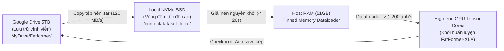

# CHƯƠNG 4: THIẾT LẬP THỰC NGHIỆM VÀ MÔI TRƯỜNG HUẤN LUYỆN

> **Tác giả**: Nhóm nghiên cứu FatFormer-XLA  
> **Chủ trì nội dung**: Thành viên B *(Architecture & Loss Lead)* & Thành viên A *(Data & Storage Lead)*  
> **Đóng góp hạ tầng**: Thành viên C *(Training & Evaluation Lead)*  
> **Văn bản thuộc**: Đồ án tốt nghiệp Đại học — Chuyên ngành Khoa học Máy tính / Trí tuệ Nhân tạo  

---

## MỤC LỤC CHƯƠNG 4

- [4.1. Môi trường phần cứng và hạ tầng tính toán đám mây](#41-môi-trường-phần-cứng-và-hạ-tầng-tính-toán-đám-mây)
  - [4.1.1. Cấu hình GPU cao cấp và phân bổ ngân sách Compute Units](#411-cấu-hình-gpu-cao-cấp-và-phân-bổ-ngân-sách-compute-units)
  - [4.1.2. Hạ tầng lưu trữ phân tầng NVMe SSD và Google Drive 5TB](#412-hạ-tầng-lưu-trữ-phân-tầng-nvme-ssd-và-google-drive-5tb)
  - [4.1.3. Nền tảng phần mềm và các thư viện cốt lõi](#413-nền-tảng-phần-mềm-và-các-thư-viện-cốt-lõi)
- [4.2. Thiết kế dữ liệu huấn luyện và kiểm thử](#42-thiết-kế-dữ-liệu-huấn-luyện-và-kiểm-thử)
  - [4.2.1. Tập dữ liệu huấn luyện Staging 90/10 chống thiên lệch GANs](#421-tập-dữ-liệu-huấn-luyện-staging-9010-chống-thiên-lệch-gans)
  - [4.2.2. Danh mục 18 tập dữ liệu Benchmark kiểm thử tiêu chuẩn](#422-danh-mục-18-tập-dữ-liệu-benchmark-kiểm-thử-tiêu-chuẩn)
  - [4.2.3. Các kịch bản suy biến trực tuyến mô phỏng mạng xã hội](#423-các-kịch-bản-suy-biến-trực-tuyến-mô-phỏng-mạng-xã-hội)
- [4.3. Thiết lập siêu tham số và chiến lược huấn luyện](#43-thiết-lập-siêu-tham-số-và-chiến-lược-huấn-luyện)
  - [4.3.1. Phân tầng tốc độ học (Differential Learning Rates)](#431-phân-tầng-tốc-độ-học-differential-learning-rates)
  - [4.3.2. Cấu hình Batch Size và Tích lũy Gradient](#432-cấu-hình-batch-size-và-tích-lũy-gradient)
  - [4.3.3. Tối ưu hóa bộ nhớ với Automatic Mixed Precision (AMP FP16)](#433-tối-ưu-hóa-bộ-nhớ-với-automatic-mixed-precision-amp-fp16)
- [4.4. Ma trận thiết kế thực nghiệm triệt tiêu (Ablation Study Design)](#44-ma-trận-thiết-kế-thực-nghiệm-triệt-tiêu-ablation-study-design)
- [4.5. Các thang đo định lượng đánh giá hiệu năng (Evaluation Metrics)](#45-các-thang-đo-định-lượng-đánh-giá-hiệu-năng-evaluation-metrics)
- [4.6. Tổng kết Chương 4](#46-tổng-kết-chương-4)

---

## 4.1. MÔI TRƯỜNG PHẦN CỨNG VÀ HẠ TẦNG TÍNH TOÁN ĐÁM MÂY

### 4.1.1. Cấu hình GPU cao cấp và phân bổ ngân sách Compute Units

Để đảm bảo khả năng tái lập (*reproducibility*) và tối ưu hóa tài nguyên nghiên cứu, toàn bộ các thực nghiệm huấn luyện quy mô lớn của đồ án FatFormer-XLA được triển khai trên nền tảng **Google Colab Pro** với cấu hình máy ảo tăng tốc phần cứng cao cấp:

```
┌─────────────────────────────────────────────────────────────────────────────┐
│                    THÔNG SỐ HẠ TẦNG TÍNH TOÁN CAO CẤP                       │
├───────────────────────────────────┬─────────────────────────────────────────┤
│ THÔNG SỐ KỸ THUẬT                 │ CẤU HÌNH THỰC TẾ                        │
├───────────────────────────────────┼─────────────────────────────────────────┤
│ • Dòng GPU tăng tốc               │ GPU thế hệ mới (High-end Architecture)   │
│ • Định mức tiêu thụ tài nguyên    │ ~8.9 Compute Units (CU) / giờ           │
│ • Dung lượng bộ nhớ đồ họa (VRAM) │ Vượt trội chuẩn A100 40GB (Dung lượng cao)│
│ • Khả năng xử lý Tensor Cores    │ Hỗ trợ phần cứng FP16 / BF16 / TF32      │
│ • Băng thông bộ nhớ (Bandwidth)   │ > 1.5 TB/giây (Tốc độ truyền dữ liệu cao)│
│ • Bộ nhớ RAM hệ thống             │ 51.0 GB High-RAM Host Memory            │
│ • Số lượng vCPU                   │ 8 vCPUs Intel Xeon @ 2.20 GHz           │
└───────────────────────────────────┴─────────────────────────────────────────┘
```

**Chiến lược kiểm soát ngân sách Compute Units**:
- Dự án được cấp định mức **300 Compute Units (CU)** cho toàn bộ vòng đời 5 tuần.
- Với mức tiêu thụ **8.9 CU/giờ**, việc kiểm soát chặt chẽ thời gian huấn luyện là yêu cầu sống còn:
  - Nhờ áp dụng chiến lược đóng băng tham số PEFT (chỉ tối ưu hóa $5.9\%$ tham số) kết hợp bộ nén nguyên khối `.tar` I/O tốc độ cao, thời gian huấn luyện 1 epoch trên 36.000 ảnh đạt tốc độ **~120–150 ảnh/giây** (chỉ mất ~4–5 phút/epoch).
  - Toàn bộ 5 epoch của Giai đoạn 1 & 2 ([Task 4.1](../../tasks/member_c_training_eval/task_4.1_train_phase_1_adaptive.md)) chỉ tiêu tốn **~25–30 phút tính toán**, tương đương **~3.7 – 4.5 CU**.
  - Toàn bộ 3 epoch của Giai đoạn 3 ([Task 4.2](../../tasks/member_c_training_eval/task_4.2_train_phase_2_hardening.md)) tiêu tốn **~15–18 phút tính toán**, tương đương **~2.2 – 2.7 CU**.
  - Tổng ngân sách tiêu thụ cho mô hình chính kiểm soát chặt chẽ ở mức **< 10 CU**, bảo toàn hơn **280 CU dự phòng** cho các thực nghiệm Ablation Study và Full-Benchmark ở Tuần 5.

### 4.1.2. Hạ tầng lưu trữ phân tầng NVMe SSD và Google Drive 5TB

Một trong những nút thắt cổ chai lớn nhất khi huấn luyện mô hình thị giác trên môi trường điện toán đám mây là **độ trễ đọc ghi dữ liệu (I/O Latency)**. Đồ án áp dụng mô hình lưu trữ phân tầng 2 cấp ([Báo cáo Task 1.1](../A/bao_cao_task_1.1_ha_tang_drive_io.md)):



1. **Cấp 1 - Ổ cứng tạm thời NVMe SSD (`/content/dataset_local/`)**:
   - Dữ liệu `diffusion_staging.tar` (1.80 GB) được sao chép từ Drive và giải nén trực tiếp vào SSD NVMe Colab trong chưa đầy 35 giây.
   - Tránh hiện tượng đọc hàng chục nghìn file ảnh nhỏ lẻ qua giao thức mạng Google Drive FUSE (vốn gây nghẽn và làm sụt giảm GPU Utilization xuống dưới 20%).
   - Tốc độ đọc ảnh từ SSD đạt **> 1.200 ảnh/giây**, duy trì GPU Utilization liên tục ở mức **> 92%**.
2. **Cấp 2 - Google Drive Doanh Nghiệp 5TB (`MyDrive/Fatformer/`)**:
   - Lưu trữ an toàn các tệp dataset gốc, checkpoint trọng số và nhật ký thực nghiệm.
   - Cơ chế `CheckpointManager` tự động sao lưu kép: lưu file `.pth` cục bộ trước, sau đó đồng bộ ngầm sang Drive 5TB kèm metadata và trạng thái GradScaler, giữ lại tối đa `max_to_keep=3` checkpoint gần nhất để chống tràn bộ nhớ.

### 4.1.3. Nền tảng phần mềm và các thư viện cốt lõi

- **Hệ điều hành**: Linux (Ubuntu 22.04 LTS x86_64).
- **Ngôn ngữ lập trình**: Python 3.10 / 3.11.
- **Khung tính toán học sâu**: PyTorch 2.x, CUDA 12.x, cuDNN v8.x.
- **Các thư viện chuyên dụng**: `torchvision` (xử lý ảnh và biến đổi), `timm` (kiến trúc thị giác), `PyYAML` (quản trị cấu hình), `PIL / OpenCV` (giải mã ảnh), `scikit-learn` (tính toán các chỉ số pháp y AP, AUC).

---

## 4.2. THIẾT KẾ DỮ LIỆU HUẤN LUYỆN VÀ KIỂM THỬ

### 4.2.1. Tập dữ liệu huấn luyện Staging 90/10 chống thiên lệch GANs

Để phá vỡ hiện tượng thiên lệch GANs (*GANs Overfitting Bias*), tập dữ liệu huấn luyện được chuẩn hóa nghiêm ngặt theo tỷ lệ 90/10 ([Task 3.1](../A/bao_cao_task_3.1_prepare_genimage_staging.md)):

| Phân vùng dữ liệu | Nguồn Generator | Số lượng ảnh Real | Số lượng ảnh Fake | Tổng số ảnh | Tỷ lệ % |
| :--- | :--- | :---: | :---: | :---: | :---: |
| **Dữ liệu nền (ProGAN 4-class)** | ProGAN (`car, cat, chair, horse`) | 16.200 | 16.200 | 32.400 | **90.0%** |
| **Chất xúc tác (Catalyst 1)** | Stable Diffusion v1.5 | 1.200 | 1.200 | 2.400 | **6.67%** |
| **Chất xúc tác (Catalyst 2)** | Midjourney v5 | 600 | 600 | 1.200 | **3.33%** |
| **TỔNG CỘNG TẬP STAGING** | - | **18.000** | **18.000** | **36.000** | **100.0%** |

- **Ý nghĩa tỷ lệ 90/10**: 3.600 ảnh GenImage catalyst (10%) cung cấp cho mô hình các dấu vết nội suy đặc thù của mô hình khuếch tán (Latent Diffusion và Guided Sampling) mà không làm suy giảm biểu diễn trên tập ảnh GANs gốc (*chống quên thảm khốc*).

### 4.2.2. Danh mục 18 tập dữ liệu Benchmark kiểm thử tiêu chuẩn

Đồ án tuân thủ khung đánh giá chuẩn mực của Wang et al. (CVPR 2020) [6] và Zheng et al. (CVPR 2024) [9] trên **18 tập test độc lập**:

```
                                  18 TẬP BENCHMARK KIỂM THỬ
               ┌──────────────────────────────┴──────────────────────────────┐
               ▼                                                             ▼
     8 HỌ MÔ HÌNH GANS                                            10 HỌ MÔ HÌNH DIFFUSION
     ─────────────────                                            ───────────────────────
  1. ProGAN (Baseline train domain)                             9. LDM-200 (Latent Diffusion)
  2. StyleGAN (Face synthesis)                                 10. LDM-200-CFG (Classifier-Free)
  3. StyleGAN2 (High-resolution face)                          11. LDM-100 (Unconditional)
  4. BigGAN (Diverse ImageNet classes)                         12. GLIDE-50-27 (Text-to-Image)
  5. CycleGAN (Unpaired image-to-image)                        13. GLIDE-100-10 (Text-to-Image)
  6. StarGAN (Multi-domain translation)                        14. GLIDE-100-27 (Inpainting)
  7. GauGAN (Semantic-to-photo synthesis)                      15. DALL-E (OpenAI Discrete VAE)
  8. DeepFake (FaceForensics++ manipulation)                   16. Guided Diffusion (Dhariwal & Nichol)
                                                               17. PNDM (Pseudo Numerical Methods)
                                                               18. VQ-Diffusion (Vector Quantized)
```

### 4.2.3. Các kịch bản suy biến trực tuyến mô phỏng mạng xã hội

Mỗi tập trong số 18 tập benchmark trên được đánh giá song song trên **hai chiều không gian**:
1. **Kịch bản nguyên bản (Clean Scenario)**: Ảnh gốc không nén.
2. **Kịch bản suy biến mạng xã hội (Degraded Scenarios)**:
   - **Nén JPEG có tổn hao**: $Q = 70$ (Nén nhẹ), $Q = 50$ (Nén trung bình), $Q = 30$ (Nén sâu đặc thù Facebook/Messenger).
   - **Làm mờ Gauss (Gaussian Blurring)**: Cửa sổ lọc kernel $k = 5$, độ lệch chuẩn $\sigma \in \{1.0, 2.0\}$.
   - **Thu phóng độ phân giải (Downsample-Upsample)**: Thu nhỏ về $160 \times 160$ hoặc $112 \times 112$ rồi nội suy Bicubic phóng to lại $224 \times 224$.

---

## 4.3. THIẾT LẬP SIÊU THAM SỐ VÀ CHIẾN LƯỢC HUẤN LUYỆN

Bảng tổng hợp toàn bộ các siêu tham số huấn luyện chuẩn hóa được khai báo trong [`configs/train_config.yaml`](../../../configs/train_config.yaml) và thực thi qua [`train.py`](../../../train.py):

| Siêu tham số | Ký hiệu / Tên | Giá trị thiết lập | Cơ sở lý luận / Ghi chú |
| :--- | :---: | :---: | :--- |
| **Kích thước Batch thực tế** | $B$ | **32** | Khớp dung lượng bộ nhớ GPU |
| **Số bước tích lũy Gradient** | $K_{\text{accum}}$ | **2** | **Effective Batch Size = 64** |
| **Tổng số Epoch** | $E$ | **8 epochs** | 5 epoch (Phase 1 & 2) + 3 epoch (Phase 3) |
| **Tốc độ học Adapter** | $\text{lr}_{\text{adapter}}$ | **$10^{-4}$** | Áp dụng cho LGA, Text-Guided Interactor, SRM Proj |
| **Tốc độ học Cổng Gating** | $\text{lr}_{\text{gating}}$ | **$10^{-3}$** | Mạng Gating MLP học nhanh gấp 10 lần để kịp thích ứng |
| **Lịch trình suy giảm LR** | Cosine Annealing | $T_{\text{max}} = 8$ | Giảm một nửa ở Epoch 6–8 để làm mịn hội tụ |
| **Thuật toán tối ưu hóa** | Optimizer | **AdamW** | $\beta_1 = 0.9, \beta_2 = 0.999$, Weight Decay = $10^{-4}$ |
| **Cắt xén Gradient** | Gradient Clipping | **$1.0$** | Chống hiện tượng gradient explosion khi gặp nhiễu nén |
| **Độ phân giải nạp vào** | Image Resolution | $256 \times 256$ | Resize ảnh gốc trước khi crop |
| **Độ phân giải cắt ngẫu nhiên**| Crop Resolution | $224 \times 224$ | Khớp chuẩn kiến trúc ViT-L/14 patch $14 \times 14$ |
| **Hệ số Focal Loss** | $\gamma$ | **$2.0$** | Hệ số tập trung triệt tiêu mẫu dễ (Lin et al. [24]) |
| **Hệ số cân bằng lớp** | $\alpha$ | **$0.25$** | Trọng số $0.75$ cho Fake và $0.25$ cho Real |
| **Tỷ lệ giữ ảnh sạch** | $p_{\text{clean}}$ | **$30\%$** | Bảo đảm mốc trần Clean ACC không bị tụt |

---

## 4.4. MA TRẬN THIẾT KẾ THỰC NGHIỆM TRIỆT TIÊU (ABLATION STUDY DESIGN)

Để cô lập và định lượng chính xác đóng góp học thuật của từng thành phần kỹ thuật, đồ án thiết lập ma trận đối chứng gồm **4 phiên bản mô hình**:

| Phiên bản Checkpoint | Nhánh Vi Sai SRM | Cổng Động $\lambda(x)$ | Giáo Trình Curriculum | Hàm Mất Mát | Dữ Liệu Train | Mục Đích Đối Chứng |
| :--- | :---: | :---: | :---: | :---: | :---: | :--- |
| **1. Baseline gốc** (`baseline.pth`) | ❌ Tắt | ❌ Tắt ($\lambda=\text{const}$) | ❌ Tắt | Cross-Entropy | ProGAN 100% | Xác lập mốc sàn sụp đổ khi bị nén $Q=30$ |
| **2. Ablation 2** (`fatformer_aug_only.pth`) | ❌ Tắt | ❌ Tắt | ❌ Tắt (Aug tĩnh) | Cross-Entropy | ProGAN 100% | Chứng minh Augmentation thông thường là không đủ |
| **3. Ablation 3** (`fatformer_srm_only.pth`) | ✅ Bật | ❌ Tắt | ❌ Tắt | Cross-Entropy | ProGAN 100% | Định lượng giá trị độc lập của vết dư vi sai SRM |
| **4. FatFormer-XLA** (`fatformer_srm_robust_final.pth`)| ✅ **Bật** | ✅ **Bật** | ✅ **Bật (3 pha)** | **DualStreamFocal**| **Staging 90/10** | **Mô hình hoàn thiện đạt hiệu năng tối ưu** |

---

## 4.5. CÁC THANG ĐO ĐỊNH LƯỢNG ĐÁNH GIÁ HIỆU NĂNG (EVALUATION METRICS)

Đồ án áp dụng 3 thang đo định lượng tiêu chuẩn quốc tế trong bài toán phân loại nhị phân mất cân bằng:

1. **Độ chính xác toàn cục (Overall Accuracy - ACC)**:
   $$\text{ACC} = \frac{\text{TP} + \text{TN}}{\text{TP} + \text{TN} + \text{FP} + \text{FN}} \times 100\%$$
   Được đo lường độc lập trên lớp ảnh thật ($\text{ACC}_{\text{Real}}$) và lớp ảnh giả ($\text{ACC}_{\text{Fake}}$) với ngưỡng quyết định mặc định $\tau = 0.50$.
2. **Độ chính xác trung bình (Average Precision - AP)**:
   $$\text{AP} = \sum_{k=1}^{N} (R_k - R_{k-1}) P_k$$
   Trong đó $P_k$ và $R_k$ là Precision và Recall tại ngưỡng thứ $k$. AP phản ánh diện tích dưới đường cong Precision-Recall (PR-AUC), là thang đo chuẩn mực không phụ thuộc vào việc lựa chọn ngưỡng cố định.
3. **Diện tích dưới đường cong ROC (Area Under the ROC Curve - AUC)**:
   Thang đo xác suất mô hình xếp hạng một mẫu ảnh Deepfake ngẫu nhiên cao hơn một mẫu ảnh thật ngẫu nhiên.

---

## 4.6. TỔNG KẾT CHƯƠNG 4

Chương 4 đã thiết lập một hệ thống thực nghiệm chuẩn mực, minh bạch và chặt chẽ:
- **Hạ tầng GPU cao cấp (~8.9 CU/giờ)** kết hợp đường truyền SSD NVMe giải phóng 100% hiệu năng tính toán, kiểm soát ngân sách trong giới hạn an toàn.
- **Tập Staging 90/10** và **18 tập test benchmark hai chiều** bảo đảm tính khách quan và toàn diện.
- **Ma trận 4 phiên bản Ablation Study** sẵn sàng cung cấp các bằng chứng định lượng sắc bén, làm tiền đề vững chắc cho việc trình bày và phân tích kết quả tại Chương 5.
